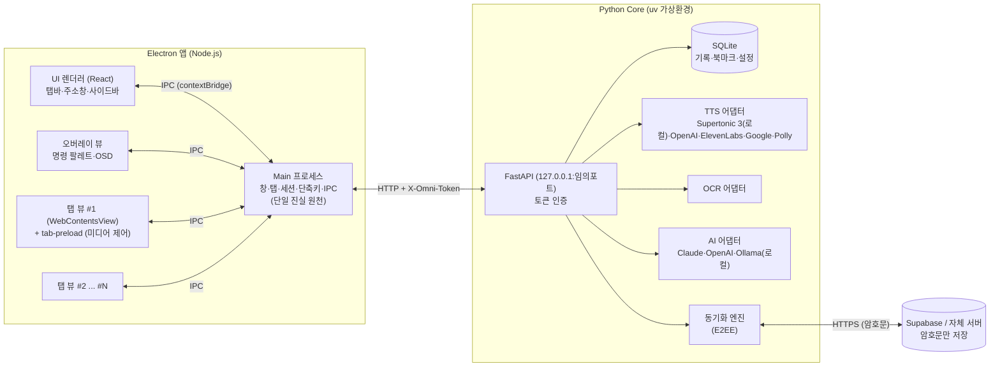
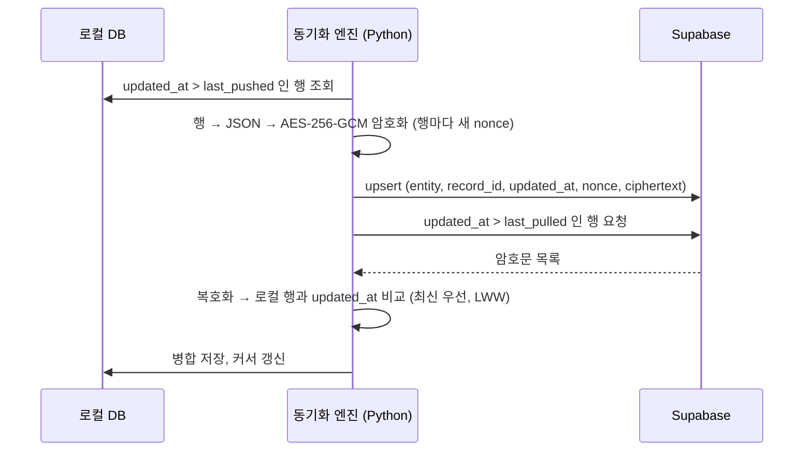
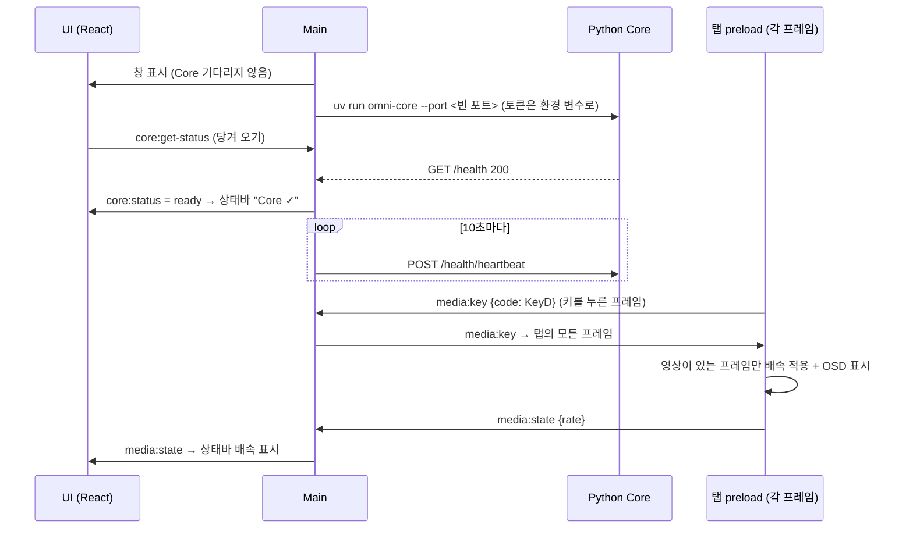

# 개인 전용 만능 웹 브라우저 OmniBrowser (가칭) — 상세 설계서 v3.3

| 항목 | 내용 |
|---|---|
| 문서 버전 | v3.3 (구현 v0.3.1: 다른 프로그램과의 동시 실행 충돌 대응 추가) · v3.2 (구현 v0.3 반영: Gemini TTS·로컬 TTS 모델 폴더 관리·AI/TTS 모델 최신 목록 갱신·사이트 호환성 강화) |
| 작성일 | 2026-09-30 (v3.0) · 2026-10-01 (v3.1, v3.2) |
| 대상 독자 | 이 브라우저를 직접 개발·운영할 **초급~중급 개발자** (1인 개발 기준) |
| 핵심 변경 | ① 사용자 편의 기능 대폭 보강 ② Electron + **Python Core(uv)** 하이브리드 구조 확정 ③ **uv 하나로** 개발·운영 환경 구축 ④ 기술적으로 불가능하거나 부정확했던 v2.0 항목 정정 |

---

## 0. 문서 안내

### 0.000 v3.2 → v3.3 주요 변경 요약 (구현 v0.3.1)

| 구분 | 변경 내용과 이유 |
|---|---|
| 아이콘·작업 표시줄 | electron-vite 템플릿 기본 아이콘(Electron 로고)을 쓰고 있어, 같은 템플릿으로 만든 다른 앱(예: Supertonic TTS 앱)과 **같은 아이콘**으로 보였음 → 고유 아이콘(`resources/icon.png`, `build/icon.ico·icns`), 창 아이콘 지정, `@electron-toolkit`가 개발 모드에서 electron.exe 경로로 바꾸던 작업 표시줄 ID를 항상 `com.omnibrowser.app`로 |
| Supertonic 모델 폴더 | 공용 폴더(`사용자/.cache/supertonic3`)를 다른 Supertonic 앱과 함께 쓰면, 패키지의 다운로드 방식(고정 임시 폴더 `.supertonic3.tmp` → **기존 폴더 삭제 후 교체**) 때문에 동시 실행 시 Windows 파일 잠금 오류로 한쪽이 기동 중 종료될 수 있음 → **OmniBrowser 전용 폴더**(`%APPDATA%/OmniBrowser/core/models/<모델>`)가 기본, 공용 폴더는 읽기·복사만, 다운로드·복사에 프로세스 간 파일 잠금 (3.2.3절) |
| 진단 도구 | `diagnose.bat` + `tools/diagnose.ps1` (읽기 전용): 관련 프로세스·명령줄, 포트 점유, 환경 변수(`ELECTRON_RUN_AS_NODE` 등), Supertonic 폴더·임시 폴더·잠긴 파일, Windows 이벤트 로그(1000번 충돌), OmniBrowser 로그·충돌 덤프, 다른 앱 소스의 위험 코드(`taskkill /im python.exe`, 고정 포트, 템플릿 기본 이름·아이콘) 검사 → 자동 판정 요약 보고서. 안내서 `docs/동시실행_문제해결.md` |
| 진단 기록 | 단일 실행 잠금으로 종료할 때 로그에 기록 |

### 0.00 v3.1 → v3.2 주요 변경 요약 (구현 v0.3 반영)

| 구분 | v3.1 | v3.2 (변경 내용과 이유) |
|---|---|---|
| 사이트 차단 | UA에서 Electron 표시 제거 | **여전히 차단되는 사이트 원인 규명:** ① UA가 **Chrome 142(1년 전 버전)** → "최신 브라우저 아님" 차단 ② JS `navigator.userAgentData` 브랜드에 "Google Chrome" 없음 ③ `window.chrome` 비어 있음. → **최신 Chrome 안정판 버전 자동 조회**(Google 버전 기록 API, 3일 주기, 실패 시 날짜로 추정), 탭마다 DevTools 프로토콜로 **UA·Client Hints·JS 정보 일관 설정**, `window.chrome` 보완, **차단 화면 자동 감지 안내 막대**, 사용자 지정 UA, **크롤러 브라우저 네트워크 모드** (3.14절) |
| TTS 엔진 | Supertonic, OpenAI | **Google Gemini TTS 추가** (음성 30종, 말투 지시), 엔진별 음성 저장, 클라우드 TTS 모델 선택 (3.2.1절) |
| 로컬 TTS 모델 | 기본 위치 고정 | **모델 폴더 변경·검사·다운로드·복사** (다른 드라이브·다른 PC에서 가져온 모델 사용) (3.2.3절) |
| 모델 이름 | 수동 입력 + 목록 불러오기 | **AI·TTS 모델 최신 목록 갱신**(🔄, 전체 갱신, 하루 1회 자동), ⭐ 추천 최신 모델, **기본 모델 단종 시 자동 대체** (3.8절) |
| API | — | `/ai/models`(캐시·refresh·추천), `/ai/models/refresh`, `/tts/voices`, `/tts/models`, `/tts/local/*` 추가 (7.1절) |

### 0.0 v3.0 → v3.1 주요 변경 요약 (구현 v0.2 반영)

| 구분 | v3.0 | v3.1 (변경 내용과 이유) |
|---|---|---|
| 사이트 차단 문제 | 언급 없음 | **사이트 호환성 절(3.14) 신설.** Electron 기본 사용자 에이전트(UA)에 `Electron/버전`·앱 이름이 들어 있어 일부 기관 사이트 방화벽(WAF)이 "Web Page Blocked! … latest version of your browser"로 차단 → **기본값을 일반 Chrome UA + Client Hints 브랜드로 변경**, 설정에서 Chrome/Edge/Electron 선택 |
| AI | Claude·OpenAI, Phase 4 | **Gemini·OpenAI·Claude 3사**를 같은 방식(REST 스트리밍)으로 연동, **작업 프리셋 9종**(요약·번역·정리 노트·핵심 3줄·쉽게 설명·용어 사전·퀴즈·교정·할 일 추출), **페이지 제자리 번역**(원문+번역 대역/번역만/원문 복원), 모델 목록 불러오기, 월 사용 한도. Phase 4 → **v0.2에서 선구현** (3.8절) |
| 웹 크롤러 | 없음 | **신설(3.13절).** 하위 페이지까지 따라가며 Markdown·HTML·텍스트·JSON·전체 합본·PDF로 저장, PDF·HWP·Word·Excel·PPT 등 **문서 종류를 골라 한 번에 다운로드**, 스캔 후 골라 받기, 원클릭 프리셋 5종, robots.txt 준수, 로그인 쿠키 연동, ZIP |
| 편의 기능 | 설계만 | **리더 모드, 페이지 저장(PDF·전체 페이지 PNG·Markdown·MHTML·HTML), 명령 팔레트, 메모, 다운로드 관리, 방문 기록 패널, 사이트별 다크 모드, 광고·추적기 차단, 쿠키·캐시 삭제** 구현 |
| 단축키 | 3.10절 초안 | 실제 구현 기준으로 개정 (명령 팔레트 `Ctrl+K`, AI `Ctrl+Shift+A`, 페이지 번역 `Alt+T` 등) |
| 인터페이스 | `/ai/chat` 1개 | `/ai/*` 6개, `/crawl/*` 8개, `/notes/*` 4개 API 추가 (7.1절) |
| 보안 | — | AI 답변 HTML 정화(DOMPurify), 리더 모드 격리 iframe, 페이지 스크립트는 **격리된 실행 공간(isolated world)**에서만 실행, UI 창 이동 차단 (6.6절) |
| 리스크 | R1~R14 | **R15~R19** 추가: 크롤링 법적·윤리 문제, AI로의 정보 유출, 번역 비용, UA 위장의 한계, 자바스크립트 렌더링 사이트 |

### 0.1 v2.0 → v3.0 주요 변경 요약

| 구분 | v2.0 | v3.0 (변경 내용과 이유) |
|---|---|---|
| 앱 프레임워크 | Electron 또는 Tauri (미정) | **Electron 확정.** Tauri는 OS 내장 WebView를 쓰므로 macOS/Linux에서는 Chromium이 아니며(WebKit), 크롬 확장·다중 웹뷰 지원이 약함 (2.1절 ADR 참고) |
| 백엔드 | 없음 (모두 Electron 안에서 처리) | **Python Core 서비스 추가 (uv로 관리).** TTS·OCR·AI·DB·동기화처럼 무거운 기능을 Python으로 분리 → 초급자가 다루기 쉽고, Supertonic 3 같은 Python 기반 로컬 AI 모델을 바로 활용 |
| Supertonic 3 | "드럼/퍼커션 신디사이저"로 기재 | **정정:** Supertone(서울)이 2026년 5월 공개한 **온디바이스 TTS 모델**(ONNX, 31개 언어, 한국어 지원, Python `supertonic` 패키지). → **로컬(오프라인) TTS 엔진**으로 편입 |
| 확장 프로그램 | Chrome Web Store 100% 호환 | **"주요 확장 부분 호환"으로 목표 현실화.** Electron은 Chrome 확장 API의 일부만 지원함. 검증 매트릭스로 관리 (4장) |
| 배속 | 0.1x~10x + 자체 피치 보정 알고리즘 | 범위 유지. 피치 보정은 Chromium 내장 `preservesPitch`로 해결(자체 알고리즘 불필요). **엔진 제한(극단 배속 시 음소거 등)을 명시**하고 UI로 안내 |
| 오디오 믹서 | 탭별 볼륨 + EQ | 기술 제약(교차 출처 미디어에 Web Audio 적용 시 무음 등)을 명시하고 **단계적 제공**(음소거·볼륨 0~100% → 부스트·EQ는 실험 기능) |
| 데이터 | 로컬 DB / 클라우드 DB 선택 | 유지 + **"무엇이 어디에 저장되는가" 표 추가**(Chromium 프로필 데이터 vs 앱 DB 구분), **휘발성 워크스페이스**(디스크에 아무것도 남기지 않음) 추가 |
| 보안 | AES-256, E2EE | 유지 + **로컬 API 보안, API 키 보관(OS 키체인), Electron 보안 체크리스트, E2EE 비밀번호 분실 정책** 추가 |
| 편의 기능 | 제스처, PIP, 캡처/OCR 등 | **명령 팔레트, 사이트별 배속 기억, 이어보기, 타임스탬프 메모, 선택 텍스트 퀵 액션, 리더 모드 읽기, 세션 자동 복원, 첫 실행 마법사, 안전 모드** 등 30여 개 추가 (3장) |
| 로드맵 | Phase 1~4 | **Phase 0(환경 구축·Hello Browser) 추가**, 클라우드 동기화를 뒤로 이동(**로컬 우선**), 각 단계에 **완료 기준** 명시 |
| 개발 환경 | 언급 없음 | **uv 기반 원클릭 설치(`setup.bat`) / 실행(`run.bat`)**, Node.js까지 uv로 설치, 초급자용 FAQ (9장·15장) |

### 0.2 초급 개발자를 위한 읽는 순서

1. **9장(개발 환경 구축)** 을 따라 하며 `run.bat`으로 빈 브라우저 창을 먼저 띄웁니다. → 성공 경험이 가장 중요합니다.
2. **2장(아키텍처)** 으로 "무엇이 어디서 돌아가는지" 큰 그림을 잡습니다.
3. **13장(로드맵)** 의 Phase 순서대로 **3장(기능 명세)** 의 해당 기능만 골라 구현합니다.
4. 막히면 **15장(트러블슈팅 FAQ)** → **14장(리스크·제약)** 순으로 확인합니다.

> 💡 **초급자 팁:** 이 문서의 코드(10장)는 "그대로 복사해서 돌아가는 최소 골격"입니다. 처음부터 모든 기능을 만들려 하지 말고, Phase 0 완료 기준(창이 뜨고 상태바에 `Core ✓` 표시)부터 달성하세요.

### 0.3 우선순위 표기

| 표기 | 의미 |
|---|---|
| **P0** | MVP 필수. 없으면 브라우저로 쓸 수 없음 |
| **P1** | 핵심 차별화 기능. 일상 사용에 중요 |
| **P2** | 선택·실험 기능. 여유가 있을 때, 또는 기술 검증(PoC) 후 도입 |

---

## 1. 프로젝트 개요

### 1.1 목적

Chromium 엔진 기반으로, 기성 브라우저가 제공하지 않는 **① 초정밀 미디어 제어 ② 다중 TTS·로컬 AI 통합 ③ 사용자가 통제하는 데이터 저장 ④ 키보드·제스처 중심의 극한 편의성**을 갖춘 **1인 전용 '만능' 브라우저**를 개발한다.

### 1.2 타겟 사용자 (페르소나)

| 페르소나 | 핵심 요구 | 대응 기능 |
|---|---|---|
| **학습자** (인강·세미나 영상 다수 시청) | 사이트마다 원하는 배속 자동 적용, 이어보기, 시점 메모 | 3.1 미디어 제어, 3.6 학습 모드 |
| **리뷰어** (영상 정밀 검토) | 0.1x 저속, 프레임 단위 이동, 구간 반복 | 3.1 |
| **리스너** (긴 글을 귀로 소비) | 자연스러운 음성, 오프라인 TTS, 비용 통제 | 3.2 TTS (Supertonic 3 로컬 + 클라우드 API) |
| **웹 오디오 파워 유저** | 오디오 웹앱의 안정 구동, MIDI 장치 사용, 탭별 음량 | 3.3 |
| **프라이버시 민감 유저** | 데이터 저장 위치 직접 선택, 흔적 없는 모드 | 2.5, 3.7, 6장 |

### 1.3 설계 원칙 (모든 기능에 공통 적용)

1. **키보드 우선, 마우스 대체 가능:** 모든 기능은 ① 단축키 ② 명령 팔레트 ③ 메뉴/버튼 중 최소 두 가지 경로로 실행 가능해야 한다.
2. **3초·3클릭 규칙:** 자주 쓰는 기능은 3클릭(또는 단축키 1회) 이내, 결과 피드백은 즉시(화면 OSD/토스트) 표시한다.
3. **되돌릴 수 있게:** 탭 닫기·설정 변경·데이터 삭제는 "실행 취소" 또는 휴지통(30일)을 제공한다.
4. **로컬 우선(Local-first):** 네트워크 없이도 핵심 기능(브라우징, 배속, 로컬 TTS, 기록·북마크)이 동작해야 한다.
5. **명시적 동의:** 페이지 내용이 외부 서버(AI·클라우드 TTS·동기화)로 나갈 때는 상태바에 표시하고, 최초 1회 동의를 받는다.
6. **실패해도 친절하게:** 오류는 "무엇이 / 왜 / 어떻게 해결"을 한국어로 보여 준다. (예: "Core 서비스 연결 실패 — 로그 보기 / 재시작")

### 1.4 범위와 비범위(Non-goals)

| 범위 안 (하는 것) | 범위 밖 (하지 않는 것) |
|---|---|
| Chromium(Electron) 위에 UI·기능 계층 구축 | 자체 렌더링 엔진 개발, Chromium 소스 직접 수정·빌드 |
| 주요 크롬 확장의 부분 호환 | Chrome Web Store 100% 호환 보장 |
| 일반 HTML5 영상의 배속·제어 | **DRM 보호 콘텐츠 우회**, 사이트 이용약관을 위반하는 조작 |
| 비밀번호는 검증된 확장/앱(예: Bitwarden) 연동 | 자체 비밀번호 관리자 구현 (보안 위험 대비 이득이 적음) |
| 1인·다중 기기 개인 사용 | 다중 사용자 서비스, 공개 배포·상용화 |

---

## 2. 시스템 아키텍처

### 2.1 기술 스택 결정 (ADR: Architecture Decision Record)

**결정:** `Electron(브라우저 셸) + React UI` 와 `Python Core 서비스(uv 관리)` 로 구성하는 하이브리드 구조.

| 후보 | 장점 | 단점 | 판정 |
|---|---|---|---|
| **Electron** | 모든 OS에서 동일한 Chromium, H.264/AAC 코덱 내장, 다중 웹뷰(`WebContentsView`), 세션 분리, 확장 일부 지원, 자료 풍부 | 메모리 사용량 큼, Chromium 보안 업데이트를 따라가려면 정기 업그레이드 필요 | ✅ **채택** |
| Tauri | 가볍고 빠름 | OS 내장 WebView 사용(macOS·Linux는 WebKit), 확장 미지원, Rust 학습 필요 | ❌ "Chromium 기반" 요구 불충족 |
| PySide6 (QtWebEngine) | 순수 Python, uv와 궁합 최고 | PyPI 배포판은 H.264/AAC 등 특허 코덱 미포함 → 인강 영상 재생 실패 가능 | ❌ 미디어 중심 브라우저에 치명적 |
| **Python Core (보조)** | TTS·OCR·AI·DB를 Python 생태계로 쉽게 구현, Supertonic 3 SDK 직접 사용, FastAPI의 자동 API 문서(`/docs`)로 초급자도 테스트 쉬움 | 프로세스가 하나 늘어남 | ✅ **채택** |

**UI 기술:** React + TypeScript + Zustand(상태 관리) + Tailwind CSS v4, 빌드 도구는 `electron-vite`.

### 2.2 전체 구성도



### 2.3 프로세스별 역할

| 구성 요소 | 언어 | 역할 | 초급자용 비유 |
|---|---|---|---|
| **Main 프로세스** | TypeScript (Node.js) | 창·탭 생성/배치, 워크스페이스별 세션, 단축키, 다운로드, 권한 요청 처리, Python Core 실행·감시. **모든 상태의 원본 보관** | 공장장 |
| **UI 렌더러** | React | 탭바, 주소창, 사이드바, 설정 화면. Main의 상태를 받아 **그리기만** 함 | 계기판 |
| **오버레이 뷰** | React | 명령 팔레트·토스트 등 웹페이지 **위에** 떠야 하는 UI 전용 투명 뷰 (아래 주의 참고) | 투명 필름 |
| **탭 뷰** | (웹페이지) | 실제 웹사이트 표시. 각 탭에 `tab-preload` 스크립트가 붙어 미디어 제어·제스처·선택 텍스트 감지 | 작업대 |
| **Python Core** | Python 3.12 | DB, TTS, OCR, AI, 동기화, 비밀키(API 키) 보관 | 전문 기술자 |

> ⚠️ **초급자가 가장 많이 막히는 지점:** 탭 뷰(`WebContentsView`)는 UI 렌더러 **위에** 겹쳐 그려지기 때문에, React로 만든 팝업(명령 팔레트 등)이 웹페이지에 **가려집니다.** 그래서 페이지 위에 떠야 하는 UI는 별도의 **투명 오버레이 뷰**를 맨 위에 추가하는 방식으로 구현합니다. (10.2절 코드 참고)

### 2.4 통신 방식

| 구간 | 방식 | 이유 |
|---|---|---|
| UI ↔ Main | Electron IPC (`contextBridge`로 **허용된 함수만** 노출) | 보안: 웹 코드가 Node.js에 직접 접근 못 하게 |
| 탭 preload ↔ Main | IPC (`ipcRenderer.send / invoke`) | 배속 명령·상태 보고 |
| Main ↔ Python Core | HTTP (`127.0.0.1`, 실행 때마다 바뀌는 포트, 요청마다 `X-Omni-Token` 헤더) | 초급자도 브라우저·`/docs`로 바로 테스트 가능. AI 답변 등 긴 응답은 SSE 스트리밍 |
| Core ↔ 클라우드 | HTTPS, **암호화된 데이터만** 전송 | E2EE |

**IPC 채널 이름 규칙:** `영역:동작` (예: `tabs:create`, `media:set-rate`). 전체 목록은 7.2절.

### 2.5 하이브리드 데이터베이스 (사용자 선택형)

#### 2.5.1 두 가지 모드

| 모드 | 저장 위치 | 외부 통신 | 적합한 경우 |
|---|---|---|---|
| **A. 로컬 전용** (기본값) | 내 PC의 SQLite 파일 | 동기화 통신 **없음** | 한 대의 PC만 사용, 최대 프라이버시 |
| **B. 클라우드 동기화** | 로컬 SQLite **+** Supabase(또는 자체 서버)에 **암호문** 복제 | 동기화 서버와만 통신 | 데스크톱·노트북 등 여러 기기 사용 |

- 모드 B도 **항상 로컬 DB가 먼저**입니다(오프라인에서도 동작, 연결되면 동기화). 이것이 "로컬 우선" 원칙입니다.
- 모드 전환은 설정 → 데이터에서 언제든 가능. A→B 전환 시 "기존 데이터 업로드" 확인, B→A 전환 시 "클라우드 사본 삭제 여부"를 묻습니다.

#### 2.5.2 무엇이 어디에 저장되는가 (중요)

브라우저 데이터는 **Chromium이 직접 관리하는 것**과 **우리 앱이 관리하는 것**으로 나뉩니다. v2.0은 이 구분이 없어 "로컬 DB 암호화 = 모든 흔적 암호화"로 오해할 수 있었습니다.

| 데이터 | 관리 주체 | 위치 | 동기화 대상 |
|---|---|---|---|
| 방문 기록, 북마크, 설정, 사이트별 설정(배속 등), 이어보기 위치, 메모, 읽기 목록, 탭 세션 | **앱 (Python Core)** | `userData/core/omni.db` | ✅ (모드 B) |
| 쿠키, 로그인 세션, 캐시, localStorage/IndexedDB(웹사이트용) | **Chromium** | `userData/Partitions/<워크스페이스>` | ❌ (기기별) |
| 확장 프로그램 파일·데이터 | Chromium | `userData/extensions`, 파티션 내부 | ❌ |
| API 키 (OpenAI 등) | OS 키체인 (Windows 자격 증명 관리자 / macOS 키체인) | OS 보안 저장소 | ❌ (기기마다 입력) |
| TTS 음성 캐시, Supertonic 모델 | Python Core | `userData/core/cache`, Hugging Face 캐시 폴더 | ❌ |
| 로그 | 앱 | `userData/logs` | ❌ |

> 💡 **흔적을 전혀 남기고 싶지 않다면:** **휘발성 워크스페이스**(3.7절)를 사용하세요. Chromium 파티션을 메모리에만 만들고(`persist:` 접두어 없음), 앱 DB에도 기록하지 않습니다. 창을 닫으면 쿠키·캐시·기록이 모두 사라집니다.

---

## 3. 주요 기능 명세

각 기능은 `ID | 기능 | 우선순위 | 구현 요점` 형식으로 정리합니다. **P0 기능에는 "완료 기준"** 을 두어, 구현이 끝났는지 스스로 판단할 수 있게 했습니다.

### 3.1 강력한 미디어 제어 (Advanced Media Control)

#### 3.1.1 글로벌 배속 제어 (0.1x ~ 10x)

| ID | 기능 | 우선 | 구현 요점 |
|---|---|---|---|
| MED-01 | 모든 `<video>`/`<audio>` 배속 강제 적용 | P0 | 탭 preload가 모든 프레임(iframe 포함)에서 미디어 요소를 찾아 `playbackRate` 설정. 동적으로 추가되는 영상은 `play` 이벤트를 캡처 단계에서 가로채 적용 |
| MED-02 | 0.1x~10x 미세 조정 | P0 | 슬라이더(0.05 단위) + 단축키(±0.1, Shift 시 ±0.5). 내부적으로 Chromium 허용 범위(0.0625~16)로 한 번 더 제한 |
| MED-03 | 피치 보정 ON/OFF | P0 | `element.preservesPitch = true`(기본). Chromium 내장 시간 늘이기 알고리즘을 사용하므로 **자체 구현 불필요** |
| MED-04 | 배속 OSD | P0 | 변경 즉시 화면 우상단에 `1.80x` 표시 후 1초 뒤 페이드. 페이지 CSS에 영향받지 않도록 Shadow DOM 안에 그림 |
| MED-05 | **사이트별 배속 기억** | P1 | 도메인별 마지막(또는 고정) 배속을 DB에 저장, 재방문 시 자동 적용. 예: `lecture.example.com → 1.8x` |
| MED-06 | 배속 되돌림 방지(가드) | P1 | 사이트 플레이어가 배속을 1.0으로 되돌리면(`ratechange` 감지) 다시 적용. **초당 5회 이상 충돌 시 포기하고 안내** (무한 루프 방지) |
| MED-07 | 즐겨찾기 배속 토글 | P1 | `G` 키 = 즐겨찾기 배속(기본 1.8x) ↔ 1.0x, `R` 키 = 직전 배속 ↔ 1.0x |
| MED-08 | 전 탭 일괄 배속 / 현재 탭만 | P1 | 설정에서 "배속 적용 범위" 선택 |

**완료 기준 (MED-01~04):** YouTube 및 일반 MP4 페이지에서 단축키로 0.1x·1.0x·2.5x·10x를 설정하면 OSD가 뜨고, 새로고침 없이 새로 삽입된 영상에도 같은 배속이 적용된다.

> ⚠️ **엔진 제한(반드시 사용자에게 안내):**
> - Chromium은 극단적인 배속(예: 약 4x 초과)에서 **오디오를 자동 음소거**하는 동작이 알려져 있습니다(버전별로 다를 수 있으므로 Phase 2에서 실측). → 이 구간에서는 OSD에 `🔇 엔진 제한: 음성 없음` 표시.
> - 10x에서는 영상 디코딩 부하로 프레임이 누락될 수 있습니다.
> - **일부 인강 플랫폼은 배속 제한이 출결·수료 인정 규정과 연결**되어 있습니다. 이용약관을 확인하고, 사이트별로 기능을 끌 수 있게 합니다(MED-05의 "이 사이트에서 사용 안 함").

#### 3.1.2 재생 편의 기능

| ID | 기능 | 우선 | 구현 요점 |
|---|---|---|---|
| MED-10 | 10초 앞/뒤 이동 | P0 | `Z` / `X` (간격 설정 가능: 5/10/30초) |
| MED-11 | 프레임 단위 이동 | P1 | 일시정지 상태에서 `,` / `.` → `currentTime ± 1/30초`. `requestVideoFrameCallback`으로 실제 프레임 경계 보정(가능한 경우) |
| MED-12 | A-B 구간 반복 | P1 | `[` 시작점, `]` 끝점, `\` 해제. `timeupdate`에서 끝점 도달 시 시작점으로 이동. 진행바 위에 구간 표시 |
| MED-13 | **이어보기** | P1 | 영상 URL별 재생 위치를 10초마다 저장 → 재방문 시 "12:34부터 이어볼까요?" 토스트(자동 이어보기 옵션) |
| MED-14 | 인트로 자동 건너뛰기 | P2 | 사이트별 "처음 N초 건너뛰기" 규칙 |
| MED-15 | 침묵 구간 자동 스킵 | P2 | Web Audio 분석기로 무음 감지 시 일시 고속 재생. **교차 출처 영상은 기술적으로 불가**(3.3.2 참고) → 가능한 사이트에서만 동작하는 실험 기능 |
| MED-16 | 시청 통계 | P2 | "이번 주 배속 시청으로 3시간 12분 절약" 같은 동기 부여 지표 |

#### 3.1.3 탭 오디오 믹서

| ID | 기능 | 우선 | 구현 요점 |
|---|---|---|---|
| MIX-01 | 탭 음소거 / 소리 나는 탭 표시 | P0 | `webContents.setAudioMuted()`, `webContents.isCurrentlyAudible()` → 탭에 🔊 아이콘 |
| MIX-02 | 탭별 볼륨 0~100% | P1 | Electron에 탭 볼륨 API가 없으므로, preload가 해당 탭의 모든 미디어 요소 `volume`에 배율을 곱해 적용 |
| MIX-03 | 볼륨 부스트(>100%) · EQ | P2 | Web Audio `GainNode`/`BiquadFilterNode` 사용. **제약:** ① 교차 출처(CORS 미허용) 미디어는 무음이 됨 ② 한 번 연결하면 되돌릴 수 없음 → 사이트별 **명시적 켜기(옵트인)** + 경고 문구 |
| MIX-04 | "다른 탭 소리 끄기" | P1 | 현재 탭 외 모든 탭 음소거 (명령 팔레트/탭 우클릭) |
| MIX-05 | 탭별 출력 장치 선택 | P2 | 미디어 요소 `setSinkId()` (예: 강의는 이어폰, 음악은 스피커) |

### 3.2 통합 음성 읽기(TTS)

#### 3.2.1 TTS 엔진 (어댑터 구조)

모든 엔진은 동일한 인터페이스(`synthesize(text, voice, lang) → 오디오 파일`)를 구현하므로, 새 엔진 추가가 쉽습니다.

| 엔진 | 종류 | 비용 | 오프라인 | 비고 |
|---|---|---|---|---|
| **Supertonic 3** | 로컬 ONNX 모델 (Python SDK `supertonic`) | 무료 | ✅ | 한국어 포함 31개 언어, CPU만으로 빠름. 최초 실행 시 Hugging Face에서 모델 자동 다운로드. 가중치 라이선스는 OpenRAIL-M(사용 제한 조항 확인) |
| OS 기본 음성 | Web Speech API (`speechSynthesis`) | 무료 | ✅ | 품질은 OS에 따라 다름, 설치 불필요 |
| OpenAI TTS | 클라우드 API | 유료 | ❌ | ✅ v0.2. 모델은 설정(`tts.openai.model`, 기본 `gpt-4o-mini-tts`) + 🔄 목록 갱신. 음성 13종 |
| **Google Gemini TTS** | 클라우드 API (`generateContent` + `responseModalities:["AUDIO"]`) | 유료 | ❌ | ✅ **v0.3.** 기본 `gemini-3.1-flash-tts-preview`, 음성 30종(Kore·Puck·Charon…), **말투 지시**(예: "차분하게 또박또박"). 응답 PCM(24kHz)에 WAV 헤더를 붙여 저장. AI와 같은 Gemini 키 사용 |
| ElevenLabs | 클라우드 API | 유료 | ❌ | 고품질·다양한 음성 |
| Google Cloud TTS | 클라우드 API | 유료 | ❌ | 서비스 계정 키 필요 |
| Amazon Polly | 클라우드 API | 유료 | ❌ | AWS 자격 증명 필요 |

- **기본 엔진 = Supertonic 3** (로컬 우선 원칙). 클라우드 엔진 실패 시 Supertonic으로 **자동 폴백**(설정 가능).
- **읽기 속도는 엔진이 아니라 재생기에서 조절:** 합성된 오디오를 UI의 `<audio>`로 재생하며 `playbackRate`(0.5~3x) + `preservesPitch`를 적용 → 모든 엔진에서 동일하게 동작하고, 속도를 바꿔도 다시 합성(=API 비용)하지 않습니다.

#### 3.2.2 읽기 사용자 경험

| ID | 기능 | 우선 | 구현 요점 |
|---|---|---|---|
| TTS-01 | 선택 텍스트 읽기 | P0 | 드래그 후 `Alt+R` 또는 선택 퀵 액션(3.5.3)의 🔊 |
| TTS-02 | 페이지 본문 읽기 | P0 | Mozilla Readability로 광고·메뉴 제거한 본문 추출 → 문장 단위 분할 |
| TTS-03 | 문장 단위 스트리밍 | P0 | 텍스트를 문장(약 300자 이하) 단위로 나눠 순서대로 합성, **다음 2문장 미리 합성** → 첫 소리까지 대기 최소화 |
| TTS-04 | 읽는 문장 하이라이트 + 자동 스크롤 | P1 | CSS Custom Highlight API(`CSS.highlights`) 사용 → **페이지 DOM을 변경하지 않아** 사이트가 깨지지 않음 |
| TTS-05 | 문장 이동·일시정지 | P1 | `Alt+[` 이전 문장, `Alt+]` 다음 문장, `Alt+R` 재생/일시정지 |
| TTS-06 | 백그라운드 계속 읽기 | P1 | 오디오는 UI 렌더러에서 재생 → 다른 탭으로 이동해도 계속 읽음 |
| TTS-07 | **합성 캐시** | P1 | `SHA-256(엔진|음성|언어|문장)` 키로 음성 파일 저장 → 같은 문장 재요청 시 API 비용 0. 캐시 용량 상한(기본 1GB) 초과 시 오래된 것부터 삭제 |
| TTS-08 | 사용량·비용 대시보드 | P1 | 엔진별 월 사용 글자 수 × **사용자가 입력한 단가**(요금은 수시로 바뀌므로 하드코딩 금지) → 예상 비용, **월 예산 초과 시 경고/차단** |
| TTS-09 | 음성 프리셋 | P1 | "한국어 뉴스용", "영어 논문용" 등 엔진+음성+속도 조합 저장, 언어 자동 감지 후 프리셋 자동 선택 |
| TTS-10 | 오디오 파일로 저장 | P2 | 선택 범위/본문 전체를 WAV(로컬)·MP3(클라우드 엔진 출력)로 저장 |
| TTS-11 | 캡처 OCR 결과 읽기 | P1 | 3.5.2와 연동 |

#### 3.2.3 로컬 TTS 모델 폴더 관리 (v0.3)

Supertonic 모델(약 수백 MB)은 v0.3.1부터 **OmniBrowser 전용 폴더** `%APPDATA%\OmniBrowser\core\models\<모델>`에 저장됩니다. Supertonic 패키지의 공용 기본 위치(`사용자 폴더\.cache\supertonic3`)는 같은 PC의 다른 Supertonic 앱도 쓰므로, OmniBrowser는 그곳에 모델이 있으면 **읽어서 복사만** 하고(인터넷 불필요) 절대 쓰거나 지우지 않습니다. 다운로드·복사는 프로세스 간 파일 잠금으로 보호합니다. C 드라이브 용량이 부족하거나, 인터넷이 막힌 PC에서 다른 PC가 받은 모델을 쓰고 싶을 때를 위해 **설정 → 읽어주기 → 로컬 모델 저장 폴더**에서 관리합니다.

| 기능 | 동작 |
|---|---|
| 다른 폴더 선택 | 폴더 선택 창 → Core가 모델 파일(`onnx/*.onnx`, `voice_styles/*.json`) 존재 여부·크기·음성 수 검사 → 설정 `tts.local.model_dir` 저장 → 엔진 다시 불러오기. `onnx` 하위 폴더를 골라도 모델 루트로 자동 보정 |
| 이 폴더로 모델 받기 | Hugging Face에서 지정 폴더로 다운로드 (백그라운드, 진행 상태 표시) |
| 다른 폴더로 복사해 사용 | 현재 모델을 새 폴더로 복사하고, **복사가 끝난 뒤** 새 폴더로 전환 |
| 기본 폴더로 | 설정을 비워 기본 위치로 복귀 |
| 모델 선택 | `supertonic-3`(기본) / `supertonic-2` 등 패키지가 지원하는 모델 |
| 없으면 자동으로 받기 | 끄면 폴더에 모델이 없을 때 다운로드하지 않고 안내만 표시 (오프라인·사내망용) |

합성 캐시 키에는 **엔진·모델·폴더·말투·음성**이 포함되어, 설정을 바꾸면 이전 음성이 잘못 재사용되지 않습니다.

**완료 기준 (TTS-01~03):** 인터넷을 끊은 상태에서 한국어 뉴스 기사를 `Alt+R`로 읽기 시작하면 3초 이내 첫 문장이 재생되고, 끝까지 끊김 없이 읽는다.

### 3.3 고성능 Web Audio / Web MIDI 지원

> **v2.0 정정:** Supertonic 3는 드럼 신디사이저가 아니라 **TTS 모델**이므로 3.2절로 옮겼습니다. 이 절은 일반적인 고사양 웹 오디오 앱(DAW, 신디사이저, 음악 교육 사이트 등)을 대상으로 합니다.

#### 3.3.1 브라우저가 할 수 있는 것 / 없는 것

브라우저는 **사이트의 오디오 코드를 대신 최적화할 수 없습니다.** 대신 방해 요소를 없애고 필요한 권한·설정을 쉽게 제공합니다.

| ID | 기능 | 우선 | 구현 요점 |
|---|---|---|---|
| AUD-01 | 백그라운드 스로틀링 해제 | P1 | 사이트별 "오디오 앱 모드" 켜면 해당 탭 `webPreferences.backgroundThrottling = false` → 다른 탭으로 가도 타이머·오디오 처리가 느려지지 않음 |
| AUD-02 | 자동재생 허용 목록 | P1 | 사이트별 자동재생 정책(허용/차단). 오디오 앱은 허용 |
| AUD-03 | Web MIDI 권한 UI | P1 | `session.setPermissionRequestHandler`에서 `midi`/`midiSysex` 요청 시 사이트별 허용 팝업, 설정에서 회수 가능 |
| AUD-04 | 오디오 앱 탭 슬립 제외 | P1 | 소리 나는 탭·오디오 앱 모드 탭은 메모리 절약(슬리핑)에서 자동 제외 |
| AUD-05 | 성능 모니터 | P2 | 탭별 CPU·메모리(`app.getAppMetrics()`) 표시 → 끊김 원인 파악 |

#### 3.3.2 알아 둘 기술 제약

- **교차 출처 미디어 + Web Audio = 무음:** 다른 도메인에서 CORS 허용 없이 가져온 영상/음성에 `createMediaElementSource()`를 연결하면 보안 규칙상 **무음(0값)** 이 출력됩니다. 그래서 EQ·부스트·침묵 스킵은 모든 사이트에서 동작할 수 없습니다.
- **DRM 콘텐츠:** Electron 공식 빌드에는 Widevine이 없어 넷플릭스 등 DRM 사이트는 재생되지 않을 수 있습니다. → **"기본 브라우저로 열기"** 버튼을 제공합니다(14장 리스크 참고).

### 3.4 UI / UX 및 레이아웃

#### 3.4.1 화면 구성

```
┌──────────────────────────────────────────────────────────────────────┐
│ [워크스페이스▼] [◀][▶][⟳]  🔒 주소창 / 명령 입력           [🔊][⋯]  │ ← 상단 툴바
├────────┬─────────────────────────────────────────────┬───────────────┤
│ 📌 고정 │                                             │  사이드바      │
│ ▾ 강의  │                                             │  (AI·메모·     │
│  · 1강  │              탭 뷰 (웹페이지)                │   읽기목록·    │
│  · 2강🔊│              ※ 최대 4분할                   │   다운로드)    │
│ ▾ 자료  │                                             │               │
│  · 논문 │                                             │               │
│ [+ 새탭]│                                             │               │
├────────┴─────────────────────────────────────────────┴───────────────┤
│ 🔒로컬DB │ Core ✓ │ 1.80x │ 🤖AI 전송중 │ 🍅 18:32 │ 🧩확장 3      │ ← 상태바
└──────────────────────────────────────────────────────────────────────┘
```

**상태바**는 "지금 무슨 일이 일어나고 있는가"를 한눈에 보여 주는 핵심 편의 장치입니다: DB 모드(🔒로컬/☁동기화), Core 연결 상태, 현재 탭 배속, 외부 전송 중 표시(AI·클라우드 TTS), 뽀모도로 타이머, 활성 확장 수.

#### 3.4.2 탭 관리

| ID | 기능 | 우선 | 구현 요점 |
|---|---|---|---|
| TAB-01 | 버티컬 탭 (좌/우 배치, 너비 조절, 접기) | P0 | React 렌더러, 드래그 앤 드롭으로 순서 변경 |
| TAB-02 | 탭 그룹 (이름·색상·접기) | P1 | 그룹 통째로 닫기/저장/다른 워크스페이스로 이동 |
| TAB-03 | 고정 탭 | P1 | 상단 고정, 실수로 닫기 방지 |
| TAB-04 | **닫은 탭 복구** | P0 | `Ctrl+Shift+T`, 최근 닫은 탭 25개 목록 |
| TAB-05 | **세션 자동 저장·복원** | P0 | 탭 구성 변경 시 2초 디바운스 저장 + 30초 주기 저장. 비정상 종료 후 재실행 시 "이전 세션 복원" |
| TAB-06 | 탭 검색 | P1 | `Ctrl+Shift+A` — 제목·URL 퍼지 검색, 모든 워크스페이스 대상 |
| TAB-07 | 중복 탭 정리 | P1 | 같은 URL 탭을 찾아 하나만 남기기 (명령 팔레트) |
| TAB-08 | **슬리핑 탭** | P1 | N분(기본 30분) 미사용 탭은 웹뷰를 해제하고 URL·스크롤 위치만 보관 → 클릭 시 복원. 소리 나는 탭·고정 탭·오디오 앱 탭은 제외 |
| TAB-09 | 탭 호버 미리보기 | P2 | `webContents.capturePage()` 썸네일 |
| TAB-10 | 트리형 탭 (어디서 열었는지 계층 표시) | P2 | 링크로 연 탭을 부모 탭 아래 들여쓰기 |

#### 3.4.3 스플릿 뷰 (최대 4분할)

| ID | 기능 | 우선 | 구현 요점 |
|---|---|---|---|
| SPL-01 | 레이아웃 1/2(좌우·상하)/3/4분할 | P1 | 각 칸에 `WebContentsView` 배치. UI가 칸의 좌표를 Main에 보내면 Main이 `setBounds()` |
| SPL-02 | 탭을 칸으로 드래그 | P1 | 탭바에서 끌어 원하는 칸에 놓기 |
| SPL-03 | 칸 크기 조절·교체 | P1 | 경계선 드래그, 칸 교환 |
| SPL-04 | 분할 레이아웃 저장 | P2 | "강의+노트", "원문+번역" 같은 레이아웃 프리셋 |
| SPL-05 | 동기 스크롤 | P2 | 원문/번역 비교용 — 스크롤 비율을 두 칸에 동기화 |

#### 3.4.4 스마트 사이드바

메신저·웹앱을 **모바일 UA로** 좁게 고정해 두는 패널 + 내장 패널(AI, 메모, 읽기 목록, 다운로드, TTS 재생기). 패널별 단축키, 사이드바 전체 `Alt+S`.

#### 3.4.5 명령 팔레트 (신규, P0)

`Ctrl+Shift+P` 또는 `F1` — **브라우저의 모든 기능을 이름으로 검색·실행**합니다(VS Code와 같은 방식). 초급자에게도 "단축키를 몰라도 모든 기능을 찾을 수 있는" 가장 강력한 편의 기능입니다.

- 항목 예: `배속: 2.0x로 설정`, `탭: 중복 탭 정리`, `워크스페이스: 학습용으로 전환`, `TTS: 본문 읽기`, `설정: 단축키 편집`
- 각 항목 옆에 현재 단축키 표시 → 자연스럽게 단축키 학습
- 최근 사용 명령이 위로 오도록 정렬
- 구현: 모든 기능을 `commands` 레지스트리(`id, title, keywords, shortcut, run()`)에 등록 → 팔레트·단축키·메뉴·제스처가 **같은 레지스트리를 공유** (중복 코드 방지)

### 3.5 극강의 사용자 편의 기능

#### 3.5.1 마우스 제스처

| ID | 기능 | 우선 | 구현 요점 |
|---|---|---|---|
| GES-01 | 우클릭 드래그 제스처 | P1 | 탭 preload에서 우클릭 누른 채 이동 궤적을 ↑↓←→ 시퀀스로 변환(최소 이동 거리 30px) → 명령 레지스트리 실행. 제스처가 인식되면 우클릭 메뉴 억제 |
| GES-02 | 궤적 표시 + 인식 결과 미리보기 | P1 | 그리는 동안 선과 "← 뒤로" 라벨 표시 → 실수 방지 |
| GES-03 | 영상 위 제스처 | P1 | 영상 위에서 시작한 ↑/↓ = 배속 ±0.25, ← / → = 10초 이동 |
| GES-04 | 우클릭+휠 = 탭 전환 | P2 | |
| GES-05 | 제스처 편집기 | P1 | 제스처 ↔ 명령 매핑을 설정 화면에서 변경 |

**기본 제스처:** `←` 뒤로 · `→` 앞으로 · `↑` 새 탭 · `↓→` 탭 닫기 · `↑↓` 새로고침 · `→↑` 닫은 탭 복구 · `↓←` 맨 위로.

#### 3.5.2 PiP · 캡처 · OCR

| ID | 기능 | 우선 | 구현 요점 |
|---|---|---|---|
| PIP-01 | 모든 영상 PiP 강제 | P1 | `Alt+P`. PiP는 사용자 제스처가 필요하므로 Main에서 `executeJavaScript(code, userGesture=true)`로 호출. `disablePictureInPicture` 속성은 사용자가 원할 때만 제거 |
| PIP-02 | 탭 전환 시 자동 PiP | P2 | 재생 중인 영상 탭을 벗어나면 자동으로 PiP |
| CAP-01 | 영역 캡처 | P1 | `Alt+C` → 오버레이에서 영역 드래그 → `webContents.capturePage(rect)` → 클립보드 복사 / 파일 저장 / OCR 선택 |
| CAP-02 | 전체 페이지(스크롤) 캡처 | P2 | Chrome DevTools Protocol `Page.captureScreenshot`(`captureBeyondViewport`)를 `webContents.debugger`로 호출 |
| OCR-01 | 캡처 즉시 텍스트 추출 | P1 | 이미지 → Python Core `/ocr` → 결과 패널에서 [복사] [번역] [🔊읽기] [메모로 저장] |
| OCR-02 | OCR 엔진 선택 | P1 | ① EasyOCR(한국어·영어, 로컬, **설치 용량 큼** → 선택 설치) ② AI 비전 모델(클라우드, 정확도 높음) ③ 추후 경량 엔진 추가 가능한 어댑터 구조 |

#### 3.5.3 선택 텍스트 퀵 액션 (신규)

텍스트를 드래그하면 선택 영역 옆에 작은 도구막대가 뜹니다(끄기 가능, 사이트별 예외 가능).

`[📋 복사] [🔍 검색] [🌐 번역] [🔊 읽기] [🤖 요약·설명] [🖍 하이라이트 저장] [📝 메모]`

- 하이라이트는 URL과 텍스트 위치를 DB에 저장 → 재방문 시 다시 표시 (CSS Highlight API 사용)
- 검색 엔진은 설정에서 선택 (Google, Naver, Daum, DuckDuckGo 등)

#### 3.5.4 기타 편의 기능

| ID | 기능 | 우선 | 구현 요점 |
|---|---|---|---|
| CNV-01 | **리더 모드** | P1 | Readability로 본문만 깔끔하게 표시(글꼴·크기·줄간격·다크 테마 조절), TTS와 연동 |
| CNV-02 | 다운로드 관리자 | P0 | `will-download` 이벤트, 진행률·일시정지·재개, 워크스페이스별 기본 저장 폴더, 완료 알림 |
| CNV-03 | 읽기 목록 | P1 | "나중에 읽기" 저장, 읽음 표시, 오프라인 사본(본문 텍스트) 저장 |
| CNV-04 | 페이지 확대 기억 | P1 | 사이트별 줌 레벨 저장 |
| CNV-05 | 강제 다크 모드 | P1 | 사이트별 켜기/끄기 (Chromium 자동 다크 모드 기능 활용) |
| CNV-06 | 링크 미리보기 | P2 | `Shift+클릭` 시 작은 팝업 창으로 미리 보기 |
| CNV-07 | 붙여넣고 바로 이동 | P1 | 주소창 우클릭 메뉴 |
| CNV-08 | QR 코드로 현재 페이지 공유 | P2 | 휴대폰으로 넘길 때 |
| CNV-09 | 광고·추적기 차단 | P1 | `@ghostery/adblocker-electron`을 세션(워크스페이스)별로 적용, 사이트별 예외 |
| CNV-10 | 외부 브라우저로 열기 | P0 | DRM·호환성 문제 사이트용 탈출구 (`shell.openExternal`) |

### 3.6 학습 모드 (신규 — 인강 학습자용)

"학습용" 워크스페이스 템플릿을 선택하면 아래 기능이 기본으로 켜집니다.

| ID | 기능 | 우선 | 구현 요점 |
|---|---|---|---|
| LRN-01 | **타임스탬프 메모** | P1 | 영상 시청 중 `Alt+N` → 현재 재생 시점 + (선택) 화면 캡처 + 메모 입력. 메모 목록에서 클릭하면 해당 시점으로 이동 |
| LRN-02 | 강의 진도표 | P2 | 사이트별 시청 완료 영상 목록, 이어보기(MED-13)와 연동 |
| LRN-03 | 뽀모도로 타이머 | P1 | 상태바 🍅, 25/5분 기본, 휴식 시간에 영상 자동 일시정지(선택) |
| LRN-04 | 집중 모드 | P2 | 타이머 동안 지정 사이트(SNS 등) 접속 차단 |
| LRN-05 | 메모 내보내기 | P1 | Markdown으로 내보내기 (타임스탬프 링크 포함) |

### 3.7 워크스페이스 (멀티 프로필)

| ID | 기능 | 우선 | 구현 요점 |
|---|---|---|---|
| WS-01 | 워크스페이스 생성·전환 | P0 | 워크스페이스마다 `session.fromPartition('persist:ws-<id>')` → 쿠키·로그인·캐시 **완전 분리**. 전환 `Ctrl+Alt+1~9` |
| WS-02 | 템플릿 | P1 | 업무용 / 학습용(인강 중심, 3.6 기능 ON) / 개인용 / 휘발성 |
| WS-03 | **휘발성 워크스페이스** | P1 | `persist:` 없는 파티션(메모리 전용) + 앱 DB 기록 안 함 → 닫으면 흔적 없음 |
| WS-04 | 워크스페이스별 색상·아이콘 | P1 | 창 테두리·탭바 색으로 현재 워크스페이스를 한눈에 구분 (업무 계정에 개인 글 올리는 실수 방지) |
| WS-05 | 워크스페이스별 확장·차단 설정 | P1 | 확장은 세션 단위로 로드되므로 워크스페이스마다 다르게 구성 가능 |
| WS-06 | 워크스페이스별 프록시·UA | P2 | `session.setProxy()`, `setUserAgent()` |
| WS-07 | 링크 규칙 | P2 | "`*.company.com` 링크는 항상 업무용에서 열기" |

### 3.8 AI 어시스턴트 통합 (v0.2 구현)

**구조:** UI(오른쪽 🤖 패널) → Main(페이지 본문 추출) → Python Core `/ai/stream` → 각 회사 REST API. SDK 없이 `httpx`로 직접 호출해 3사 응답을 **같은 형식(글자 조각 스트리밍)**으로 통일합니다. 키는 OS 키체인, 모델 이름은 설정(비우면 기본값).

| 제공자 | 기본 모델 (2026-09 기준, 설정에서 변경) | 키 발급 | 호출 방식 |
|---|---|---|---|
| Google Gemini (기본) | `gemini-3.6-flash` | aistudio.google.com/apikey | `models/{모델}:streamGenerateContent?alt=sse` |
| OpenAI | `gpt-5.4-mini` | platform.openai.com/api-keys | Chat Completions (`max_completion_tokens`, temperature 미지정) |
| Anthropic Claude | `claude-haiku-4-5-20251001` | console.anthropic.com | Messages API (`anthropic-version: 2023-06-01`) |

> **모델 최신 목록 갱신 (v0.3):** 모델은 자주 바뀌므로 각 회사 API에서 목록을 받아 Core에 저장(캐시)합니다.
> - 설정의 모델 선택 상자·AI 패널 상단의 **🔄** = 해당 회사 목록 갱신, **"모든 AI·TTS 모델 목록 지금 갱신"** = 키가 있는 모든 회사의 대화·TTS 모델 일괄 갱신
> - **하루 한 번 자동 갱신**(앱 시작 시 24시간 지난 목록만, `ai.models_auto_refresh`)
> - 목록은 최신순(OpenAI·Claude는 출시일, Gemini는 버전 번호). **⭐ 추천 최신** = 기본 모델과 같은 계열(Gemini `*-flash`, OpenAI `gpt-*-mini`, Claude `haiku`)의 가장 높은 정식 버전
> - **단종 시 자동 대체**(`ai.auto_latest`): 모델을 "기본값"으로 둔 상태에서 갱신한 목록에 기본 모델이 없으면 ⭐ 추천 모델로 호출
> - 목록에 없는 모델은 "✏ 직접 입력". 404 오류는 대부분 모델 이름 문제입니다.

| ID | 기능 | 우선 | 상태 | 구현 요점 |
|---|---|---|---|---|
| AI-01 | 사이드바 AI 채팅 | P1 | ✅ v0.2 | 제공자·결과 언어 선택, 스트리밍 표시, 중지, 대화 이어가기(최근 10개), 답변 복사·메모 저장·.md 저장·읽어주기 |
| AI-02 | 현재 페이지 요약·질문 | P1 | ✅ | Readability 본문 추출(격리 공간 1001). "페이지 내용 포함" 체크 시 본문을 근거 자료로 첨부. 최대 60,000자(설정) |
| AI-03 | 주소창 `?` 질문 | P1 | ✅ | `?질문` → AI 패널에서 답변 (명령 팔레트에서도 `?`) |
| AI-04 | 선택 텍스트 AI | P1 | ✅ | 우클릭 → 🤖 AI → 번역·요약·쉽게 설명·정리·용어 사전·교정·질문 |
| AI-05 | 페이지 제자리 번역 | P1 | ✅ | `Alt+T`: 문단(말단 블록 요소) 단위로 ⟦번호⟧ 표시를 붙여 40문단·3,500자씩 묶어 3개 병렬 요청 → 원문 아래에 번역 표시(대역). "번역만" 모드, `Alt+Shift+T` 원문 복원. 대상 언어가 한국어면 이미 한글인 문단은 건너뜀. 최대 400문단(설정) |
| AI-06 | 외부 전송 안내 | P0 | 🟡 | 설정 화면에 전송 안내 문구. 최초 사용 동의 창·워크스페이스별 AI 금지는 Phase 4 |
| AI-07 | 비용 가드 | P1 | ✅ | 월 사용 한도(글자 수, 기본 300만 자), 이번 달 제공자별 사용량 표시(`/ai/usage`) |
| AI-08 | 작업 프리셋 | P1 | ✅ | 요약·번역·정리 노트·핵심 3줄·쉽게 설명·용어 사전·퀴즈·교정·할 일 추출 (Core `presets.py`에서 문구 수정) |
| AI-09 | 리더 모드 연동 | P1 | ✅ | 리더 화면에서 AI 요약·번역·정리 |
| AI-10 | 로컬 LLM (Ollama 등) | P2 | ⬜ | OpenAI 호환 주소 입력 방식으로 추가 예정 |
| AI-11 | 크롤링 결과 일괄 요약 | P2 | ⬜ | 전체 합본 Markdown을 AI로 요약·목차화 |
| AI-12 | 용어집 고정 번역 | P2 | ⬜ | 전문 용어(예: 방사선방호 용어)를 사용자 사전으로 고정 번역 |

### 3.9 스마트 주소창 (옴니박스) 문법

| 입력 | 동작 | 예 |
|---|---|---|
| 일반 텍스트 | 기본 검색 엔진 검색 (URL이면 이동) | `파이썬 비동기 입문` |
| `?` + 질문 | AI 패널에서 답변 (AI-03, 현재 페이지 내용을 근거로 포함) | `?이 페이지 핵심이 뭐야` |
| `>` + 명령 | 명령 팔레트 실행 | `>배속 2` |
| `#` + 키워드 | 열린 탭 검색·이동 | `#논문` |
| `*` + 키워드 | 북마크 검색 | `*uv 문서` |
| 검색 키워드 + 공백 | 지정 검색 엔진 | `n 날씨`(네이버), `yt 강의`(YouTube), `g 검색어`(Google) — 사용자 정의 가능 |

자동 완성 순서: 열린 탭 → 북마크 → 방문 기록(자주·최근 방문 가중치) → 검색 제안.

### 3.10 기본 단축키 맵 (v0.2 구현 기준)

| 분류 | 동작 | 기본 키 |
|---|---|---|
| 일반 | 명령 팔레트 (모든 기능·탭·북마크·기록 검색, `?`로 AI 질문) | `Ctrl+K` / `Ctrl+Shift+P` |
| | 주소창 포커스 | `Ctrl+L` / `Alt+D` / `F6` |
| 탭 | 새 탭 / 닫기 / 닫은 탭 복구 | `Ctrl+T` / `Ctrl+W` / `Ctrl+Shift+T` |
| | 다음·이전 탭 / 워크스페이스 전환 | `Ctrl+Tab` · `Ctrl+Shift+Tab` / `Ctrl+Alt+1~9` |
| AI | AI 패널 / 페이지 요약 | `Ctrl+Shift+A` / `Alt+S` |
| | 페이지 번역(대역) / 원문으로 | `Alt+T` (다시 누르면 중지) / `Alt+Shift+T` |
| 도구 | 리더 모드 | `F9` (닫기: `F9`·`Esc`) |
| | 크롤러 · 메모 · 다운로드 · 방문 기록 | `Ctrl+Shift+L` · `Ctrl+Shift+N` · `Ctrl+J` · `Ctrl+H` |
| | 페이지 저장 메뉴 / 전체 페이지 PNG / 인쇄 | `Ctrl+S` / `Ctrl+Shift+S` / `Ctrl+P` |
| | 다크 모드 (사이트별 기억) | `Alt+Shift+D` |
| | 찾기 / 북마크 / 확대·축소 | `Ctrl+F` / `Ctrl+D` / `Ctrl+=` · `Ctrl+-` · `Ctrl+0` |
| 미디어\* | 느리게 / 빠르게 (±0.1) | `S` / `D` (`Shift` 누르면 ±0.5) |
| | 1.0x ↔ 직전 배속 / 즐겨찾기 배속 | `R` / `G` |
| | 10초 뒤로 / 앞으로 · 프레임 이동 | `Z` / `X` · `,` / `.` |
| | 구간 반복 시작 / 끝 / 해제 | `[` / `]` / `\` |
| | PiP / 선택 텍스트 읽기 | `Alt+P` / `Alt+R` |

\* 미디어 단축키는 **입력창·편집 영역에 포커스가 없을 때만** 동작합니다(글 쓰다 배속이 바뀌는 사고 방지). 사이트 자체 단축키와 충돌하면 사이트별로 끌 수 있습니다.

### 3.11 첫 실행 마법사 · 설정 · 복구 (신규)

| ID | 기능 | 우선 | 구현 요점 |
|---|---|---|---|
| ONB-01 | **첫 실행 마법사** (5단계) | P1 | ① 언어·테마 ② 데이터 저장 방식(로컬/클라우드, "나중에 바꿀 수 있어요") ③ 워크스페이스 템플릿 선택 ④ 가져오기(크롬에서 내보낸 북마크 HTML) ⑤ 핵심 단축키 30초 투어 |
| SET-01 | 설정 검색 | P0 | 설정 화면 상단 검색창 — 모든 설정 항목 즉시 필터 |
| SET-02 | 사이트별 설정 모아보기 | P1 | 주소창 🔒 클릭 → 이 사이트의 배속·줌·권한·자동재생·차단 예외를 한 화면에서 |
| SET-03 | 설정 내보내기/가져오기 | P1 | JSON 파일 (API 키는 제외) |
| SET-04 | 되돌리기 | P1 | 설정 변경 후 5초간 "실행 취소" 토스트 |
| REC-01 | **안전 모드** | P1 | `Shift` 누른 채 실행 → 확장·사용자 스크립트·실험 기능 끄고 시작 (문제 원인 분리) |
| REC-02 | 내부 상태 페이지 `omni://status` | P1 | Core 연결, DB 모드·크기, 버전(Electron/Chromium/Python), 로그 폴더 열기, Core 재시작 버튼 |
| REC-03 | 자동 백업 | P1 | 하루 1회 DB 백업(최근 7개 보관), 수동 백업/복원 |

### 3.12 접근성 · 국제화

- UI 기본 한국어, 영어 전환 (i18n 키 기반, 하드코딩 문자열 금지)
- 전역 UI 글꼴 크기(90~150%), 고대비 테마, 모든 버튼에 툴팁·`aria-label`
- 키보드만으로 모든 기능 접근 가능(Tab 순서·포커스 표시)
- 애니메이션 줄이기 옵션 (`prefers-reduced-motion` 존중)

---

### 3.13 웹 크롤러 · 일괄 다운로더 (신규, v0.2 구현)

**목적:** 자료실·기술 문서·규정 사이트처럼 여러 하위 페이지에 흩어진 문서를 **한 번에** 모읍니다. 오른쪽 🕸 패널(`Ctrl+Shift+L`), 우클릭 "이 페이지 크롤링", 링크 우클릭 "이 링크부터 크롤링".

**동작 구조:** UI → Main(현재 워크스페이스의 **로그인 쿠키**와 브라우저 UA를 붙임) → Core `/crawl/start` → 백그라운드 작업(`asyncio`, 동시 3개까지). UI는 1초마다 진행 상황을 받습니다. "PDF" 형식만은 Core 작업이 끝난 뒤 Main이 **숨은 브라우저 창으로 페이지를 열어 인쇄**합니다(자바스크립트로 그리는 페이지도 보이는 그대로).

| ID | 기능 | 상태 | 요점 |
|---|---|---|---|
| CRW-01 | 범위 선택 | ✅ | 이 페이지만 / **하위 경로만**(시작 주소의 폴더 아래) / 같은 사이트 전체 |
| CRW-02 | 깊이·최대 페이지 | ✅ | 깊이 0~10, 최대 페이지 1~5000 (기본 2, 200) |
| CRW-03 | 페이지 저장 형식 | ✅ | Markdown(본문, trafilatura로 광고·메뉴 제거), HTML 원본(`<base>` 추가), 텍스트, JSON(구조화), **전체 합본 1개(.md, 목차 포함)**, PDF(브라우저 인쇄) |
| CRW-04 | 파일 종류 선택 | ✅ | PDF, **한글 HWP·HWPX**, Word, Excel·CSV, PowerPoint, TXT·MD, 압축, 이미지, 음성·영상, JSON·XML·EPUB + 사용자 확장자 |
| CRW-05 | 스캔 후 골라 받기 | ✅ | "먼저 스캔" → 종류별로 묶인 목록에서 체크 → 선택한 것만 다운로드 |
| CRW-06 | 원클릭 프리셋 | ✅ | 이 페이지 문서 전부 / 하위 페이지 → Markdown+합본 / 하위 페이지+문서 전부(ZIP) / 하위 페이지 → PDF / 이 페이지 이미지 전부 |
| CRW-07 | 예절·안전 | ✅ | robots.txt 준수(기본 켬), 요청 간격(기본 0.3초), 동시 요청 4개, 파일당 300MB·전체 5GB 상한, http(s)만 허용 |
| CRW-08 | 포함·제외 규칙 | ✅ | 주소에 들어간 글자(정규식)로 포함/제외 (예: 제외 `logout\|print`) |
| CRW-09 | 결과 정리 | ✅ | 사이트 폴더 구조 유지, Windows 금지 문자·예약어·경로 길이 처리, `Content-Disposition` 한글 파일명(UTF-8·EUC-KR) 복원, `_목록_pages.csv`·`_목록_files.csv`(엑셀 한글 호환), `_crawl.json`, 선택 시 ZIP |
| CRW-10 | 로그인 사이트 | ✅ | 현재 워크스페이스 쿠키 사용 (워크스페이스별 계정 분리 유지) |
| CRW-11 | 진행·중지·폴더 열기 | ✅ | 작업 카드에 페이지/파일/용량/현재 주소/알림, 중지, 폴더·ZIP 열기 |
| CRW-12 | 자바스크립트 렌더링 크롤 | ⬜ P2 | 링크 탐색은 HTML 기준 → 스크립트로만 링크를 만드는 사이트는 누락될 수 있음. 숨은 창 렌더링 탐색 모드는 추후 |

저장 위치: `다운로드\OmniBrowser\<사이트>_<날짜-시각>\` (설정 → 크롤러에서 변경). 폴더 안: `pages\`(페이지), `files\`(문서), `pdf\`(PDF 인쇄본), 목록 CSV, `_전체합본.md`.

> ⚖ **사용자 책임:** 저작권·이용 약관·개인정보 보호법을 지키고, 로그인이 필요한 자료를 무단 재배포하지 마세요. 서버에 부담을 주지 않도록 기본 간격·동시 요청 수를 낮추지 않는 것을 권장합니다 (14장 R15).

### 3.14 사이트 호환성 (사용자 에이전트) — v0.2 신규, v0.3 강화

**증상:** 일부 기관·기업 사이트에서 *"Web Page Blocked! The page cannot be displayed. Please check that you are using the latest version of your browser"* 같은 화면이 뜸.

**원인 (단계별로 확인됨):**

| # | 사이트가 검사하는 것 | Electron 기본 상태 | 대응 | 버전 |
|---|---|---|---|---|
| 1 | UA 문자열에 낯선 표시 | `Electron/39.x`, `omnibrowser/x` 포함 | 일반 Chrome UA로 교체 | v0.2 |
| 2 | **브라우저 버전이 최신인가** | Chrome **142** (Electron 39의 엔진, 2025-10) → 2026-10 기준 약 12버전 낮음 | **현재 Chrome 안정판 버전**을 Google 버전 기록 API(`versionhistory.googleapis.com`)에서 받아 사용 (3일마다, `userData/chrome-version.json` 캐시). 실패 시 "142 + 출시 후 경과 주 ÷ 4"로 추정 | v0.3 |
| 3 | HTTPS 요청 헤더 `sec-ch-ua`의 브랜드·버전 | `"Chromium"`만 있고 버전도 142 | 세션 헤더 보정 + 탭별 DevTools `Emulation.setUserAgentOverride`(`userAgentMetadata`: 브랜드·전체 버전·플랫폼) | v0.2→v0.3 |
| 4 | **자바스크립트** `navigator.userAgentData.brands`, `navigator.languages` | Chromium 142, `en-US` | 위 Emulation으로 JS 값까지 일치, 언어 `ko-KR, ko, en-US, en` | v0.3 |
| 5 | `window.chrome`의 `app·runtime·csi·loadTimes` | 빈 객체 | 탭 preload에서 `contextBridge.executeInMainWorld`로 **페이지 스크립트보다 먼저** 보완 | v0.3 |
| 6 | 크롤러(일반 프로그램) 요청의 TLS·헤더 | Python httpx → 브라우저와 다름 | **브라우저 네트워크로 받기**(기본): Core 크롤러가 Main의 가져오기 서비스(127.0.0.1+토큰)에 요청 → Electron `session.fetch`가 Chrome 네트워크·쿠키·헤더로 대신 받음 | v0.3 |

**사용자 기능**
- 설정 → 브라우저 → 사이트 호환 모드: **최신 Chrome**(기본) / 최신 Edge / 직접 입력 UA / Electron 기본. 표시 중인 Chrome 버전 확인·"최신 버전 다시 확인"
- **차단 화면 자동 감지**(`browser.block_detect`): 페이지 글이 짧고 "Web Page Blocked", "browser-update.org", "지원하지 않는 브라우저" 등이 보이면 주소창 아래 안내 막대 → [Edge로 표시하고 다시 시도] [외부 브라우저로 열기]
- 크롤러 고급 설정: "브라우저 네트워크로 받기 (차단 사이트 대응, 권장)"

**구현 주의:** 새 탭은 아직 렌더러가 없어 DevTools 명령이 페이지를 열 때까지 대기합니다. 명령 완료를 기다리면 탭이 열리지 않으므로 **최대 300ms만 기다리고 바로 주소를 엽니다**(명령은 순서대로 처리되어 첫 페이지에도 적용됨 — 실측 확인).

**한계:** TLS·HTTP/2 지문 자체는 Chromium 142 그대로이며, 고급 봇 판별(행동 분석, CAPTCHA)은 우회하지 않습니다. 그래도 막히면 **외부 브라우저로 열기**(14장 R18).

**검증 (v0.3, 흉내 방화벽 사이트):** Chrome 150 미만 차단 규칙 통과, JS 브라우저 검사 통과(`Google Chrome` 브랜드·`chrome.loadTimes`), 차단 화면 감지 → Edge 재시도 동작, 일반 프로그램 요청을 막는 사이트에서 브라우저 네트워크 크롤 성공(직접 모드는 403).

## 4. 확장 프로그램 호환성

### 4.1 현실적인 목표

Electron은 Chrome 확장 API의 **일부만** 지원합니다(예: `runtime`, `storage`, `scripting`, `tabs` 일부 등 — 버전마다 다르므로 공식 문서 "Chrome Extension Support" 확인). 툴바 버튼·팝업(`action`) 등은 기본 제공되지 않습니다. 따라서 목표를 다음과 같이 정합니다.

| 단계 | 목표 | 방법 |
|---|---|---|
| 1단계 (P1) | 압축 해제된 확장 폴더 로드 | `session.extensions.loadExtension(path)` (구버전 Electron은 `session.loadExtension`) — 워크스페이스 세션마다 로드 |
| 2단계 (P1) | 툴바 버튼·팝업·탭 API 보강 | 오픈소스 `electron-chrome-extensions` 라이브러리 도입 검토 |
| 3단계 (P2) | Chrome Web Store에서 직접 설치 | 오픈소스 `electron-chrome-web-store` 라이브러리 PoC |

### 4.2 호환성 검증 매트릭스 (Phase 4에서 실측 후 채움)

| 확장 | 용도 | 기대 수준 | 대안 (안 될 때) |
|---|---|---|---|
| uBlock Origin Lite (MV3) | 광고 차단 | 부분 | 내장 차단(CNV-09) |
| Bitwarden | 비밀번호 | 부분 | Bitwarden 데스크톱 앱 + 자동입력 단축키 |
| Dark Reader | 다크 모드 | 높음 | 내장 강제 다크 모드(CNV-05) |
| 사전·번역 확장 | 읽기 보조 | 부분 | 퀵 액션 번역(3.5.3) |
| 직접 개발한 확장 | 개인 업무 도구 | 직접 조정 가능 | 지원되는 API만 쓰도록 수정 |

> 결과 기록 양식: `확장명 | 버전 | 설치 OK | 핵심 기능 OK | 팝업 OK | 비고`. 새 Electron 버전으로 올릴 때마다 재검증합니다.

---

## 5. 데이터 설계

### 5.1 설계 규칙 (동기화를 염두에 둠)

- 기본키는 **UUID 문자열**(기기마다 따로 만들어도 충돌 없음)
- 모든 동기화 대상 테이블에 `updated_at`(밀리초 정수)과 `deleted`(삭제 표시, 톰스톤) 컬럼 → 삭제도 다른 기기로 전파
- 스키마 변경은 `migrations/NNN_설명.sql` 파일로 관리, `PRAGMA user_version`으로 적용 여부 추적 (10.1절 코드)
- **모든 DB 접근은 `db/connection.py`의 `connect()` 한 곳을 통과** → 나중에 암호화 DB(SQLCipher)로 바꿀 때 이 함수만 수정

### 5.2 테이블 목록

| 테이블 | 용도 | 동기화 |
|---|---|---|
| `workspaces` | 워크스페이스 정의 | ✅ |
| `history` (+ `history_fts`) | 방문 기록 (+ 전문 검색 색인) | ✅ |
| `bookmarks` | 북마크 트리 (폴더/링크) | ✅ |
| `settings` | 전역 설정 (key → JSON) | ✅ (기기 전용 키 제외) |
| `site_settings` | 사이트별 설정 (배속, 줌, 권한 등) | ✅ |
| `media_positions` | 이어보기 위치 | ✅ |
| `notes` | 메모·하이라이트·타임스탬프 메모 | ✅ |
| `reading_list` | 읽기 목록 | ✅ |
| `session_snapshots` | 창·탭 세션 스냅샷 | ❌ (기기별) |
| `downloads` | 다운로드 이력 | ❌ |
| `tts_cache` | TTS 캐시 색인 | ❌ |
| `api_usage` | API 사용량 기록 | ✅ (월 합산 확인용) |
| `sync_state` | 동기화 커서 | ❌ |

### 5.3 초기 스키마 (`src/omni_core/db/migrations/001_init.sql`)

```sql
-- 공통: id TEXT(UUID), updated_at INTEGER(ms), deleted INTEGER(0/1)

CREATE TABLE workspaces (
  id          TEXT PRIMARY KEY,
  name        TEXT NOT NULL,
  color       TEXT NOT NULL DEFAULT '#4F46E5',
  icon        TEXT,
  template    TEXT NOT NULL DEFAULT 'personal',   -- work | study | personal | ephemeral
  partition   TEXT NOT NULL UNIQUE,               -- 예: persist:ws-<id>
  sort_order  INTEGER NOT NULL DEFAULT 0,
  updated_at  INTEGER NOT NULL,
  deleted     INTEGER NOT NULL DEFAULT 0
);

CREATE TABLE history (
  id           TEXT PRIMARY KEY,
  workspace_id TEXT NOT NULL REFERENCES workspaces(id),
  url          TEXT NOT NULL,
  title        TEXT NOT NULL DEFAULT '',
  visit_count  INTEGER NOT NULL DEFAULT 1,
  last_visit   INTEGER NOT NULL,
  updated_at   INTEGER NOT NULL,
  deleted      INTEGER NOT NULL DEFAULT 0,
  UNIQUE (workspace_id, url)
);
CREATE INDEX idx_history_recent ON history(workspace_id, last_visit DESC);

-- 한국어 부분 검색을 위해 trigram 토크나이저 사용 ('방사선' 검색 시 '방사선방호'도 찾음)
-- 주의: trigram은 3글자 이상 검색어에만 동작 → 1~2글자는 LIKE 검색으로 대체
CREATE VIRTUAL TABLE history_fts USING fts5(
  title, url, content='history', content_rowid='rowid', tokenize='trigram'
);
CREATE TRIGGER history_ai AFTER INSERT ON history BEGIN
  INSERT INTO history_fts(rowid, title, url) VALUES (new.rowid, new.title, new.url);
END;
CREATE TRIGGER history_ad AFTER DELETE ON history BEGIN
  INSERT INTO history_fts(history_fts, rowid, title, url) VALUES ('delete', old.rowid, old.title, old.url);
END;
CREATE TRIGGER history_au AFTER UPDATE ON history BEGIN
  INSERT INTO history_fts(history_fts, rowid, title, url) VALUES ('delete', old.rowid, old.title, old.url);
  INSERT INTO history_fts(rowid, title, url) VALUES (new.rowid, new.title, new.url);
END;

CREATE TABLE bookmarks (
  id         TEXT PRIMARY KEY,
  parent_id  TEXT REFERENCES bookmarks(id),
  kind       TEXT NOT NULL CHECK (kind IN ('folder', 'link')),
  title      TEXT NOT NULL,
  url        TEXT,
  position   REAL NOT NULL DEFAULT 0,      -- 실수형: 두 항목 사이에 끼워 넣기 쉬움
  updated_at INTEGER NOT NULL,
  deleted    INTEGER NOT NULL DEFAULT 0
);

CREATE TABLE settings (
  key        TEXT PRIMARY KEY,
  value_json TEXT NOT NULL,
  updated_at INTEGER NOT NULL
);

CREATE TABLE site_settings (
  origin       TEXT NOT NULL,              -- 예: https://www.youtube.com
  workspace_id TEXT,                       -- NULL = 모든 워크스페이스 공통
  key          TEXT NOT NULL,              -- 예: media.rate, zoom, autoplay, gesture.enabled
  value_json   TEXT NOT NULL,
  updated_at   INTEGER NOT NULL,
  deleted      INTEGER NOT NULL DEFAULT 0,
  PRIMARY KEY (origin, workspace_id, key)
);

CREATE TABLE media_positions (
  url_hash     TEXT PRIMARY KEY,           -- SHA-256(정규화 URL)
  url          TEXT NOT NULL,
  title        TEXT,
  position_sec REAL NOT NULL,
  duration_sec REAL,
  rate         REAL NOT NULL DEFAULT 1.0,
  completed    INTEGER NOT NULL DEFAULT 0,
  updated_at   INTEGER NOT NULL,
  deleted      INTEGER NOT NULL DEFAULT 0
);

CREATE TABLE notes (
  id           TEXT PRIMARY KEY,
  kind         TEXT NOT NULL CHECK (kind IN ('note', 'highlight', 'timestamp')),
  url          TEXT NOT NULL,
  media_time   REAL,                       -- 타임스탬프 메모일 때 재생 시점(초)
  selector     TEXT,                       -- 하이라이트 위치 정보(JSON)
  quote        TEXT,                       -- 선택한 원문
  body         TEXT NOT NULL DEFAULT '',
  image_path   TEXT,                       -- 캡처 이미지(로컬 경로)
  created_at   INTEGER NOT NULL,
  updated_at   INTEGER NOT NULL,
  deleted      INTEGER NOT NULL DEFAULT 0
);
CREATE INDEX idx_notes_url ON notes(url);

CREATE TABLE reading_list (
  id         TEXT PRIMARY KEY,
  url        TEXT NOT NULL UNIQUE,
  title      TEXT,
  excerpt    TEXT,
  is_read    INTEGER NOT NULL DEFAULT 0,
  updated_at INTEGER NOT NULL,
  deleted    INTEGER NOT NULL DEFAULT 0
);

CREATE TABLE session_snapshots (
  id         INTEGER PRIMARY KEY AUTOINCREMENT,
  created_at INTEGER NOT NULL,
  reason     TEXT NOT NULL,                -- auto | quit | manual
  payload    TEXT NOT NULL                 -- 창·탭·분할 레이아웃 JSON
);

CREATE TABLE downloads (
  id         TEXT PRIMARY KEY,
  url        TEXT NOT NULL,
  file_path  TEXT,
  state      TEXT NOT NULL,                -- progressing | completed | cancelled | interrupted
  bytes      INTEGER,
  created_at INTEGER NOT NULL
);

CREATE TABLE tts_cache (
  cache_key    TEXT PRIMARY KEY,           -- SHA-256(엔진|음성|언어|문장)
  provider     TEXT NOT NULL,
  file_path    TEXT NOT NULL,
  chars        INTEGER NOT NULL,
  bytes        INTEGER NOT NULL,
  created_at   INTEGER NOT NULL,
  last_used_at INTEGER NOT NULL
);

CREATE TABLE api_usage (
  id         TEXT PRIMARY KEY,
  provider   TEXT NOT NULL,                -- openai | anthropic | elevenlabs | ...
  kind       TEXT NOT NULL,                -- tts | ai | ocr
  units      INTEGER NOT NULL,             -- 글자 수 또는 토큰 수
  est_cost   REAL,                         -- 사용자 입력 단가 기준 추정치
  created_at INTEGER NOT NULL,
  updated_at INTEGER NOT NULL,
  deleted    INTEGER NOT NULL DEFAULT 0
);

CREATE TABLE sync_state (
  entity      TEXT PRIMARY KEY,
  last_pulled INTEGER NOT NULL DEFAULT 0,
  last_pushed INTEGER NOT NULL DEFAULT 0
);

-- 기본 워크스페이스 (history 등의 외래키가 참조)
INSERT INTO workspaces (id, name, template, partition, updated_at)
VALUES ('default', '개인용', 'personal', 'persist:ws-default', 0);
```

### 5.4 동기화 설계 (모드 B, Phase 4)

**원칙:** 서버는 **암호문만** 보관하고, 복호화 키는 사용자 기기에만 존재합니다(E2EE).



**서버 테이블 (Supabase SQL 편집기에서 1회 실행):**

```sql
create table public.sync_records (
  user_id     uuid   not null default auth.uid(),
  entity      text   not null,          -- history | bookmarks | notes ...
  record_id   text   not null,
  device_id   text   not null,
  updated_at  bigint not null,
  deleted     boolean not null default false,
  key_version int    not null default 1,
  nonce       text   not null,          -- base64
  ciphertext  text   not null,          -- base64 (JSON을 암호화한 것)
  primary key (user_id, entity, record_id)
);
alter table public.sync_records enable row level security;
create policy "본인 데이터만" on public.sync_records
  for all using (user_id = auth.uid()) with check (user_id = auth.uid());
```

| 항목 | 설계 |
|---|---|
| 키 생성 | 동기화 비밀번호 → **Argon2id**(솔트는 서버에 평문 저장 가능) → 256비트 마스터 키 |
| 암호화 | AES-256-GCM, 레코드마다 무작위 96비트 nonce, `entity|record_id`를 추가 인증 데이터(AAD)로 사용해 레코드 바꿔치기 방지 |
| 키 보관 | 마스터 키는 OS 키체인에 저장(매번 비밀번호 입력 불필요) |
| 충돌 해결 | 레코드 단위 **최신 쓰기 우선(LWW)**: `updated_at` 비교, 같으면 `device_id` 사전순. 개인 사용에는 충분 |
| 주기 | 변경 발생 후 10초 디바운스 + 5분 주기 + 앱 시작/종료 시 |
| 메타데이터 노출 | 서버는 내용은 못 보지만 **엔티티 종류·개수·시각**은 볼 수 있음을 설정 화면에 명시 |
| **비밀번호 분실** | **복구 불가**(E2EE의 본질). 설정 시 **복구 키(24단어)** 를 출력·보관하도록 강제하고 확인 절차를 거침 |

---

## 6. 보안 및 프라이버시

### 6.1 로컬 데이터 보호

| 단계 | 방법 | 도입 시점 |
|---|---|---|
| 기본 | OS 계정 보호 + **디스크 전체 암호화 권장**(Windows BitLocker / macOS FileVault) 안내 | Phase 1 |
| 쿠키 | Electron Fuse `EnableCookieEncryption` 활성화 → Chromium 쿠키를 OS 보안 저장소 키로 암호화 | Phase 5 |
| **강력 보호 모드** (v2.0의 "AES-256 전체 암호화") | **SQLCipher**로 DB 파일 전체를 AES-256 암호화. 키는 OS 키체인 보관. `connect()` 함수만 교체하면 되도록 설계됨(5.1) | Phase 5 (PoC 후) |
| 휘발성 | 휘발성 워크스페이스(WS-03) | Phase 3 |

> 💡 필드 단위 암호화(URL·제목 컬럼만 암호화)는 **검색(FTS)이 불가능**해지므로 채택하지 않았습니다. 전체 DB 암호화(SQLCipher)는 검색 기능을 그대로 유지합니다.

### 6.2 API 키 관리

- API 키는 **DB·설정 파일·`.env`에 저장하지 않고 OS 키체인**에 저장 (Python `keyring` 패키지: Windows 자격 증명 관리자, macOS 키체인, Linux Secret Service)
- Core API는 키를 **저장만** 받고, 조회 시 `sk-...ab12`처럼 **마스킹된 존재 여부**만 반환
- 개발 편의를 위해 `OMNI_DEV_MODE=true`일 때만 환경 변수(`OMNI_OPENAI_API_KEY` 등) 폴백 허용
- 로그에 요청 본문·헤더를 남기지 않음 (키 유출 방지)

### 6.3 로컬 Core API 보안 (중요)

로컬 서버는 **내 PC의 다른 프로그램이나 악성 웹페이지도 접근을 시도할 수 있습니다.** 다음과 같이 여러 겹으로 방어합니다.

1. `127.0.0.1`에만 바인딩 (외부 네트워크에서 접근 불가)
2. 실행마다 바뀌는 **임의 포트**
3. 실행마다 새로 생성되는 **256비트 토큰**을 `X-Omni-Token` 헤더로 검증 (Main이 생성해 환경 변수로 전달)
4. `Host` 헤더 검사(`127.0.0.1`/`localhost`만 허용) → DNS 리바인딩 공격 방지, **CORS 미설정** → 웹페이지의 JS가 응답을 읽을 수 없음
5. (추가) `/docs` API 문서는 개발 모드에서만 활성화

### 6.4 Electron 보안 체크리스트

| # | 항목 | 설정 |
|---|---|---|
| 1 | 모든 렌더러 샌드박스 | `app.enableSandbox()` |
| 2 | 컨텍스트 격리 | `contextIsolation: true` (기본값 유지) |
| 3 | Node 통합 금지 | `nodeIntegration: false` |
| 4 | 웹 보안 유지 | `webSecurity: true` (절대 끄지 않기) |
| 5 | preload는 최소 API만 노출 | `ipcRenderer` 자체를 노출하지 말고 함수 단위로 |
| 6 | IPC 발신자 검증 | `event.senderFrame.url`이 앱 UI인지 확인 후 처리 |
| 7 | 새 창 제어 | `setWindowOpenHandler`로 팝업을 새 탭으로 전환, 위험 스킴 차단 |
| 8 | 권한 요청 처리 | `setPermissionRequestHandler` — 카메라·마이크·위치·MIDI·알림은 사이트별로 사용자에게 묻기 |
| 9 | UI 렌더러 CSP | `default-src 'self'` 기반 Content-Security-Policy |
| 10 | Fuses | `RunAsNode` 끄기, `EnableNodeCliInspectArguments` 끄기, `OnlyLoadAppFromAsar`·`EnableEmbeddedAsarIntegrityValidation` 켜기 (`@electron/fuses`) |
| 11 | **정기 업그레이드** | 브라우저는 인터넷의 모든 페이지를 여는 프로그램이므로, Chromium 보안 패치가 포함된 **Electron 최신 안정판으로 최소 월 1회 업데이트** (12.5절) |

### 6.5 외부 전송 투명성

- AI·클라우드 TTS·OCR(클라우드)·동기화 사용 시 상태바에 전송 대상 아이콘 표시
- 설정 → 개인정보에서 "최근 외부 전송 로그"(시각·대상·글자 수, **내용은 저장 안 함**) 확인
- 워크스페이스별로 외부 AI 사용 금지 가능 (업무 보안)

### 6.6 AI · 페이지 도구 · 크롤러 보안 (v0.2)

| 위협 | 대응 |
|---|---|
| 악성 페이지가 AI 답변에 HTML·스크립트를 끼워 넣음(프롬프트 인젝션) | AI 답변 Markdown → HTML 변환 후 **DOMPurify**로 스크립트·이벤트 속성·style·form·iframe 제거 후 표시 |
| 리더 모드로 가져온 본문의 스크립트 실행 | 본문은 **`sandbox` iframe(스크립트 불가) + 자체 CSP**(`default-src 'none'`)로만 표시 |
| 페이지 분석 코드가 사이트 변수와 섞이거나 사이트가 이를 조작 | 본문 추출·번역 코드는 **격리된 실행 공간**(isolated world 1001·1002)에서 실행 |
| UI 창이 링크 클릭으로 외부 사이트로 이동 | UI 창 `will-navigate` 차단, UI에서 여는 링크는 새 탭으로 |
| 크롤러로 로컬 파일·내부 스킴 접근 | Core가 `http(s)` 시작 주소만 허용(검증 실패 시 422) |
| 크롤러 저장 경로 조작(`..`, 예약어) | 주소 조각을 안전한 파일 이름으로 변환, 결과 폴더 밖으로 쓰지 않음 |
| 크롤러용 브라우저 가져오기 서비스 악용 | 127.0.0.1 전용, 실행마다 새 토큰, http(s)·`persist:ws-` 파티션만 허용 |
| API 키 노출 | 키는 Core만 읽음(Main·UI로 전달하지 않음), 테스트용 가짜 AI는 `OMNI_ALLOW_MOCK_AI=true`일 때만 표시 |

---

## 7. 인터페이스 명세

### 7.1 Python Core REST API

- 기본 주소: `http://127.0.0.1:<포트>` (Main이 실행 시 전달)
- 인증: `/health` 외 모든 요청에 `X-Omni-Token` 헤더 필수
- 개발 모드에서는 `http://127.0.0.1:47800/docs`에서 **모든 API를 화면으로 테스트** 가능 (오른쪽 위 `Authorize` 버튼에 토큰 입력)

| 메서드 | 경로 | 설명 | Phase |
|---|---|---|---|
| GET | `/health` | 상태 확인 `{status, version, db_mode}` (인증 불필요) | 0 |
| POST | `/health/heartbeat` | Main이 10초마다 호출. 30초간 없으면 Core 스스로 종료(고아 프로세스 방지) | 0 |
| GET / PUT | `/settings`, `/settings/{key}` | 전역 설정 조회·변경 | 1 |
| GET / PUT / DELETE | `/site-settings/{origin}` | 사이트별 설정 | 1 |
| POST | `/history` | 방문 기록 추가(같은 URL이면 횟수 증가) | 1 |
| GET | `/history?q=&workspace_id=&limit=` | 기록 검색 (FTS, 1~2글자는 LIKE) | 1 |
| DELETE | `/history?from=&to=` | 기간별 기록 삭제 | 1 |
| GET / POST / PATCH / DELETE | `/bookmarks[/{id}]` | 북마크 CRUD, 트리 조회 | 1 |
| POST | `/bookmarks/import` | 크롬 북마크 HTML 가져오기 | 1 |
| GET / PUT | `/sessions/latest` | 세션 스냅샷 저장·복원 | 1 |
| GET / PUT | `/media/positions/{url_hash}` | 이어보기 위치 | 2 |
| GET | `/tts/voices?provider=` | 엔진별 음성 목록 | 2 |
| POST | `/tts/synthesize` | `{provider, voice, lang, text}` → 오디오 파일 (캐시 적용) | 2 |
| POST | `/tts/split` | 텍스트 → 문장 목록 (한국어 문장 분리 규칙) | 2 |
| POST | `/ocr` | 이미지(multipart) → `{text, blocks[]}` | 3 |
| GET / POST / PATCH / DELETE | `/notes[/{id}]` | 메모·하이라이트·타임스탬프 메모 | 3 |
| GET | `/ai/providers` · `/ai/presets` · `/ai/usage` | 제공자(키 등록 여부·모델) / 작업 프리셋 / 이번 달 사용량 | v0.2 |
| GET | `/ai/models?provider=&kind=chat\|tts&refresh=` | 모델 목록(캐시 우선, `refresh=true`면 회사 API에서 갱신) → `{models[{id,name,created}], recommended, default, current, updated}` | v0.3 |
| POST | `/ai/models/refresh?only_stale=` | 키가 있는 모든 회사의 대화·TTS 모델 목록 갱신 (`only_stale`: 24시간 지난 것만) | v0.3 |
| GET | `/tts/voices?provider=` · `/tts/models?provider=&refresh=` | 엔진별 음성 목록 / 클라우드 TTS 모델 목록 | v0.3 |
| GET | `/tts/local/status?dir=&model=` | 로컬 모델 폴더 검사(설치 여부·크기·음성·기본 폴더·작업 상태) | v0.3 |
| POST | `/tts/local/download` · `/tts/local/copy` · `/tts/local/reload` | 지정 폴더로 모델 받기 / 현재 모델 복사 / 엔진 다시 불러오기 | v0.3 |
| POST | `/ai/stream` | `{preset?, instruction?, question?, history[], input, lang, provider?, model?, page_title, page_url}` → **글자 조각 스트리밍(text/plain)**. 첫 조각을 미리 받아 키 없음·한도 초과 등은 일반 JSON 오류로 응답 | v0.2 |
| POST | `/ai/translate-segments` | `{segments:[{id,text}] (≤200), lang}` → `{translations:{id:번역}, missing:[]}` (페이지 제자리 번역) | v0.2 |
| GET | `/crawl/file-types` | 파일 종류 → 확장자 목록 | v0.2 |
| POST | `/crawl/start` | 크롤 작업 시작 (3.13절 옵션, v0.3: `fetch_via`·`fetch_token` = 브라우저 네트워크 경유) → 작업 상태 | v0.2 |
| GET | `/crawl/jobs` · `/crawl/{id}?files=` · `/crawl/{id}/pages` | 작업 목록 / 상태(+발견 파일) / 방문 페이지 | v0.2 |
| POST | `/crawl/{id}/download` · `/crawl/{id}/cancel` | 스캔 후 고른 파일 받기 / 중지 | v0.2 |
| POST | `/crawl/to-markdown` | `{html, url}` → `{markdown, text}` (페이지 Markdown 저장·복사) | v0.2 |
| GET / POST / DELETE | `/notes`, `/notes/{id}`, GET `/notes/export` | 메모 목록(url·검색)·추가·삭제 / 전체 Markdown 내보내기 | v0.2 |
| GET | `/usage?month=` | API 사용량·예상 비용 | 2 |
| PUT / GET / DELETE | `/secrets/{name}` | API 키 저장 / **마스킹된** 존재 확인 / 삭제 | 2 |
| POST | `/sync/setup`, `/sync/now` · GET `/sync/status` | 동기화 설정·실행·상태 | 4 |
| POST | `/backup/export` · `/backup/import` | 백업·복원 | 3 |

**오류 응답 형식 (모든 API 공통):**

```json
{ "error": { "code": "TTS_PROVIDER_UNAVAILABLE", "message": "OpenAI API 키가 등록되지 않았습니다.", "hint": "설정 → TTS → API 키에서 등록하세요." } }
```

`hint` 필드는 UI 토스트에 그대로 표시됩니다(설계 원칙 6 "실패해도 친절하게").

### 7.2 IPC 채널 (UI·탭 ↔ Main)

| 채널 | 방향 | 형식 | 설명 |
|---|---|---|---|
| `tabs:create` / `tabs:close` / `tabs:activate` / `tabs:move` | UI → Main | invoke | 탭 조작 |
| `tabs:state` | Main → UI | event | 탭 목록·활성 탭·로딩 상태 전체 스냅샷 |
| `nav:go` / `nav:back` / `nav:forward` / `nav:reload` | UI → Main | invoke | 탐색 |
| `split:set-layout` / `split:set-bounds` | UI → Main | invoke | 분할 레이아웃·칸 좌표 |
| `ws:switch` / `ws:create` | UI → Main | invoke | 워크스페이스 |
| `media:set-rate` | UI → Main → 탭(모든 프레임) | invoke → event | 상태바·명령 팔레트·제스처에서 배속 지정 |
| `media:key` | 탭(키를 누른 프레임) → Main → 탭(모든 프레임) | send → event | 미디어 단축키 중계. 영상이 **iframe 안**에 있어도 동작하게 하는 핵심 |
| `media:get-site-rate` | 탭 → Main | invoke | 첫 재생 시 사이트 기억 배속 요청 (Main이 **최상위 페이지 출처** 기준으로 조회) |
| `media:state` | 탭 → Main → UI | event | 현재 배속·재생 여부 (상태바 표시) |
| `gesture:run` | 탭 → Main | send | 인식된 제스처 → 명령 실행 |
| `selection:changed` | 탭 → Main → 오버레이 | send | 퀵 액션 도구막대 표시 |
| `cmd:run` | UI/오버레이 → Main | invoke | 명령 레지스트리 실행 `{id, args}` |
| `overlay:show` / `overlay:hide` | Main ↔ 오버레이 | event | 팔레트·캡처 영역 선택 |
| `core:status` / `core:get-status` | Main → UI / UI → Main | event / invoke | Core 연결 상태 (상태바). UI는 시작 시 `get-status`로 **한 번 당겨 온 뒤** 이벤트를 구독 (이벤트 누락 방지) |
| `tabs:list` | UI → Main | invoke | 시작 시 현재 탭 목록 당겨 오기 |

**IPC 보안 규칙:** Main은 모든 요청에서 **보낸 쪽(sender)을 검사**합니다. UI 채널(`tabs:*`, `nav:*` 등)은 UI 창·오버레이에서 온 것만, 탭 채널(`media:key` 등)은 등록된 탭에서 온 것만 처리합니다(10.2절 `assertUI`·`assertTab`). 웹페이지가 UI 기능을 몰래 호출하는 것을 막습니다.

**상태 관리 원칙:** 탭·워크스페이스의 **진짜 상태는 Main에만** 있고, UI(Zustand 스토어)는 `tabs:state` 이벤트를 받아 그대로 반영합니다. UI가 상태를 직접 바꾸지 않고 항상 "요청 → Main 처리 → 이벤트로 결과 수신" 순서를 지키면 상태 불일치 버그가 크게 줄어듭니다.

---

## 8. 프로젝트 폴더 구조

```
omnibrowser/                      ← 저장소 루트 (여기서 uv 명령 실행)
├─ pyproject.toml                 ← Python 의존성 + 작업(poe) 정의  ★
├─ uv.lock                        ← 정확한 버전 잠금 파일 (Git에 커밋)
├─ .python-version                ← 3.12
├─ .env.example                   ← 환경 변수 예시 (복사해서 .env로)
├─ setup.bat / run.bat            ← Windows 원클릭 설치·실행  ★
├─ setup.sh  / run.sh             ← macOS·Linux용
├─ README.md
├─ .github/workflows/ci.yml       ← (선택) 자동 검사 (12.7절)
│
├─ src/omni_core/                 ← Python Core 서비스
│  ├─ __init__.py
│  ├─ cli.py                      ← 실행 진입점 (omni-core 명령)
│  ├─ main.py                     ← FastAPI 앱 조립
│  ├─ config.py                   ← 설정 (환경 변수·경로)
│  ├─ security.py                 ← 토큰 검증
│  ├─ secrets_store.py            ← OS 키체인 래퍼
│  ├─ errors.py                   ← 공통 오류 형식
│  ├─ db/
│  │  ├─ connection.py            ← connect() + 마이그레이션 실행
│  │  └─ migrations/
│  │     ├─ __init__.py
│  │     └─ 001_init.sql
│  ├─ routers/                    ← API 엔드포인트 (health, history, bookmarks, tts, ...)
│  └─ services/
│     ├─ tts/                     ← base.py, supertonic_local.py, openai_tts.py, cache.py, splitter.py
│     ├─ ai/                      ← anthropic.py, openai.py, ollama.py
│     ├─ ocr/
│     └─ sync/                    ← crypto.py, supabase_backend.py, engine.py
│
├─ tests/                         ← pytest 테스트
├─ tools/
│  ├─ doctor.py                   ← 개발 환경 자동 점검  ★
│  └─ core_entry.py               ← PyInstaller 빌드용 진입 스크립트
│
└─ desktop/                       ← Electron 앱 (electron-vite + React + TS)
   ├─ package.json
   ├─ electron.vite.config.ts
   ├─ electron-builder.yml        ← 설치 파일 빌드 설정 (12.2절)
   ├─ build/after-pack.cjs        ← 보안 퓨즈 적용 (12.2절)
   ├─ resources/                  ← 아이콘, (빌드 시) omni-core 실행 파일
   ├─ tests/media-harness/        ← 배속·단축키 자동 테스트 (11.3절)
   └─ src/
      ├─ main/                    ← Main 프로세스
      │  ├─ index.ts              ← 앱 시작, 창 생성
      │  ├─ core-process.ts       ← Python Core 실행·감시·호출  ★
      │  ├─ tabs.ts               ← 탭(WebContentsView) 관리
      │  ├─ overlay.ts            ← 웹페이지 위에 뜨는 UI용 투명 뷰
      │  ├─ workspaces.ts         ← 세션·파티션
      │  ├─ commands.ts           ← 명령 레지스트리 (팔레트·단축키·제스처 공용)
      │  └─ security.ts           ← 권한·새 창·IPC 검증
      ├─ preload/
      │  ├─ index.ts              ← UI용 브리지 (contextBridge)
      │  └─ tab.ts                ← 탭용: 미디어 제어·제스처·선택 감지  ★
      └─ renderer/                ← React UI (탭바, 주소창, 사이드바, 설정, 오버레이)
         └─ src/ (components/, stores/, pages/, i18n/)
```

---

## 9. 개발 환경 구축 (초급자용 단계별 가이드, uv 기반)

### 9.0 핵심 아이디어: "uv 하나만 설치하면 된다"

| 필요한 것 | 설치 방법 | 직접 설치? |
|---|---|---|
| uv | 공식 설치 스크립트 1줄 | ✅ (유일하게 직접 설치) |
| Python 3.12 | `uv`가 자동 다운로드 (시스템 Python 불필요) | ❌ |
| Python 패키지 (FastAPI, Supertonic 등) | `uv sync` → 프로젝트 전용 가상환경 `.venv`에 설치 | ❌ |
| **Node.js / npm** | `nodejs-wheel` 패키지를 개발 의존성으로 추가 → **`.venv` 안에 Node.js 설치** | ❌ |
| Electron, React 등 | `uv run npm install` | ❌ |
| Git (권장) | git-scm.com 또는 `winget install Git.Git` | 선택 |

> 💡 **가상환경 "활성화"는 필요 없습니다.** `uv run <명령>`이 자동으로 `.venv`를 사용합니다. 예: `uv run python`, `uv run npm`, `uv run pytest`.
>
> 💡 `nodejs-wheel`은 Node.js를 Python 패키지(wheel)로 배포하는 **비공식** 프로젝트입니다. 문제가 생기면 Node.js LTS를 공식 설치(`winget install OpenJS.NodeJS.LTS`)한 뒤 `pyproject.toml`에서 `nodejs-wheel`을 빼도 나머지 절차는 똑같이 동작합니다.

### 9.1 준비 사항

- OS: Windows 10/11 64비트(주 대상), macOS 13.5+, Linux(glibc 2.28+)
- 디스크 여유 공간: 최소 5GB (Electron·모델·캐시 포함, OCR 설치 시 +3GB)
- **작업 폴더는 영문·공백 없는 경로** (예: `C:\dev\omnibrowser`). 한글 경로·`OneDrive` 동기화 폴더는 빌드 도구 오류와 파일 잠금 문제를 일으킬 수 있으므로 피합니다.
- 회사·기관망(프록시, SSL 검사)을 사용한다면 **9.8절을 먼저** 적용합니다.

### 9.2 Step 1 — uv 설치

**Windows (명령 프롬프트 또는 PowerShell)**

```bat
powershell -ExecutionPolicy ByPass -c "irm https://astral.sh/uv/install.ps1 | iex"
```

또는 `winget install --id=astral-sh.uv -e`

**macOS / Linux**

```bash
curl -LsSf https://astral.sh/uv/install.sh | sh
```

**설치 확인 — 반드시 터미널을 새로 연 뒤:**

```bat
uv --version
```

> ❗ `'uv'은(는) 내부 또는 외부 명령...이 아닙니다` 가 나오면 터미널을 닫고 새로 여세요. 그래도 안 되면 15장 FAQ #1.

### 9.3 Step 2 — 프로젝트 뼈대 만들기 (처음 한 번만)

> 이미 만들어진 저장소를 내려받은 경우에는 이 절을 건너뛰고 **9.6절 `setup.bat`** 만 실행하면 됩니다.

```bat
:: ① 작업 폴더로 이동
mkdir C:\dev
cd /d C:\dev

:: ② Python 패키지형 프로젝트 생성 (src/omni_core 폴더와 pyproject.toml이 만들어짐)
uv init --package --name omni-core --python 3.12 omnibrowser
cd omnibrowser

:: ③ 핵심 의존성 추가 (uv가 Python 3.12를 자동으로 내려받고 .venv를 만듦)
uv add fastapi "uvicorn[standard]" pydantic-settings httpx keyring platformdirs cryptography python-multipart

:: ④ 선택 기능 (extras) — 필요할 때만 설치되는 묶음
uv add --optional tts-local supertonic
uv add --optional ai anthropic openai
uv add --optional ocr easyocr
uv add --optional sync supabase

:: ⑤ 개발 도구 (dev 그룹은 uv sync 시 자동 설치) — Node.js도 여기서 설치!
uv add --dev pytest ruff poethepoet nodejs-wheel
uv add --group build pyinstaller

:: ⑥ Node.js 동작 확인
uv run node --version
uv run npm --version
```

**각 명령이 하는 일 (초급자용 풀이)**

| 명령 | 하는 일 |
|---|---|
| `uv init --package` | `pyproject.toml`(프로젝트 설명서), `src/omni_core/`(코드 폴더), `.python-version`(Python 버전 고정) 생성 |
| `uv add 패키지` | `pyproject.toml`에 의존성을 기록하고, `uv.lock`에 정확한 버전을 잠그고, `.venv`에 설치 |
| `--optional 이름` | "이름" 묶음(extra)에 추가 → `uv sync --extra 이름`일 때만 설치 (예: 무거운 OCR은 필요할 때만) |
| `--dev` / `--group` | 앱 실행에는 필요 없고 개발할 때만 쓰는 도구 |

### 9.4 Step 3 — `pyproject.toml` 완성본

`uv add`로 대부분 자동 작성되며, 아래와 같이 **`requires-python` 상한 추가**, **`[project.scripts]` 수정**, **`[tool.*]` 섹션 추가**만 직접 하면 됩니다. (버전 숫자는 `uv add` 시점의 최신값으로 자동 기록되므로 달라도 정상입니다.)

```toml
[project]
name = "omni-core"
version = "0.1.0"
description = "OmniBrowser Python Core 서비스 (TTS·OCR·AI·DB·동기화)"
readme = "README.md"
requires-python = ">=3.12,<3.13"          # 모델·OCR 패키지 호환성을 위해 3.12로 고정
dependencies = [
    "fastapi>=0.115",
    "uvicorn[standard]>=0.30",
    "pydantic-settings>=2.4",
    "httpx>=0.27",
    "keyring>=25",
    "platformdirs>=4",
    "cryptography>=43",
    "python-multipart>=0.0.9",
]

[project.optional-dependencies]
tts-local = ["supertonic"]                # Supertonic 3 로컬 TTS (ONNX)
ai        = ["anthropic", "openai"]       # AI 어시스턴트 + OpenAI TTS
ocr       = ["easyocr"]                   # 로컬 OCR (용량 큼: PyTorch 포함)
sync      = ["supabase"]                  # 클라우드 동기화

[project.scripts]
omni-core = "omni_core.cli:main"          # ← uv init 기본값에서 이렇게 수정

[dependency-groups]
dev   = ["pytest>=8", "ruff>=0.6", "poethepoet>=0.29", "nodejs-wheel>=22.12"]
build = ["pyinstaller>=6.10"]

[build-system]                            # uv init이 만든 값을 그대로 둡니다 (버전 숫자는 달라도 정상)
requires = ["uv_build>=0.11.7,<0.12.0"]
build-backend = "uv_build"

[tool.ruff]
line-length = 100
target-version = "py312"

[tool.ruff.lint]
# 검사 규칙을 명시해 두면 ruff가 업데이트되어도 검사 결과가 갑자기 달라지지 않음
select = ["E", "F", "I", "B", "UP"]
ignore = ["E501"]                         # 줄 길이는 ruff format(poe fmt)이 정리

[tool.pytest.ini_options]
testpaths = ["tests"]

# ───────── 작업(task) 단축 명령: uv run poe <이름> ─────────
[tool.poe.tasks]
doctor       = { cmd = "python tools/doctor.py", help = "개발 환경 자동 점검" }
setup-ui     = { cmd = "npm install", cwd = "desktop", help = "Electron UI 패키지 설치" }
dev          = { cmd = "npm run dev", cwd = "desktop", help = "브라우저 실행 (개발 모드, Core 자동 실행)" }
core         = { cmd = "omni-core --port 47800 --reload", env = { OMNI_DEV_MODE = "true" }, help = "Core만 단독 실행 → http://127.0.0.1:47800/docs" }
test         = { cmd = "pytest -q", help = "Python 테스트" }
check-ui     = { cmd = "npm run check", cwd = "desktop", help = "UI 타입·코드 검사 (TypeScript, ESLint)" }
test-media   = { cmd = "npm run test:media", cwd = "desktop", help = "배속·단축키 자동 테스트 (Electron 실행)" }
check        = { sequence = ["lint", "test", "check-ui"], help = "커밋 전 전체 검사" }
lint         = { cmd = "ruff check src tests tools", help = "코드 검사" }
fmt          = { cmd = "ruff format src tests tools", help = "코드 자동 정리" }
fetch-models = { cmd = "supertonic download", help = "로컬 TTS(Supertonic 3) 모델 미리 받기" }
build-core   = { cmd = "pyinstaller --noconfirm --onedir --name omni-core --distpath desktop/resources --collect-data omni_core --collect-all supertonic --collect-all onnxruntime tools/core_entry.py", help = "Core 실행 파일 빌드" }
build-app    = { cmd = "npm run build:win", cwd = "desktop", help = "Windows 설치 파일 빌드" }
release      = { sequence = ["check", "build-core", "build-app"], help = "전체 검사 → Core 빌드 → 설치 파일 빌드" }
```

작업 목록 보기: `uv run poe` (이름과 설명이 표로 출력됨)

> `check-ui`·`test-media`는 `desktop/package.json`의 `"scripts"`에 아래 두 줄을 추가해야 동작합니다(9.5절 이후).
>
> ```json
> "check": "npm run typecheck && npm run lint",
> "test:media": "electron-vite build && electron tests/media-harness/main.cjs",
> ```

### 9.5 Step 4 — Electron UI 프로젝트 만들기

> ⚠ 이 명령은 `desktop` 폴더가 **없을 때** 실행하세요. 폴더가 이미 있으면 "기존 파일을 지울까요?"(기본값 No)에서 생성이 취소됩니다.

```bat
:: 루트(omnibrowser)에서 실행 — uv가 제공하는 npm으로 electron-vite 템플릿 생성
uv run npm create @quick-start/electron@latest desktop -- --template react-ts
```

질문 2개(Electron updater 플러그인, 다운로드 미러 프록시)는 모두 기본값 **No**로 Enter. 이어서 필요한 패키지를 추가합니다.

```bat
cd desktop
uv run npm install
uv run npm install zustand @mozilla/readability @ghostery/adblocker-electron electron-log
uv run npm install -D tailwindcss @tailwindcss/vite @electron/fuses
:: npm이 "allow-scripts" 경고를 띄우면: 설치 스크립트가 필요한 패키지를 승인 (package.json에 기록됨)
uv run npm approve-scripts electron esbuild electron-winstaller
cd ..
```

> 💡 `desktop` 폴더 안에서도 `uv run`이 동작합니다. uv는 상위 폴더의 `pyproject.toml`을 자동으로 찾아 같은 `.venv`(= 같은 Node.js)를 사용합니다.
>
> 💡 **npm "allow-scripts" 경고란?** 최신 npm은 패키지 설치 스크립트(Electron 본체 다운로드 등)를 실행하기 전에 승인을 요구하는 방향으로 바뀌고 있습니다. 현재 버전은 경고만 표시하지만, 차단되면 `Electron failed to install correctly` 오류가 납니다 → 위 `approve-scripts` 후 `uv run npm rebuild electron`. Electron 버전을 올린 뒤 경고가 다시 나오면 같은 명령을 한 번 더 실행합니다.

**템플릿에서 수정할 곳 4가지** (2026년 9월 기준 템플릿: electron-vite 5, Electron 39, React 19)

1. **`desktop/electron.vite.config.ts` 전체를 아래로 교체** — Tailwind 연결 + 탭용 preload 추가

   ```ts
   import { resolve } from 'path'
   import { defineConfig } from 'electron-vite'
   import react from '@vitejs/plugin-react'
   import tailwindcss from '@tailwindcss/vite'

   export default defineConfig({
     main: {},
     preload: {
       build: {
         rollupOptions: {
           input: {
             index: resolve('src/preload/index.ts'), // UI 창용
             tab: resolve('src/preload/tab.ts') // 웹페이지(탭)용
           }
         }
       }
     },
     renderer: {
       resolve: {
         alias: {
           '@renderer': resolve('src/renderer/src')
         }
       },
       plugins: [react(), tailwindcss()]
     }
   })
   ```

   > electron-vite 5부터는 의존성 외부화가 기본값이라 예전 문서에 나오는 `externalizeDepsPlugin()`을 쓰지 않습니다.

2. **`src/renderer/src/assets/main.css` 내용 전체를 한 줄로 교체** — 템플릿 CSS에는 화면 가운데 정렬 스타일이 있어 브라우저 레이아웃이 깨집니다.

   ```css
   @import "tailwindcss";
   ```

   그리고 템플릿 예제 컴포넌트 `src/renderer/src/components/Versions.tsx`는 삭제합니다.

3. **샌드박스 켜기** — 템플릿 `src/main/index.ts`의 `sandbox: false`는 10.2절 코드로 교체되면서 `true`가 됩니다. 샌드박스 preload에서는 **`electron` 외의 npm 패키지를 import하지 않습니다**(샌드박스 preload는 외부 모듈을 불러올 수 없음). 또한 **두 preload가 같은 로컬 파일을 import하지 않게** 합니다 — 공유 파일이 생기면 빌드 도구가 별도 조각(chunk) 파일로 분리해 샌드박스에서 로드에 실패합니다.

4. **앱 이름 바꾸기** — `desktop/package.json`에서 `"name": "omnibrowser"`로 바꾸고 `"productName": "OmniBrowser",` 줄을 추가합니다. 이 값으로 데이터·로그 폴더(`%APPDATA%\OmniBrowser`)가 정해지므로 **개발 초기에 한 번만** 정하고 이후에는 바꾸지 않습니다. `electron-builder.yml`은 12.2절 완성본으로 교체합니다.

### 9.6 Step 5 — 원클릭 스크립트 (`setup.bat` / `run.bat`)

다른 PC에서 저장소를 내려받았을 때, 또는 환경이 꼬였을 때 **더블클릭 한 번**으로 복구합니다.

**`setup.bat`**

```bat
@echo off
chcp 65001 >nul
setlocal
cd /d "%~dp0"
title OmniBrowser 개발 환경 설치

echo ============================================
echo   OmniBrowser 개발 환경 설치 (uv 기반)
echo ============================================

rem [1/5] uv 확인 및 설치
where uv >nul 2>nul
if errorlevel 1 (
  echo [1/5] uv가 없어 설치합니다...
  powershell -NoProfile -ExecutionPolicy Bypass -c "irm https://astral.sh/uv/install.ps1 | iex"
  set "PATH=%USERPROFILE%\.local\bin;%PATH%"
) else (
  echo [1/5] uv 확인 완료
)
uv --version || goto :fail

rem [2/5] Python 3.12 + 패키지 + Node.js(nodejs-wheel) 설치
echo [2/5] Python 패키지 설치 중... (처음에는 몇 분 걸릴 수 있습니다)
uv sync --extra tts-local --extra ai || goto :fail

rem [3/5] 환경 변수 파일 준비
if not exist ".env" copy ".env.example" ".env" >nul
echo [3/5] .env 준비 완료

rem [4/5] Electron UI 패키지 설치
echo [4/5] Electron UI 패키지 설치 중...
uv run poe setup-ui || goto :fail

rem [5/5] 환경 점검
echo [5/5] 환경 점검...
uv run poe doctor
echo.
echo  로컬 TTS(Supertonic 3) 모델을 미리 받으려면:  uv run poe fetch-models
echo  설치 완료! run.bat 을 실행하세요.
pause
exit /b 0

:fail
echo.
echo [오류] 설치가 중단되었습니다. 위 메시지와 설계서 15장(FAQ)을 확인하세요.
pause
exit /b 1
```

**`run.bat`**

```bat
@echo off
chcp 65001 >nul
cd /d "%~dp0"
uv run poe dev
if errorlevel 1 (
  echo 실행 중 오류가 발생했습니다.  uv run poe doctor  로 점검하세요.
  pause
)
```

> 💡 `.bat` 파일은 **UTF-8로 저장**해야 한글 메시지가 깨지지 않습니다(VS Code 오른쪽 아래 인코딩 표시 확인). 그래도 깨지면 `echo` 문구를 영어로 바꿔도 동작에는 영향이 없습니다.

**macOS / Linux: `setup.sh`, `run.sh`**

```bash
#!/usr/bin/env bash
# setup.sh
set -euo pipefail
cd "$(dirname "$0")"
if ! command -v uv >/dev/null 2>&1; then
  curl -LsSf https://astral.sh/uv/install.sh | sh
  export PATH="$HOME/.local/bin:$PATH"
fi
uv sync --extra tts-local --extra ai
[ -f .env ] || cp .env.example .env
uv run poe setup-ui
uv run poe doctor
echo "설치 완료! ./run.sh 로 실행하세요."
```

```bash
#!/usr/bin/env bash
# run.sh
cd "$(dirname "$0")" && uv run poe dev
```

(처음 한 번 `chmod +x setup.sh run.sh`)

**`.env.example`**

```ini
# 개발 모드: Core의 /docs 화면 활성화, 환경 변수 API 키 폴백 허용
OMNI_DEV_MODE=true

# Core 단독 실행(uv run poe core) 때 쓰는 토큰.
# 앱(run.bat)으로 실행하면 Main이 매번 새 토큰을 만들어 환경 변수로 넘기며, 그 값이 이 값보다 우선합니다.
OMNI_CORE_TOKEN=dev-token-change-me

# (선택) 개발용 API 키 — 평소에는 앱 설정 화면(OS 키체인 저장)을 사용하세요
# OMNI_OPENAI_API_KEY=
# OMNI_ANTHROPIC_API_KEY=
```

**`.gitignore` 추가 항목**

```gitignore
.venv/
.env
__pycache__/
/build/          # 루트의 PyInstaller 작업 폴더만 (desktop/build 는 아이콘·빌드 훅이라 포함)
/dist/
*.spec
desktop/node_modules/
desktop/out/
desktop/dist/
desktop/resources/omni-core/
*.db
```

### 9.7 Step 6 — 첫 실행과 동작 확인 체크리스트

| # | 확인 | 명령 / 방법 | 기대 결과 |
|---|---|---|---|
| 1 | 환경 점검 | `uv run poe doctor` | 모든 항목 ✅ (❌ 항목에는 해결 방법이 함께 출력됨) |
| 2 | Core 단독 실행 | `uv run poe core` 후 브라우저에서 `http://127.0.0.1:47800/health` | `{"status":"ok", ...}` |
| 3 | API 문서 | `http://127.0.0.1:47800/docs` → `Authorize`에 `.env`의 토큰 입력 → `GET /history` 실행 | 200 응답 |
| 4 | 브라우저 실행 | `run.bat` | 창이 뜨고 상태바에 `Core ✓` |
| 5 | 배속 | YouTube 영상에서 `D` 키 3번 | 화면에 `1.30x` OSD |
| 6 | 테스트 | `uv run poe test` | 모두 통과 |

### 9.8 회사·기관망(프록시, SSL 검사) 환경 설정

사내망에서는 다운로드가 막히거나 인증서 오류(`certificate verify failed`, `SELF_SIGNED_CERT_IN_CHAIN`)가 자주 발생합니다. 아래 값을 **Windows 사용자 환경 변수**(시작 → "환경 변수" 검색)에 등록하면 모든 터미널에 적용됩니다. (주소·경로는 사내 전산 담당에게 확인)

| 변수 | 예시 값 | 효과 |
|---|---|---|
| `HTTPS_PROXY`, `HTTP_PROXY` | `http://proxy.company.local:8080` | uv, Python(Hugging Face 모델 다운로드 포함) 프록시 |
| `UV_NATIVE_TLS` | `true` | uv가 **Windows 인증서 저장소**(사내 루트 인증서 포함)를 신뢰 |
| `NODE_EXTRA_CA_CERTS` | `C:\certs\company-root-ca.pem` | Node.js·npm·Electron 다운로드가 사내 인증서 신뢰 |
| `SSL_CERT_FILE` | `C:\certs\company-root-ca.pem` | (필요 시) Python 라이브러리의 인증서 오류 해결 |
| `ELECTRON_GET_USE_PROXY` | `true` | Electron 바이너리 다운로드가 프록시 사용 |
| `GLOBAL_AGENT_HTTPS_PROXY` | `http://proxy.company.local:8080` | (위와 함께) Electron 다운로드 프록시 주소 |

npm 전용 설정(한 번만):

```bat
uv run npm config set proxy http://proxy.company.local:8080
uv run npm config set https-proxy http://proxy.company.local:8080
```

### 9.9 VS Code 권장 설정

- 확장: **Python**, **Ruff**, **ESLint**, **Prettier**, **Tailwind CSS IntelliSense**, **Even Better TOML**
- 인터프리터 선택: `Ctrl+Shift+P` → "Python: Select Interpreter" → `.venv` 선택
- `.vscode/settings.json`

```json
{
  "python.defaultInterpreterPath": "${workspaceFolder}/.venv/Scripts/python.exe",
  "[python]": { "editor.defaultFormatter": "charliermarsh.ruff", "editor.formatOnSave": true },
  "files.encoding": "utf8"
}
```

(macOS·Linux는 경로를 `.venv/bin/python`으로)

### 9.10 자주 쓰는 uv 명령 치트시트

| 하고 싶은 일 | 명령 |
|---|---|
| 잠금 파일대로 전부 설치/복구 | `uv sync` (+ `--extra tts-local --extra ai`) |
| 모든 선택 기능까지 설치 | `uv sync --all-extras` |
| 패키지 추가 / 제거 | `uv add 이름` / `uv remove 이름` |
| 개발 도구 추가 | `uv add --dev 이름` |
| 명령 실행 (가상환경 자동 사용) | `uv run 명령` (예: `uv run python`, `uv run npm`) |
| 작업 목록 / 실행 | `uv run poe` / `uv run poe dev` |
| 의존성 트리 보기 | `uv tree` |
| 전체 업그레이드 (잠금 갱신) | `uv lock --upgrade` → `uv sync` |
| 특정 패키지만 업그레이드 | `uv lock --upgrade-package fastapi` |
| 잠금 파일과 불일치 시 실패 (CI용) | `uv sync --locked` |
| Python 버전 설치·목록 | `uv python install 3.12` / `uv python list` |
| uv 자체 업데이트 | `uv self update` |
| 캐시 정리 (디스크 확보·이상 동작 시) | `uv cache clean` |
| 가상환경 완전 초기화 | `.venv` 폴더 삭제 → `uv sync` |

---

## 10. 핵심 코드 골격 (Starter Code)

> 📦 **v3.1 안내:** 이 장의 코드는 Phase 0~2(구현 v0.1)의 출발점입니다. v0.2에서 추가된 AI(`services/ai/`, `routers/ai.py`), 크롤러(`services/crawler/engine.py`, `routers/crawl.py`), 메모(`routers/notes.py`), Electron의 `ua.ts`·`page-tools.ts`·`ai.ts`·`crawl.ts`·`downloads.ts`·`adblock.ts`와 UI 패널들은 분량이 커서 **배포 패키지(omnibrowser-v0.3.1.zip)의 소스를 기준 코드**로 합니다. 검증(v0.3.1): Python 테스트 29개, 배속 자동 테스트 9개, 실제 창을 띄운 종합 테스트(사이트 호환·AI 요약·페이지 번역/복원·리더 모드·크롤러·명령 팔레트·Markdown 복사) 통과.

> 아래 코드는 Phase 0~2의 **출발점**입니다. 파일 경로는 8장 구조를 따릅니다. 복사 → `uv run poe core` → `/docs`에서 확인하는 순서로 하나씩 추가하세요.
>
> ✅ **검증 상태**: 이 절의 Python 코드는 uv 0.11 + Python 3.12 환경에서 `uv sync` → `uv run poe test`(5개 통과) → `uv run poe lint`(통과) → `omni-core` 실제 실행(토큰·Host 검사·한국어 검색 확인)까지 점검했습니다.
>
> 📁 **먼저 빈 `__init__.py` 파일 5개를 만드세요** (폴더를 Python 패키지로 인식시키는 표시 파일, 내용 없음):
> `src/omni_core/db/`, `src/omni_core/db/migrations/`, `src/omni_core/routers/`, `src/omni_core/services/`, `src/omni_core/services/tts/`
>
> ```bat
> for %d in (db db\migrations routers services services\tts) do type nul > src\omni_core\%d\__init__.py
> ```
>
> (폴더가 없으면 먼저 `mkdir src\omni_core\db\migrations src\omni_core\routers src\omni_core\services\tts`)

### 10.1 Python Core

**`src/omni_core/__init__.py`** (uv init이 만든 내용을 교체)

```python
__version__ = "0.1.0"
```

**`src/omni_core/config.py`** — 설정 한곳에서 관리

```python
"""설정: 환경 변수(OMNI_*)와 .env 파일에서 읽음. 환경 변수가 .env보다 우선한다."""
from functools import lru_cache
from pathlib import Path

from platformdirs import user_data_dir
from pydantic_settings import BaseSettings, SettingsConfigDict


class Settings(BaseSettings):
    model_config = SettingsConfigDict(env_prefix="OMNI_", env_file=".env", extra="ignore")

    data_dir: Path = Path(user_data_dir("OmniBrowser", appauthor=False)) / "core"
    core_token: str = "dev-token-change-me"
    dev_mode: bool = False          # True: /docs 활성화, .env API 키 폴백 허용
    watchdog: bool = False          # Electron이 실행할 때 True로 전달 (heartbeat 감시)
    tts_cache_limit_mb: int = 1024
    openai_tts_model: str = "gpt-4o-mini-tts"   # 모델명은 설정으로 (하드코딩 금지)

    # 개발 모드 전용 API 키 폴백 (.env). 운영에서는 OS 키체인 사용
    openai_api_key: str | None = None
    anthropic_api_key: str | None = None

    @property
    def db_path(self) -> Path:
        return self.data_dir / "omni.db"

    @property
    def cache_dir(self) -> Path:
        return self.data_dir / "cache"


@lru_cache
def get_settings() -> Settings:
    s = Settings()
    s.cache_dir.mkdir(parents=True, exist_ok=True)   # data_dir도 함께 생성됨
    return s
```

**`src/omni_core/security.py`** — 토큰 검증 (Swagger `/docs`의 Authorize 버튼과 연동)

```python
import secrets

from fastapi import HTTPException, Security
from fastapi.security import APIKeyHeader

from .config import get_settings

_header = APIKeyHeader(name="X-Omni-Token", auto_error=False)


def require_token(token: str | None = Security(_header)) -> None:
    expected = get_settings().core_token
    # compare_digest: 비교 시간이 일정해 토큰 추측 공격(타이밍 공격)을 막음
    if not token or not secrets.compare_digest(token, expected):
        raise HTTPException(status_code=401, detail="invalid token")
```

**`src/omni_core/errors.py`** — "무엇이/왜/어떻게" 형식의 공통 오류

```python
from fastapi import Request
from fastapi.responses import JSONResponse


class OmniError(Exception):
    def __init__(self, code: str, message: str, hint: str = "", status: int = 400):
        super().__init__(message)
        self.code, self.message, self.hint, self.status = code, message, hint, status


async def omni_error_handler(_: Request, e: OmniError) -> JSONResponse:
    return JSONResponse(
        status_code=e.status,
        content={"error": {"code": e.code, "message": e.message, "hint": e.hint}},
    )
```

**`src/omni_core/db/connection.py`** — DB 연결 + 마이그레이션 (`db/migrations/__init__.py`는 빈 파일로 생성)

```python
"""모든 DB 접근은 connect()를 통과한다 → 나중에 SQLCipher로 바꿀 때 여기만 수정."""
import sqlite3
from collections.abc import Iterator
from contextlib import contextmanager
from importlib import resources
from pathlib import Path

_db_path: Path | None = None


def init_db(path: Path) -> None:
    global _db_path
    _db_path = path
    with connect() as con:
        con.execute("PRAGMA journal_mode=WAL")            # 읽기·쓰기 동시성 향상
        current = con.execute("PRAGMA user_version").fetchone()[0]
        files = sorted(
            (f for f in resources.files("omni_core.db.migrations").iterdir()
             if f.name.endswith(".sql")),
            key=lambda f: f.name,
        )
        for f in files:                                    # 001_init.sql, 002_xxx.sql ...
            version = int(f.name.split("_", 1)[0])
            if version > current:
                con.executescript(f.read_text(encoding="utf-8"))
                con.execute(f"PRAGMA user_version = {version}")


@contextmanager
def connect() -> Iterator[sqlite3.Connection]:
    if _db_path is None:
        raise RuntimeError("init_db()가 먼저 호출되어야 합니다")
    con = sqlite3.connect(_db_path, timeout=10)
    con.row_factory = sqlite3.Row                         # row["컬럼명"]으로 접근
    con.execute("PRAGMA foreign_keys = ON")
    try:
        yield con
        con.commit()
    except Exception:
        con.rollback()
        raise
    finally:
        con.close()
```

**`src/omni_core/watchdog.py`** — Electron이 죽으면 Core도 스스로 종료 (고아 프로세스 방지)

```python
import os
import threading
import time

_last_beat = time.monotonic()


def beat() -> None:
    global _last_beat
    _last_beat = time.monotonic()


def start_watchdog(timeout_sec: int = 30) -> None:
    def loop() -> None:
        while True:
            time.sleep(5)
            if time.monotonic() - _last_beat > timeout_sec:
                os._exit(0)
    threading.Thread(target=loop, daemon=True).start()
```

**`src/omni_core/secrets_store.py`** — API 키는 OS 키체인에 (키체인이 없는 환경에서도 앱이 죽지 않게)

```python
"""API 키 저장소: Windows 자격 증명 관리자 / macOS 키체인 / Linux Secret Service."""
import keyring
from keyring.errors import KeyringError, PasswordDeleteError

from .config import get_settings
from .errors import OmniError

SERVICE = "OmniBrowser"
_HINT = "OS 키체인을 쓸 수 없습니다. Windows·macOS는 기본 지원, Linux는 gnome-keyring 등을 설치하세요."


def set_secret(name: str, value: str) -> None:
    try:
        keyring.set_password(SERVICE, name, value)
    except KeyringError as e:
        raise OmniError("KEYRING_UNAVAILABLE", "API 키를 저장하지 못했습니다.", _HINT, 500) from e


def get_secret(name: str) -> str | None:
    try:
        value = keyring.get_password(SERVICE, name)
    except KeyringError:
        value = None                                       # 키체인 없음 → 아래 개발용 폴백으로
    s = get_settings()
    if value is None and s.dev_mode:                      # 개발 모드에서만 .env 폴백
        value = getattr(s, f"{name}_api_key", None)
    return value


def delete_secret(name: str) -> None:
    try:
        keyring.delete_password(SERVICE, name)
    except PasswordDeleteError:
        pass                                               # 이미 없으면 무시


def masked(name: str) -> str | None:
    v = get_secret(name)
    return f"{v[:3]}...{v[-4:]}" if v else None           # 키 원문은 절대 반환하지 않음
```

**`src/omni_core/routers/health.py`**

```python
from fastapi import APIRouter, Depends

from .. import __version__
from ..security import require_token
from ..watchdog import beat

router = APIRouter(tags=["health"])


@router.get("/health")
def health() -> dict:
    return {"status": "ok", "version": __version__, "db_mode": "local"}


@router.post("/health/heartbeat", dependencies=[Depends(require_token)])
def heartbeat() -> dict:
    beat()
    return {"ok": True}
```

**`src/omni_core/routers/history.py`** — 방문 기록 (한국어 부분 검색)

```python
import time
import uuid

from fastapi import APIRouter, Query
from pydantic import BaseModel

from ..db.connection import connect

router = APIRouter(tags=["history"])


class VisitIn(BaseModel):
    workspace_id: str = "default"
    url: str
    title: str = ""


def now_ms() -> int:
    return int(time.time() * 1000)


@router.post("")
def add_visit(v: VisitIn) -> dict:
    t = now_ms()
    with connect() as con:
        con.execute(
            """INSERT INTO history (id, workspace_id, url, title, last_visit, updated_at)
               VALUES (?, ?, ?, ?, ?, ?)
               ON CONFLICT(workspace_id, url) DO UPDATE SET
                 title = excluded.title, visit_count = visit_count + 1,
                 last_visit = excluded.last_visit, updated_at = excluded.updated_at, deleted = 0""",
            (uuid.uuid4().hex, v.workspace_id, v.url, v.title, t, t),
        )
    return {"ok": True}


@router.get("")
def search(q: str = "", workspace_id: str | None = None,
           limit: int = Query(50, ge=1, le=500)) -> list[dict]:
    sql = "SELECT h.url, h.title, h.visit_count, h.last_visit FROM history h"
    where: list[str] = ["h.deleted = 0"]
    params: list = []
    if len(q) >= 3:                                        # trigram FTS: 3글자 이상
        sql += " JOIN history_fts ON history_fts.rowid = h.rowid"
        where.append("history_fts MATCH ?")
        params.append('"' + q.replace('"', '""') + '"')    # 특수문자로 인한 구문 오류 방지
    elif q:                                                # 1~2글자: LIKE
        where.append("(h.title LIKE ? OR h.url LIKE ?)")
        params += [f"%{q}%", f"%{q}%"]
    if workspace_id:
        where.append("h.workspace_id = ?")
        params.append(workspace_id)
    sql += " WHERE " + " AND ".join(where) + " ORDER BY h.last_visit DESC LIMIT ?"
    params.append(limit)
    with connect() as con:
        return [dict(r) for r in con.execute(sql, params)]
```

**`src/omni_core/services/tts/supertonic_local.py`** — 로컬 TTS (Supertonic 3)

```python
"""Supertonic 3: ONNX 기반 온디바이스 TTS. 최초 실행 시 Hugging Face에서 모델 자동 다운로드."""
from pathlib import Path

from starlette.concurrency import run_in_threadpool


class SupertonicTTS:
    name, media_type, ext = "supertonic", "audio/wav", "wav"

    def __init__(self) -> None:
        self._engine = None                                # 첫 요청 때 로드 (앱 시작을 느리게 하지 않음)

    def _load(self):
        if self._engine is None:
            # 지연 import: supertonic 미설치 시 여기서만 오류 (앱의 나머지 기능은 정상 동작)
            from supertonic import TTS

            self._engine = TTS(auto_download=True)
        return self._engine

    def _run(self, text: str, voice: str, lang: str, out: Path) -> None:
        tts = self._load()
        style = tts.get_voice_style(voice_name=voice or "M1")
        wav, _duration = tts.synthesize(text, voice_style=style, lang=lang)  # 언어 코드는 SDK 문서 확인
        tts.save_audio(wav, str(out))

    async def synthesize(self, text: str, voice: str, lang: str, out: Path) -> None:
        # CPU를 많이 쓰는 작업은 별도 스레드에서 → 서버가 다른 요청을 계속 처리
        await run_in_threadpool(self._run, text, voice, lang, out)
```

**`src/omni_core/services/tts/openai_tts.py`** — 클라우드 TTS 예시 (다른 엔진도 같은 모양으로 추가)

```python
from pathlib import Path

import httpx

from ...config import get_settings
from ...errors import OmniError
from ...secrets_store import get_secret


class OpenAITTS:
    name, media_type, ext = "openai", "audio/mpeg", "mp3"

    async def synthesize(self, text: str, voice: str, lang: str, out: Path) -> None:
        key = get_secret("openai")
        if not key:
            raise OmniError("OPENAI_KEY_MISSING", "OpenAI API 키가 등록되지 않았습니다.",
                            "설정 → TTS → API 키에서 등록하세요.")
        async with httpx.AsyncClient(timeout=60) as client:
            r = await client.post(
                "https://api.openai.com/v1/audio/speech",
                headers={"Authorization": f"Bearer {key}"},
                json={"model": get_settings().openai_tts_model, "voice": voice or "alloy",
                      "input": text, "response_format": "mp3"},
            )
        if r.status_code != 200:
            raise OmniError("OPENAI_TTS_FAILED", f"OpenAI TTS 오류 ({r.status_code})",
                            "API 키·잔액·모델명을 확인하세요.", status=502)
        out.write_bytes(r.content)
```

**`src/omni_core/routers/tts.py`** — 캐시가 적용된 합성 API

```python
import hashlib
import time

from fastapi import APIRouter
from fastapi.responses import FileResponse
from pydantic import BaseModel, Field

from ..config import get_settings
from ..db.connection import connect
from ..errors import OmniError
from ..services.tts.openai_tts import OpenAITTS
from ..services.tts.supertonic_local import SupertonicTTS

router = APIRouter(tags=["tts"])
PROVIDERS = {p.name: p for p in (SupertonicTTS(), OpenAITTS())}


class TTSRequest(BaseModel):
    provider: str = "supertonic"
    voice: str = ""
    lang: str = "ko"
    text: str = Field(min_length=1, max_length=2000)       # 긴 글은 문장 단위로 나눠 요청


@router.post("/synthesize")
async def synthesize(req: TTSRequest) -> FileResponse:
    p = PROVIDERS.get(req.provider)
    if p is None:
        raise OmniError("TTS_UNKNOWN_PROVIDER", f"알 수 없는 TTS 엔진: {req.provider}")
    key = hashlib.sha256(f"{p.name}|{req.voice}|{req.lang}|{req.text}".encode()).hexdigest()
    out = get_settings().cache_dir / f"{key}.{p.ext}"
    now = int(time.time() * 1000)
    if not out.exists():                                    # 캐시에 없을 때만 합성 (= 비용 발생)
        tmp = out.with_name(f"{key}.tmp.{p.ext}")           # 실패 시 깨진 파일이 캐시에 남지 않도록
        await p.synthesize(req.text, req.voice, req.lang, tmp)
        tmp.replace(out)
        with connect() as con:
            con.execute("INSERT OR REPLACE INTO tts_cache VALUES (?, ?, ?, ?, ?, ?, ?)",
                        (key, p.name, str(out), len(req.text), out.stat().st_size, now, now))
            # TODO(Phase 2): 클라우드 엔진이면 api_usage에 글자 수 기록
    else:
        with connect() as con:
            con.execute("UPDATE tts_cache SET last_used_at = ? WHERE cache_key = ?", (now, key))
    return FileResponse(out, media_type=p.media_type)
```

**`src/omni_core/main.py`** — 앱 조립

```python
from contextlib import asynccontextmanager

from fastapi import Depends, FastAPI
from fastapi.middleware.trustedhost import TrustedHostMiddleware

from . import __version__
from .config import get_settings
from .db.connection import init_db
from .errors import OmniError, omni_error_handler
from .routers import health, history, tts
from .security import require_token
from .watchdog import start_watchdog


def create_app() -> FastAPI:
    s = get_settings()

    @asynccontextmanager
    async def lifespan(app: FastAPI):
        init_db(s.db_path)
        if s.watchdog:
            start_watchdog(timeout_sec=30)
        yield

    app = FastAPI(
        title="OmniBrowser Core", version=__version__, lifespan=lifespan,
        docs_url="/docs" if s.dev_mode else None, redoc_url=None,
        openapi_url="/openapi.json" if s.dev_mode else None,
    )
    # Host 헤더 검사: DNS 리바인딩 공격 방지 (포트 번호는 자동으로 무시됨)
    app.add_middleware(TrustedHostMiddleware, allowed_hosts=["127.0.0.1", "localhost"])
    app.add_exception_handler(OmniError, omni_error_handler)

    app.include_router(health.router)                      # /health 는 인증 없음
    guarded = [Depends(require_token)]
    app.include_router(history.router, prefix="/history", dependencies=guarded)
    app.include_router(tts.router, prefix="/tts", dependencies=guarded)
    return app
```

**`src/omni_core/cli.py`** — `omni-core` 명령

```python
"""예: uv run omni-core --port 47800 --reload"""
import argparse
import os
from pathlib import Path

import uvicorn


def main() -> None:
    p = argparse.ArgumentParser(prog="omni-core", description="OmniBrowser Python Core")
    p.add_argument("--port", type=int, default=47800)
    p.add_argument("--data-dir", help="데이터 폴더 (Electron이 userData/core 경로를 전달)")
    p.add_argument("--reload", action="store_true", help="코드 변경 시 자동 재시작 (개발용)")
    args = p.parse_args()

    if args.data_dir:
        os.environ["OMNI_DATA_DIR"] = args.data_dir        # Settings가 읽도록 전달

    # 보안: 주소는 127.0.0.1로 고정 (외부 접속 불가). 옵션으로도 바꿀 수 없게 함
    if args.reload:
        src_dir = str(Path(__file__).resolve().parent)     # src/omni_core만 감시 (node_modules 제외)
        uvicorn.run("omni_core.main:create_app", factory=True, host="127.0.0.1",
                    port=args.port, reload=True, reload_dirs=[src_dir])
    else:
        from omni_core.main import create_app
        uvicorn.run(create_app(), host="127.0.0.1", port=args.port, log_level="info")
```

**`tools/core_entry.py`** — PyInstaller 빌드용 진입점

```python
from omni_core.cli import main

if __name__ == "__main__":
    main()
```

**`tests/test_core.py`**

```python
import pytest
from fastapi.testclient import TestClient

H = {"X-Omni-Token": "test-token"}


@pytest.fixture
def client(tmp_path, monkeypatch):
    monkeypatch.setenv("OMNI_DATA_DIR", str(tmp_path))
    monkeypatch.setenv("OMNI_CORE_TOKEN", "test-token")
    from omni_core.config import get_settings
    get_settings.cache_clear()                              # 테스트마다 새 설정
    from omni_core.main import create_app
    # base_url을 127.0.0.1로: 기본값(testserver)은 TrustedHostMiddleware에서 거부됨
    with TestClient(create_app(), base_url="http://127.0.0.1") as c:
        yield c


def test_health(client):
    assert client.get("/health").json()["status"] == "ok"


def test_token_required(client):
    assert client.get("/history").status_code == 401


def test_history_korean_search(client):
    r = client.post("/history", headers=H,
                    json={"url": "https://example.com/a", "title": "브라우저 설계 기초"})
    assert r.status_code == 200
    hits = client.get("/history", params={"q": "브라우저"}, headers=H).json()
    assert hits and hits[0]["title"] == "브라우저 설계 기초"


def test_error_format(client):
    r = client.post("/tts/synthesize", headers=H, json={"provider": "nope", "text": "안녕"})
    assert r.status_code == 400
    assert r.json()["error"]["code"] == "TTS_UNKNOWN_PROVIDER"   # 무엇이/왜/어떻게 형식


def test_cloud_tts_without_key(client, monkeypatch):
    from omni_core.services.tts import openai_tts
    monkeypatch.setattr(openai_tts, "get_secret", lambda name: None)   # "키 없음" 상황 재현
    r = client.post("/tts/synthesize", headers=H, json={"provider": "openai", "text": "안녕"})
    assert r.json()["error"]["code"] == "OPENAI_KEY_MISSING"
```

**`tools/doctor.py`** — 개발 환경 자동 점검 (`uv run poe doctor`)

```python
"""❌ 항목에는 해결 방법(→)이 함께 출력된다."""
import importlib.util
import os
import shutil
import sqlite3
import subprocess
import sys
from pathlib import Path

ROOT = Path(__file__).resolve().parents[1]
result = {"ok": 0, "fail": 0}


def check(name: str, passed: bool, hint: str = "", optional: bool = False) -> None:
    if passed:
        result["ok"] += 1
        print(f"  ✅ {name}")
    elif optional:
        print(f"  ➖ {name} (선택 기능)  → {hint}")
    else:
        result["fail"] += 1
        print(f"  ❌ {name}\n     → {hint}")


def version_of(cmd: str) -> str | None:
    exe = shutil.which(cmd)
    if not exe:
        return None
    try:
        return subprocess.run([exe, "--version"], capture_output=True, text=True,
                              timeout=30).stdout.strip() or "?"
    except Exception:
        return None


print("OmniBrowser 개발 환경 점검\n")
check(f"Python {sys.version.split()[0]} (3.12.x 필요)", sys.version_info[:2] == (3, 12),
      "uv python install 3.12 → uv sync")
check("가상환경(.venv) 사용 중", sys.prefix != sys.base_prefix, "uv run poe doctor 로 실행하세요")
uv_v, node_v, npm_v = version_of("uv"), version_of("node"), version_of("npm")
check(f"uv ({uv_v or '없음'})", uv_v is not None, "9.2절 방법으로 설치 후 터미널 재시작")
check(f"Node.js ({node_v or '없음'})", node_v is not None, "uv sync (nodejs-wheel) 또는 Node LTS 설치")
check(f"npm ({npm_v or '없음'})", npm_v is not None, "uv sync 재실행")
check("Electron UI 패키지 (desktop/node_modules)", (ROOT / "desktop" / "node_modules").exists(),
      "uv run poe setup-ui")
check(".env 파일", (ROOT / ".env").exists(), "copy .env.example .env")

try:
    sqlite3.connect(":memory:").execute("CREATE VIRTUAL TABLE t USING fts5(x, tokenize='trigram')")
    fts_ok = True
except sqlite3.Error:
    fts_ok = False
check(f"SQLite {sqlite3.sqlite_version} FTS5·trigram", fts_ok,
      "uv python install 3.12 --reinstall 후 uv sync")

try:
    import keyring
    kr = keyring.get_keyring()
    backend = f"{type(kr).__module__}.{type(kr).__name__}"
    check(f"OS 키체인 ({backend})", "fail" not in backend,
          "Linux: gnome-keyring 설치 (개발 모드에서는 .env 폴백으로 대체 가능)", optional=True)
except Exception as e:  # 어떤 오류든 점검 결과로 표시하고 계속 진행
    check("OS 키체인", False, str(e), optional=True)

check("로컬 TTS (supertonic)", importlib.util.find_spec("supertonic") is not None,
      "uv sync --extra tts-local", optional=True)
check("AI SDK (anthropic, openai)", importlib.util.find_spec("anthropic") is not None,
      "uv sync --extra ai", optional=True)
check("로컬 OCR (easyocr)", importlib.util.find_spec("easyocr") is not None,
      "uv sync --extra ocr", optional=True)
if os.getenv("HTTPS_PROXY"):
    print(f"\n  ℹ 프록시 사용 중: {os.getenv('HTTPS_PROXY')}")

print(f"\n결과: ✅ {result['ok']}개 통과, ❌ {result['fail']}개 실패")
sys.exit(1 if result["fail"] else 0)
```

### 10.2 Electron (Main · Preload · Renderer)

> ✅ **검증 상태**: 아래 코드는 2026년 9월 electron-vite 5 템플릿(Electron 39, React 19)에 넣어 `npm run typecheck`·`npm run lint`·`electron-vite build`를 통과했고, 실제 Electron에서 다음을 확인했습니다.
> - 앱 실행 → Core 자동 실행 → `/health` 응답 → 10초마다 heartbeat → **앱을 강제 종료하면 30초 안에 Core도 스스로 종료**(고아 프로세스 방지)
> - 설치본 구조(`resources/core/omni-core`)에서도 같은 흐름 동작, 보안 퓨즈 적용 확인 (12.2절)
> - 탭 preload의 배속 제어 자동 테스트 9개 항목 통과 (11.3절)
>
> ⚠ 검증은 Linux 환경에서 했습니다. Windows 고유 부분(`taskkill`, 경로, 한글 입력기)은 Phase 0·2 체크리스트(11.4절)로 실기 확인하세요.

**교체·추가할 파일 한눈에 보기**

| 파일 | 작업 | 역할 |
|---|---|---|
| `src/main/core-process.ts` | 신규 | Python Core 실행·감시·호출 |
| `src/main/tabs.ts` | 신규 | 탭(WebContentsView) 생성·전환·배치 |
| `src/main/overlay.ts` | 신규 | 웹페이지 위에 뜨는 UI(명령 팔레트 등)용 투명 뷰 |
| `src/main/index.ts` | **전체 교체** | 앱 시작, IPC 연결, 보안 검사 |
| `src/preload/index.ts`, `index.d.ts` | **전체 교체** | UI 창 ↔ Main 브리지 (`window.omni`) |
| `src/preload/tab.ts` | 신규 | 웹페이지 안에서 배속·단축키·OSD 처리 |
| `src/renderer/src/stores/tabs.ts` | 신규 | Zustand 상태 저장소 |
| `src/renderer/src/components/ContentArea.tsx` | 신규 | 웹페이지가 그려질 자리 표시 |
| `src/renderer/src/App.tsx` | **전체 교체** | 탭 줄·주소창·상태바 (Phase 0용 최소 화면) |

**`desktop/src/main/core-process.ts`** — Core를 띄우고, 준비될 때까지 기다리고, 끌 때 확실히 정리합니다. **토큰은 Main 안에만** 있고 UI로는 절대 넘기지 않습니다.

```ts
/**
 * Python Core 실행·감시·호출.
 * - 개발: 저장소 루트에서 `uv run --no-sync omni-core ...`
 * - 배포: resources/core/omni-core(.exe) (PyInstaller 결과물)
 */
import { app } from 'electron'
import { execFile, spawn, type ChildProcess } from 'node:child_process'
import { randomBytes } from 'node:crypto'
import { createServer } from 'node:net'
import { join, resolve } from 'node:path'
import log from 'electron-log/main'

export type CoreStatus = 'stopped' | 'starting' | 'ready' | 'failed'

const token = randomBytes(32).toString('hex') // 실행할 때마다 새 256비트 토큰 (UI에는 절대 전달하지 않음)
let child: ChildProcess | null = null
let heartbeat: NodeJS.Timeout | null = null
let port = 0
let status: CoreStatus = 'stopped'
let lastError = ''
const listeners = new Set<(s: CoreStatus) => void>()

export function onCoreStatus(fn: (s: CoreStatus) => void): () => void {
  listeners.add(fn)
  return () => listeners.delete(fn)
}

export function getCoreStatus(): { status: CoreStatus; port: number; error: string } {
  return { status, port, error: lastError }
}

function setStatus(s: CoreStatus, error = ''): void {
  status = s
  lastError = error
  listeners.forEach((fn) => fn(s))
}

/** OS에게 빈 포트를 하나 받아 온다 (포트 충돌 방지) */
function freePort(): Promise<number> {
  return new Promise((ok, fail) => {
    const srv = createServer()
    srv.unref()
    srv.on('error', fail)
    srv.listen(0, '127.0.0.1', () => {
      const addr = srv.address()
      const p = typeof addr === 'object' && addr ? addr.port : 0
      srv.close(() => ok(p))
    })
  })
}

function coreCommand(): { cmd: string; args: string[]; cwd: string } {
  const dataDir = join(app.getPath('userData'), 'core')
  const common = ['--port', String(port), '--data-dir', dataDir]
  if (app.isPackaged) {
    const dir = join(process.resourcesPath, 'core')
    const exe = process.platform === 'win32' ? 'omni-core.exe' : 'omni-core'
    return { cmd: join(dir, exe), args: common, cwd: dir }
  }
  // 개발 모드: app.getAppPath() = desktop 폴더 → 그 상위가 저장소 루트(pyproject.toml 위치)
  const root = resolve(app.getAppPath(), '..')
  const uv = process.env.UV ?? 'uv' // `uv run`으로 실행되면 UV 환경 변수에 uv 경로가 들어 있음
  return { cmd: uv, args: ['run', '--no-sync', 'omni-core', ...common], cwd: root }
}

async function waitForHealth(timeoutMs = 60_000): Promise<void> {
  const until = Date.now() + timeoutMs
  while (Date.now() < until) {
    if (!child || child.exitCode !== null) throw new Error('Core 프로세스가 시작 직후 종료됨')
    try {
      const r = await fetch(`http://127.0.0.1:${port}/health`)
      if (r.ok) return
    } catch {
      // 아직 준비 안 됨 → 잠시 후 재시도
    }
    await new Promise((r) => setTimeout(r, 300))
  }
  throw new Error(`Core가 ${timeoutMs / 1000}초 안에 응답하지 않음`)
}

export async function startCore(): Promise<void> {
  if (child) return
  setStatus('starting')
  port = await freePort()
  const { cmd, args, cwd } = coreCommand()
  log.info('[core] start:', cmd, args.join(' '))
  child = spawn(cmd, args, {
    cwd,
    windowsHide: true, // 검은 콘솔 창 숨김
    env: {
      ...process.env,
      OMNI_CORE_TOKEN: token,
      OMNI_WATCHDOG: 'true', // heartbeat가 끊기면 Core 스스로 종료
      PYTHONUTF8: '1', // Windows 한글 깨짐 방지
      PYTHONUNBUFFERED: '1' // 로그 즉시 출력
    }
  })
  child.stdout?.on('data', (d) => log.info('[core]', String(d).trimEnd()))
  child.stderr?.on('data', (d) => log.info('[core]', String(d).trimEnd())) // uvicorn은 stderr로 로그 출력
  child.on('exit', (code) => {
    log.warn('[core] exit', code)
    child = null
    if (heartbeat) clearInterval(heartbeat)
    if (status !== 'stopped') setStatus('failed', `Core 종료 (코드 ${code})`)
  })
  child.on('error', (e) => log.error('[core] spawn error', e)) // 예: uv를 찾지 못함

  try {
    await waitForHealth()
  } catch (e) {
    setStatus(
      'failed',
      `${(e as Error).message} → 'uv run poe core'로 단독 실행해 오류를 확인하세요`
    )
    return
  }
  heartbeat = setInterval(() => {
    core('/health/heartbeat', { method: 'POST' }).catch(() => {})
  }, 10_000)
  setStatus('ready')
}

export function stopCore(): void {
  setStatus('stopped')
  if (heartbeat) clearInterval(heartbeat)
  if (!child?.pid) return
  if (process.platform === 'win32') {
    // /T: uv → python 자식 프로세스까지 함께 종료
    execFile('taskkill', ['/pid', String(child.pid), '/T', '/F'], () => {})
  } else {
    child.kill('SIGTERM')
  }
  child = null
}

/** Core API 호출 도우미. 오류 시 Core가 준 message + hint로 예외를 만든다. */
export async function core(
  path: string,
  opts: { method?: string; body?: unknown } = {}
): Promise<Response> {
  if (status !== 'ready' && path !== '/health/heartbeat') throw new Error('Core 준비 전입니다')
  const res = await fetch(`http://127.0.0.1:${port}${path}`, {
    method: opts.method ?? 'GET',
    headers: { 'Content-Type': 'application/json', 'X-Omni-Token': token },
    body: opts.body === undefined ? undefined : JSON.stringify(opts.body)
  })
  if (!res.ok) {
    const err = (await res.json().catch(() => null))?.error
    throw new Error(err ? `${err.message} → ${err.hint}` : `Core 오류 (${res.status})`)
  }
  return res
}
```

**`desktop/src/main/tabs.ts`** — 탭 하나 = `WebContentsView` 하나. 워크스페이스마다 다른 `partition`을 써서 로그인이 섞이지 않습니다.

```ts
/** 탭 = WebContentsView 하나. 진짜 탭 상태는 여기(Main)에만 있다. */
import { WebContentsView, type BrowserWindow, type Rectangle } from 'electron'
import { join } from 'node:path'

export interface TabInfo {
  id: number
  workspaceId: string
  url: string
  title: string
  loading: boolean
  audible: boolean
  muted: boolean
}

interface Tab {
  view: WebContentsView
  workspaceId: string
}

interface Hooks {
  onState: (list: TabInfo[], activeId: number | null) => void // → UI 'tabs:state'
  onVisit: (tab: TabInfo) => void // → Core 방문 기록 저장
}

/** 주소창 입력 → URL (주소처럼 보이면 이동, 아니면 검색) */
export function toUrl(input: string): string {
  const s = input.trim()
  if (/^[a-z][a-z0-9+.-]*:\/\//i.test(s) || s.startsWith('about:')) return s
  if (/^[^\s]+\.[^\s]{2,}$/.test(s) || s.startsWith('localhost')) return `https://${s}`
  return `https://www.google.com/search?q=${encodeURIComponent(s)}`
}

export class TabManager {
  private tabs = new Map<number, Tab>()
  private activeId: number | null = null
  private bounds: Rectangle = { x: 0, y: 0, width: 0, height: 0 }

  constructor(
    private win: BrowserWindow,
    private hooks: Hooks
  ) {}

  has(id: number): boolean {
    return this.tabs.has(id)
  }

  create(url: string, workspaceId = 'default'): number {
    const view = new WebContentsView({
      webPreferences: {
        partition: `persist:ws-${workspaceId}`, // 워크스페이스별 쿠키·저장소 완전 분리
        preload: join(__dirname, '../preload/tab.js'),
        sandbox: true,
        contextIsolation: true,
        nodeIntegration: false,
        nodeIntegrationInSubFrames: true // iframe 안의 인강 플레이어에도 tab preload 주입
      }
    })
    const wc = view.webContents
    const id = wc.id
    this.tabs.set(id, { view, workspaceId })

    // 새 창(팝업) 요청 → 같은 워크스페이스의 새 탭으로
    wc.setWindowOpenHandler(({ url: target }) => {
      this.create(target, workspaceId)
      return { action: 'deny' }
    })
    const emit = (): void => this.emit()
    wc.on('page-title-updated', emit)
    wc.on('did-start-loading', emit)
    wc.on('did-stop-loading', emit)
    wc.on('audio-state-changed', emit)
    wc.on('did-navigate-in-page', emit)
    wc.on('did-navigate', emit)
    wc.on('did-finish-load', () => {
      const info = this.info(id) // 제목이 정해진 뒤 방문 기록 저장
      if (info && info.url.startsWith('http')) this.hooks.onVisit(info)
    })

    this.win.contentView.addChildView(view)
    void wc.loadURL(toUrl(url))
    this.activate(id)
    return id
  }

  activate(id: number): void {
    if (!this.tabs.has(id)) return
    for (const [tid, t] of this.tabs) t.view.setVisible(tid === id) // 활성 탭만 보이기
    this.activeId = id
    this.layout()
    this.emit()
  }

  close(id: number): void {
    const t = this.tabs.get(id)
    if (!t) return
    this.win.contentView.removeChildView(t.view)
    t.view.webContents.close() // WebContentsView는 직접 닫아야 메모리가 해제됨
    this.tabs.delete(id)
    if (this.activeId === id) {
      const next = [...this.tabs.keys()].at(-1)
      this.activeId = null
      if (next !== undefined) return this.activate(next)
    }
    this.emit()
  }

  /** UI의 콘텐츠 영역 좌표(ContentArea)에 맞춰 탭 뷰를 배치 */
  setBounds(b: Rectangle): void {
    this.bounds = b
    this.layout()
  }

  navigate(id: number, input: string): void {
    void this.tabs.get(id)?.view.webContents.loadURL(toUrl(input))
  }

  back(id: number): void {
    this.tabs.get(id)?.view.webContents.navigationHistory.goBack()
  }

  forward(id: number): void {
    this.tabs.get(id)?.view.webContents.navigationHistory.goForward()
  }

  reload(id: number): void {
    this.tabs.get(id)?.view.webContents.reload()
  }

  setMuted(id: number, muted: boolean): void {
    this.tabs.get(id)?.view.webContents.setAudioMuted(muted)
    this.emit()
  }

  /** 탭 안의 모든 프레임(iframe 포함)에 메시지 전달 — 미디어 제어용 */
  sendToFrames(id: number, channel: string, ...args: unknown[]): void {
    const wc = this.tabs.get(id)?.view.webContents
    wc?.mainFrame.framesInSubtree.forEach((f) => f.send(channel, ...args))
  }

  get active(): number | null {
    return this.activeId
  }

  info(id: number): TabInfo | null {
    const t = this.tabs.get(id)
    if (!t) return null
    const wc = t.view.webContents
    return {
      id,
      workspaceId: t.workspaceId,
      url: wc.getURL(),
      title: wc.getTitle(),
      loading: wc.isLoading(),
      audible: wc.isCurrentlyAudible(),
      muted: wc.isAudioMuted()
    }
  }

  list(): TabInfo[] {
    return [...this.tabs.keys()].map((id) => this.info(id)!).filter(Boolean)
  }

  private layout(): void {
    if (this.activeId !== null) this.tabs.get(this.activeId)?.view.setBounds(this.bounds)
  }

  private emit(): void {
    this.hooks.onState(this.list(), this.activeId)
  }
}
```

**`desktop/src/main/overlay.ts`** — 탭(WebContentsView)은 항상 UI 창 **위에** 그려집니다. 그래서 명령 팔레트·드롭다운처럼 웹페이지를 덮어야 하는 UI는 투명한 뷰를 한 장 더 올려서 그립니다(렌더러에서 `#/overlay` 경로로 구분).

```ts
/**
 * 오버레이 뷰: 명령 팔레트·드롭다운·캡처 영역 선택처럼 "웹페이지 위에" 떠야 하는 UI.
 * WebContentsView(탭)는 항상 UI 창 위에 그려지므로, UI를 투명한 별도 뷰로 한 장 더 올린다.
 */
import { WebContentsView, type BrowserWindow, type WebContents } from 'electron'
import { join } from 'node:path'

export interface Overlay {
  webContents: WebContents
  show(): void
  hide(): void
}

export function createOverlay(win: BrowserWindow, rendererUrl: string | null): Overlay {
  const view = new WebContentsView({
    webPreferences: { preload: join(__dirname, '../preload/index.js'), sandbox: true }
  })
  view.setBackgroundColor('#00000000') // 완전 투명
  view.setVisible(false)
  win.contentView.addChildView(view)
  if (rendererUrl) void view.webContents.loadURL(`${rendererUrl}#/overlay`)
  else
    void view.webContents.loadFile(join(__dirname, '../renderer/index.html'), { hash: '/overlay' })

  return {
    webContents: view.webContents,
    show(): void {
      win.contentView.addChildView(view) // 이미 있는 뷰를 다시 추가하면 "맨 위"로 올라감
      const [width, height] = win.getContentSize()
      view.setBounds({ x: 0, y: 0, width, height })
      view.setVisible(true)
      view.webContents.focus()
    },
    hide(): void {
      view.setVisible(false)
      win.webContents.focus()
    }
  }
}
```

**`desktop/src/main/index.ts`** — 앱의 시작점. UI를 먼저 띄우고 Core는 병렬로 시작하므로 Core가 느려도 창은 바로 뜹니다.

```ts
import {
  app,
  BrowserWindow,
  ipcMain,
  shell,
  type IpcMainEvent,
  type IpcMainInvokeEvent,
  type Rectangle
} from 'electron'
import { join } from 'node:path'
import { electronApp, is, optimizer } from '@electron-toolkit/utils'
import log from 'electron-log/main'
import { core, getCoreStatus, onCoreStatus, startCore, stopCore } from './core-process'
import { createOverlay, type Overlay } from './overlay'
import { TabManager } from './tabs'

log.initialize() // 로그 파일: %APPDATA%\OmniBrowser\logs\main.log
app.enableSandbox() // 모든 렌더러를 샌드박스로 (보안 체크리스트 #1)

const START_URL = 'https://www.google.com'
let win: BrowserWindow
let tabs: TabManager
let overlay: Overlay

/** UI 창(또는 오버레이)에서 온 요청만 허용 — 웹페이지가 UI용 채널을 호출하는 것 차단 */
function assertUI(e: IpcMainEvent | IpcMainInvokeEvent): void {
  if (e.sender !== win.webContents && e.sender !== overlay.webContents) {
    throw new Error(`forbidden IPC sender: ${e.sender.getURL()}`)
  }
}

/** 탭(웹페이지)에서 온 요청인지 확인 */
function assertTab(e: IpcMainEvent | IpcMainInvokeEvent): void {
  if (!tabs.has(e.sender.id)) throw new Error('not a tab')
}

function createWindow(): void {
  win = new BrowserWindow({
    width: 1400,
    height: 900,
    show: false,
    autoHideMenuBar: true,
    webPreferences: { preload: join(__dirname, '../preload/index.js'), sandbox: true }
  })
  win.on('ready-to-show', () => win.show())
  win.webContents.setWindowOpenHandler(({ url }) => {
    void shell.openExternal(url) // UI 창에서 여는 링크(도움말 등)는 기본 브라우저로
    return { action: 'deny' }
  })
  const devUrl = is.dev ? (process.env['ELECTRON_RENDERER_URL'] ?? null) : null
  if (devUrl) void win.loadURL(devUrl)
  else void win.loadFile(join(__dirname, '../renderer/index.html'))

  tabs = new TabManager(win, {
    onState: (list, activeId) => win.webContents.send('tabs:state', { list, activeId }),
    onVisit: (t) => {
      core('/history', {
        method: 'POST',
        body: { workspace_id: t.workspaceId, url: t.url, title: t.title }
      }).catch((err) => log.warn('[history]', err.message)) // Core가 아직 준비 전이면 조용히 건너뜀
    }
  })
  overlay = createOverlay(win, devUrl)
}

/** UI 전용 invoke 핸들러 등록 (보낸 쪽 검사 포함) */
function handleUI<A extends unknown[]>(channel: string, fn: (...args: A) => unknown): void {
  ipcMain.handle(channel, (e, ...args) => {
    assertUI(e)
    return fn(...(args as A))
  })
}

function registerIpc(): void {
  // ── UI → Main ──
  handleUI('core:get-status', () => getCoreStatus()) // 이벤트를 놓쳤을 수 있으니 UI가 시작 시 한 번 당겨 감
  handleUI('tabs:list', () => ({ list: tabs.list(), activeId: tabs.active }))
  handleUI('tabs:create', (url?: string) => tabs.create(url ?? START_URL))
  handleUI('tabs:activate', (id: number) => tabs.activate(id))
  handleUI('tabs:close', (id: number) => tabs.close(id))
  handleUI('nav:go', (id: number, input: string) => tabs.navigate(id, input))
  handleUI('nav:back', (id: number) => tabs.back(id))
  handleUI('nav:forward', (id: number) => tabs.forward(id))
  handleUI('nav:reload', (id: number) => tabs.reload(id))
  handleUI('split:set-bounds', (b: Rectangle) => tabs.setBounds(b))
  handleUI('overlay:show', () => overlay.show())
  handleUI('overlay:hide', () => overlay.hide())
  handleUI('media:set-rate', (rate: number) => {
    // 상태바 슬라이더·명령 팔레트·제스처 → 활성 탭의 모든 프레임에 전달
    if (tabs.active !== null) tabs.sendToFrames(tabs.active, 'media:set-rate', rate)
  })

  // ── 탭(웹페이지) → Main ──
  // 어느 프레임에서 누른 단축키든 → 같은 탭의 모든 프레임에 전달 (영상이 iframe 안에 있어도 동작)
  ipcMain.on('media:key', (e, key: { code: string; shift: boolean }) => {
    assertTab(e)
    tabs.sendToFrames(e.sender.id, 'media:key', key)
  })
  ipcMain.on('media:state', (e, state: { rate: number; playing: boolean }) => {
    assertTab(e)
    win.webContents.send('media:state', { tabId: e.sender.id, ...state }) // → 상태바
  })
  ipcMain.handle('media:get-site-rate', async (e) => {
    assertTab(e)
    const origin = new URL(e.sender.getURL()).origin // 최상위 페이지 기준 (iframe 출처 아님)
    try {
      const r = await core(`/site-settings/${encodeURIComponent(origin)}`) // Phase 1 API
      return ((await r.json()) as { playback_rate?: number }).playback_rate ?? null
    } catch {
      return null // 설정 없음 / Core 준비 전 → 사이트 기본 동작
    }
  })
}

// 두 번 실행하면 새로 띄우지 않고 기존 창을 앞으로 (같은 DB 동시 접근 방지)
const gotLock = app.requestSingleInstanceLock()
if (!gotLock) app.quit()
app.on('second-instance', () => {
  if (win?.isMinimized()) win.restore()
  win?.focus()
})

app.whenReady().then(() => {
  if (!gotLock) return
  electronApp.setAppUserModelId('com.omnibrowser.app')
  app.on('browser-window-created', (_, w) => optimizer.watchWindowShortcuts(w))
  registerIpc()
  createWindow()
  onCoreStatus((s) => win.webContents.send('core:status', s))
  void startCore() // UI는 먼저 띄우고 Core는 병렬로 시작 (상태바에 '연결 중…' 표시)
  tabs.create(START_URL)
})

app.on('window-all-closed', () => app.quit())
app.on('will-quit', () => stopCore())
```

**`desktop/src/preload/index.ts`** — UI(React)가 쓸 수 있는 기능 목록. 여기에 없는 기능은 UI에서도 호출할 수 없습니다(최소 권한).

```ts
/** UI 창 전용 브리지: window.omni 로 노출. 허용된 채널만 사용할 수 있다. */
import { contextBridge, ipcRenderer, type IpcRendererEvent } from 'electron'

const EVENTS = ['tabs:state', 'core:status', 'media:state'] as const
type EventName = (typeof EVENTS)[number]
type Bounds = { x: number; y: number; width: number; height: number }

const api = {
  core: {
    getStatus: (): Promise<{ status: string; port: number; error: string }> =>
      ipcRenderer.invoke('core:get-status')
  },
  tabs: {
    list: () => ipcRenderer.invoke('tabs:list'),
    create: (url?: string): Promise<number> => ipcRenderer.invoke('tabs:create', url),
    activate: (id: number) => ipcRenderer.invoke('tabs:activate', id),
    close: (id: number) => ipcRenderer.invoke('tabs:close', id),
    setBounds: (b: Bounds) => ipcRenderer.invoke('split:set-bounds', b)
  },
  nav: {
    go: (id: number, input: string) => ipcRenderer.invoke('nav:go', id, input),
    back: (id: number) => ipcRenderer.invoke('nav:back', id),
    forward: (id: number) => ipcRenderer.invoke('nav:forward', id),
    reload: (id: number) => ipcRenderer.invoke('nav:reload', id)
  },
  media: {
    setRate: (rate: number) => ipcRenderer.invoke('media:set-rate', rate)
  },
  overlay: {
    show: () => ipcRenderer.invoke('overlay:show'),
    hide: () => ipcRenderer.invoke('overlay:hide')
  },
  /** Main이 보내는 이벤트 구독. 반환값(함수)을 호출하면 구독 해제 */
  on(event: EventName, fn: (payload: unknown) => void): () => void {
    if (!EVENTS.includes(event)) throw new Error(`허용되지 않은 이벤트: ${event}`)
    const handler = (_e: IpcRendererEvent, payload: unknown): void => fn(payload)
    ipcRenderer.on(event, handler)
    return () => ipcRenderer.removeListener(event, handler)
  }
}

contextBridge.exposeInMainWorld('omni', api)
export type OmniApi = typeof api
```

**`desktop/src/preload/index.d.ts`** — `window.omni`의 타입 선언 — 렌더러에서 자동 완성이 됩니다.

```ts
import type { OmniApi } from './index'

declare global {
  interface Window {
    omni: OmniApi
  }
}
```

**`desktop/src/preload/tab.ts`** — 웹페이지의 **모든 프레임**(iframe 포함)에서 실행됩니다. 단축키는 어느 프레임에서 눌렀든 Main을 거쳐 탭 전체에 전달되므로, 인강 플레이어가 iframe 안에 있어도 동작합니다.

```ts
/**
 * 탭(웹페이지)용 preload — 모든 프레임(iframe 포함)에서 실행된다.
 * 역할: 배속·탐색 단축키, 사이트가 배속을 되돌릴 때 재적용, 화면 표시(OSD), 상태 보고.
 * ⚠ 샌드박스 preload이므로 'electron' 외의 모듈은 import하지 않는다.
 */
import { ipcRenderer } from 'electron'

const MIN = 0.1
const MAX = 10 // Chromium 허용 범위(약 0.0625~16) 안쪽. 고배속에서 소리가 끊기면 브라우저 제약
const FAVORITE = 1.5 // TODO(Phase 3): 설정 값으로
const clamp = (r: number): number => Math.min(MAX, Math.max(MIN, Math.round(r * 100) / 100))

let targetRate: number | null = null // null = 강제하지 않음 (사이트 기본 동작 존중)
let previousRate = FAVORITE // R 키: 1.0x ↔ 직전 배속
let lastOwnSet = 0
let fightStart = 0
let fights = 0
let siteRateChecked = false
let loopA: number | null = null
let loopB: number | null = null

/** 문서 + 열린 Shadow DOM 안의 모든 video/audio 수집 */
function collectMedia(
  root: Document | ShadowRoot = document,
  out: HTMLMediaElement[] = []
): HTMLMediaElement[] {
  root.querySelectorAll<HTMLMediaElement>('video, audio').forEach((m) => out.push(m))
  root.querySelectorAll('*').forEach((el) => {
    if (el.shadowRoot) collectMedia(el.shadowRoot, out)
  })
  return out
}

/** 조작 대상: 재생 중인 것 우선, 없으면 화면에서 가장 큰 영상 */
function mainMedia(): HTMLMediaElement | undefined {
  const all = collectMedia()
  const area = (m: HTMLMediaElement): number => m.clientWidth * m.clientHeight
  return all.find((m) => !m.paused) ?? all.sort((a, b) => area(b) - area(a))[0]
}

function apply(m: HTMLMediaElement): void {
  if (targetRate === null) return
  m.preservesPitch = true // 고배속에서도 목소리 톤 유지 (Chromium 내장 기능)
  if (Math.abs(m.playbackRate - targetRate) > 0.001) {
    try {
      m.playbackRate = targetRate
    } catch {
      // 지원 범위를 벗어난 값 → 무시
    }
  }
}

function report(): void {
  const m = mainMedia()
  if (m) ipcRenderer.send('media:state', { rate: m.playbackRate, playing: !m.paused })
}

function setRate(rate: number, osd = true): void {
  const next = clamp(rate)
  if (targetRate !== null && targetRate !== 1) previousRate = targetRate
  targetRate = next
  lastOwnSet = performance.now()
  collectMedia().forEach(apply)
  if (osd) showOSD(`${next.toFixed(2)}×`)
  report()
}

// ── 사이트가 배속을 1.0으로 되돌리면 다시 적용 (capture 단계에서 감지) ──
document.addEventListener(
  'ratechange',
  (e) => {
    const m = e.target
    if (!(m instanceof HTMLMediaElement) || targetRate === null) return
    if (Math.abs(m.playbackRate - targetRate) < 0.001) return
    const now = performance.now()
    // 사용자가 사이트의 배속 메뉴를 직접 클릭해서 바꾼 경우 → 그 값을 받아들임
    if (navigator.userActivation?.isActive && now - lastOwnSet > 1000) {
      targetRate = clamp(m.playbackRate)
      return report()
    }
    if (now - fightStart > 1000) {
      fightStart = now
      fights = 0
    }
    if (++fights > 5) return // 1초에 5회 넘게 싸우면 양보 (무한 루프·CPU 폭주 방지)
    apply(m)
  },
  true
)

document.addEventListener(
  'play',
  (e) => {
    if (!(e.target instanceof HTMLMediaElement)) return
    if (!siteRateChecked) {
      siteRateChecked = true // 이 사이트에서 기억해 둔 배속이 있으면 적용 (최초 1회)
      void ipcRenderer.invoke('media:get-site-rate').then((r: number | null) => {
        if (r && targetRate === null) setRate(r, false)
      })
    }
    apply(e.target)
    report()
  },
  true
)
document.addEventListener('pause', () => report(), true)

// 구간 반복 (A-B)
document.addEventListener(
  'timeupdate',
  (e) => {
    const m = e.target
    if (
      m instanceof HTMLMediaElement &&
      loopA !== null &&
      loopB !== null &&
      m.currentTime >= loopB
    ) {
      m.currentTime = loopA
    }
  },
  true
)

// ── 단축키: 어느 프레임에서 눌렀든 Main을 거쳐 탭의 모든 프레임에 전달 ──
function deepActiveElement(): Element | null {
  let el = document.activeElement
  while (el?.shadowRoot?.activeElement) el = el.shadowRoot.activeElement
  return el
}

function isTyping(): boolean {
  const el = deepActiveElement()
  if (!el) return false
  if (el instanceof HTMLInputElement || el instanceof HTMLTextAreaElement) return true
  if (el instanceof HTMLSelectElement) return true
  return (el as HTMLElement).isContentEditable
}

const MEDIA_KEYS = new Set([
  'KeyS',
  'KeyD',
  'KeyR',
  'KeyG',
  'KeyZ',
  'KeyX',
  'Comma',
  'Period',
  'BracketLeft',
  'BracketRight',
  'Backslash'
])

window.addEventListener(
  'keydown',
  (e) => {
    // e.code = 키보드의 "물리적 위치" → 한글 입력 모드(ㄴ, ㅇ)에서도 S, D로 인식
    if (!MEDIA_KEYS.has(e.code) || e.ctrlKey || e.altKey || e.metaKey || isTyping()) return
    if (collectMedia().length > 0) {
      e.preventDefault() // 이 프레임에 영상이 있으면 사이트 자체 단축키와 중복 실행 방지
      e.stopImmediatePropagation()
    }
    ipcRenderer.send('media:key', { code: e.code, shift: e.shiftKey })
  },
  true
)

ipcRenderer.on('media:key', (_e, key: { code: string; shift: boolean }) => {
  const m = mainMedia()
  if (!m) return // 영상이 없는 프레임은 무시
  const cur = targetRate ?? m.playbackRate
  const step = key.shift ? 0.5 : 0.1
  switch (key.code) {
    case 'KeyD':
      return setRate(cur + step)
    case 'KeyS':
      return setRate(cur - step)
    case 'KeyR':
      return setRate(cur === 1 ? previousRate : 1)
    case 'KeyG':
      return setRate(FAVORITE)
    case 'KeyZ':
      m.currentTime = Math.max(0, m.currentTime - 10)
      return showOSD('⏪ 10초')
    case 'KeyX':
      m.currentTime += 10
      return showOSD('10초 ⏩')
    case 'Comma':
    case 'Period':
      if (!m.paused) return // 프레임 이동은 일시정지 중에만
      m.currentTime += (key.code === 'Period' ? 1 : -1) / 30 // 약 1프레임(30fps 가정)
      return
    case 'BracketLeft':
      loopA = m.currentTime
      return showOSD('반복 시작 A')
    case 'BracketRight':
      loopB = m.currentTime
      return showOSD('반복 끝 B')
    case 'Backslash':
      loopA = loopB = null
      return showOSD('반복 해제')
  }
})

// 상태바 슬라이더·명령 팔레트·제스처에서 온 배속 지정
ipcRenderer.on('media:set-rate', (_e, rate: number) => {
  if (collectMedia().length > 0) setRate(rate)
})

// ── 화면 표시(OSD): innerHTML 대신 createElement (Trusted Types 사이트에서도 동작) ──
let osd: HTMLDivElement | null = null
let osdTimer: ReturnType<typeof setTimeout> | undefined

function showOSD(text: string): void {
  if (!osd) {
    osd = document.createElement('div')
    osd.style.cssText =
      'position:fixed;top:24px;left:50%;transform:translateX(-50%);z-index:2147483647;' +
      'padding:6px 14px;border-radius:8px;background:rgba(0,0,0,.75);color:#fff;' +
      'font:600 18px system-ui,sans-serif;pointer-events:none;transition:opacity .3s'
  }
  // 전체 화면일 때는 전체 화면 요소 안에 붙여야 보임 (<video> 자체가 전체 화면이면 표시 불가 → 상태바로 대신)
  const fs = document.fullscreenElement
  const host = fs && !(fs instanceof HTMLMediaElement) ? fs : document.documentElement
  if (osd.parentNode !== host) host.appendChild(osd)
  osd.textContent = text
  osd.style.opacity = '1'
  clearTimeout(osdTimer)
  osdTimer = setTimeout(() => {
    if (osd) osd.style.opacity = '0'
  }, 800)
}
```

**`desktop/src/renderer/src/stores/tabs.ts`** — UI 상태 저장소. **UI는 상태를 직접 바꾸지 않고** Main의 이벤트를 받아 반영만 합니다(7.2절 원칙).

```ts
import { create } from 'zustand'

export interface TabInfo {
  id: number
  workspaceId: string
  url: string
  title: string
  loading: boolean
  audible: boolean
  muted: boolean
}

interface TabsState {
  list: TabInfo[]
  activeId: number | null
  coreStatus: string
  mediaRate: number | null
  /** 앱 시작 시 한 번 호출. 반환 함수는 구독 해제 */
  init: () => () => void
}

// UI는 상태를 "직접 바꾸지 않는다": 요청(window.omni.*) → Main 처리 → 이벤트로 결과 수신
export const useTabs = create<TabsState>((set) => ({
  list: [],
  activeId: null,
  coreStatus: 'starting',
  mediaRate: null,
  init: () => {
    const offs = [
      window.omni.on('tabs:state', (p) => set(p as Pick<TabsState, 'list' | 'activeId'>)),
      window.omni.on('core:status', (s) => set({ coreStatus: s as string })),
      window.omni.on('media:state', (p) => set({ mediaRate: (p as { rate: number }).rate }))
    ]
    // 이벤트는 UI가 뜨기 전에 이미 지나갔을 수 있으므로 현재 값을 한 번 당겨 온다
    void window.omni.core.getStatus().then((s) => set({ coreStatus: s.status }))
    void window.omni.tabs.list().then((p) => set(p as Pick<TabsState, 'list' | 'activeId'>))
    return () => offs.forEach((off) => off())
  }
}))
```

**`desktop/src/renderer/src/components/ContentArea.tsx`** — 빈 div의 화면 좌표를 Main에 알려 주면, Main이 그 자리에 웹페이지를 겹쳐 그립니다. 사이드바를 열어 폭이 바뀌어도 `ResizeObserver`가 자동으로 다시 알립니다.

```tsx
import { useEffect, useRef } from 'react'

/** 빈 자리 표시용 div. 실제 웹페이지(WebContentsView)는 Main이 이 좌표에 겹쳐 그린다. */
export function ContentArea(): React.JSX.Element {
  const ref = useRef<HTMLDivElement>(null)

  useEffect(() => {
    const el = ref.current
    if (!el) return
    const send = (): void => {
      const r = el.getBoundingClientRect()
      void window.omni.tabs.setBounds({
        x: Math.round(r.x),
        y: Math.round(r.y),
        width: Math.round(r.width),
        height: Math.round(r.height)
      })
    }
    const ro = new ResizeObserver(send) // 사이드바 열기·창 크기 변경 등 모든 크기 변화 감지
    ro.observe(el)
    window.addEventListener('resize', send)
    send()
    return () => {
      ro.disconnect()
      window.removeEventListener('resize', send)
    }
  }, [])

  return <div ref={ref} className="flex-1 bg-neutral-100 dark:bg-neutral-900" />
}
```

**`desktop/src/renderer/src/App.tsx`** — Phase 0 확인용 최소 화면. Phase 1~3에서 탭바·주소창·사이드바 컴포넌트로 나눠 키워 갑니다.

```tsx
import { useEffect, useState } from 'react'
import { ContentArea } from './components/ContentArea'
import { useTabs } from './stores/tabs'

const RATES = [0.5, 1, 1.25, 1.5, 2, 3]

export default function App(): React.JSX.Element {
  const { list, activeId, coreStatus, mediaRate, init } = useTabs()
  const active = list.find((t) => t.id === activeId)
  const [draft, setDraft] = useState<string | null>(null) // 입력 중인 주소 (null = 현재 탭 URL 표시)

  useEffect(() => init(), [init])

  return (
    <div className="flex h-screen flex-col text-sm">
      {/* 탭 줄 */}
      <div className="flex gap-1 bg-neutral-200 p-1">
        {list.map((t) => (
          <button
            key={t.id}
            onClick={() => window.omni.tabs.activate(t.id)}
            className={`max-w-48 truncate rounded px-2 py-1 ${t.id === activeId ? 'bg-white' : ''}`}
          >
            {t.audible ? '🔊 ' : ''}
            {t.loading ? '⏳ ' : ''}
            {t.title || t.url}
            <span
              className="ml-2"
              onClick={(e) => {
                e.stopPropagation()
                void window.omni.tabs.close(t.id)
              }}
            >
              ×
            </span>
          </button>
        ))}
        <button className="px-2" onClick={() => window.omni.tabs.create()}>
          ＋
        </button>
      </div>

      {/* 주소창 */}
      <form
        className="flex gap-1 p-1"
        onSubmit={(e) => {
          e.preventDefault()
          if (activeId !== null && draft) void window.omni.nav.go(activeId, draft)
          setDraft(null)
        }}
      >
        <button type="button" onClick={() => activeId !== null && window.omni.nav.back(activeId)}>
          ◀
        </button>
        <button
          type="button"
          onClick={() => activeId !== null && window.omni.nav.forward(activeId)}
        >
          ▶
        </button>
        <button type="button" onClick={() => activeId !== null && window.omni.nav.reload(activeId)}>
          ⟳
        </button>
        <input
          className="flex-1 rounded border px-2"
          value={draft ?? active?.url ?? ''}
          onChange={(e) => setDraft(e.target.value)}
          onBlur={() => setDraft(null)}
        />
      </form>

      <ContentArea />

      {/* 상태바: Core 연결 상태 + 현재 배속 + 빠른 배속 버튼 */}
      <div className="flex items-center gap-3 bg-neutral-200 px-2 py-0.5 text-xs">
        <span>
          Core{' '}
          {coreStatus === 'ready' ? '✓' : coreStatus === 'failed' ? '✕ (uv run poe doctor)' : '…'}
        </span>
        <span>배속 {mediaRate ? `${mediaRate.toFixed(2)}×` : '-'}</span>
        {RATES.map((r) => (
          <button key={r} onClick={() => window.omni.media.setRate(r)}>
            {r}×
          </button>
        ))}
      </div>
    </div>
  )
}
```

**동작 흐름 요약 (앱 시작 → 배속 변경)**



**Phase 0 완료 확인**: `run.bat` 실행 → 창이 뜨고 구글 첫 화면이 보임 → 상태바에 `Core ✓` → 유튜브 등에서 `D`를 누르면 화면 위에 `1.10×`가 표시되면 성공입니다.

---
## 11. 테스트 전략

### 11.1 무엇을 어떻게 검사하나

초급자는 "모든 것을 테스트"하려다 지치기 쉽습니다. 아래처럼 **자동으로 돌릴 수 있는 것은 명령 하나로**, 사람 눈이 필요한 것은 **체크리스트로** 나눕니다.

| 층 | 대상 | 도구 | 명령 | 언제 |
|---|---|---|---|---|
| 정적 검사 | Python 코드 | ruff | `uv run poe lint` | 저장할 때마다(VS Code) |
| 정적 검사 | TypeScript 코드 | tsc + ESLint | `uv run poe check-ui` | 커밋 전 |
| 단위·API | Python Core | pytest + TestClient | `uv run poe test` | 커밋 전 |
| 통합 | 탭 preload(배속·단축키) | 실제 Electron + 테스트 페이지 | `uv run poe test-media` | `tab.ts` 수정 후 |
| 수동 | 실제 사이트·Windows 고유 동작 | 체크리스트(11.4절) | — | Phase 완료 시 |
| 호환성 | 확장 프로그램·인강 사이트 | 검증 매트릭스(4.2절) | — | Phase 4, 이후 월 1회 |

> 💡 **커밋 전 한 줄:** `uv run poe check` = 린트 + Python 테스트 + UI 검사를 한 번에 실행합니다. 모두 통과해야 커밋하는 습관이 가장 효과적인 버그 예방입니다.

### 11.2 Python 테스트 작성 규칙

- 테스트마다 **임시 폴더에 새 DB**를 만듭니다(10.1절 `client` 픽스처의 `tmp_path`). 실제 데이터가 절대 오염되지 않습니다.
- 외부 API(OpenAI 등)는 **실제로 호출하지 않습니다.** `monkeypatch`로 가짜 함수를 끼워 "키 없음", "오류 응답" 상황을 재현합니다(10.1절 `test_cloud_tts_without_key` 참고). → 비용 0원, 인터넷 없이도 통과.
- 새 API를 만들 때 최소 3가지를 확인: ① 정상 동작 ② 토큰 없으면 401 ③ 잘못된 입력이면 `{"error": {code, message, hint}}` 형식.
- 한국어 데이터를 반드시 섞어서 테스트합니다(검색·문장 분리·파일 경로).

### 11.3 탭 preload 자동 테스트 (배속 제어)

실제 Electron을 띄워 **iframe 안에 오디오가 있는 테스트 페이지**(인강 사이트 구조를 재현)를 열고, 단축키·사이트 되돌림·상하한을 자동으로 확인합니다. 인터넷 연결이 필요 없습니다.

**`desktop/tests/media-harness/page.html`**

```html
<!doctype html>
<html>
  <body>
    <h1>미디어 제어 테스트 페이지</h1>
    <!-- 인강 사이트처럼 플레이어가 iframe 안에 있는 상황을 재현 (20초 무음 WAV를 코드로 생성) -->
    <iframe
      srcdoc="<audio id='a'></audio><script>
        const sr = 8000, n = sr * 20, b = new ArrayBuffer(44 + n * 2), v = new DataView(b)
        const w = (o, s) => [...s].forEach((c, i) => v.setUint8(o + i, c.charCodeAt(0)))
        w(0, 'RIFF'); v.setUint32(4, 36 + n * 2, true); w(8, 'WAVE'); w(12, 'fmt ')
        v.setUint32(16, 16, true); v.setUint16(20, 1, true); v.setUint16(22, 1, true)
        v.setUint32(24, sr, true); v.setUint32(28, sr * 2, true); v.setUint16(32, 2, true)
        v.setUint16(34, 16, true); w(36, 'data'); v.setUint32(40, n * 2, true)
        const a = document.getElementById('a')
        a.src = URL.createObjectURL(new Blob([b], { type: 'audio/wav' }))
        a.play()
      </script>"
    ></iframe>
  </body>
</html>
```

**`desktop/tests/media-harness/main.cjs`**

```js
/* eslint-disable */ // 테스트 도구(일반 JS)라 TS용 검사 규칙에서 제외
/**
 * 탭 preload(out/preload/tab.js) 자동 테스트 — 실제 Electron에서 실행.
 * 실행: cd desktop → uv run npm run test:media   (결과: ✅/❌ 목록, 실패 시 종료 코드 1)
 */
const { app, BrowserWindow, WebContentsView, ipcMain } = require('electron')
const path = require('path')

const SITE_RATE = 1.75 // Main이 "이 사이트에서 기억한 배속"으로 돌려줄 값
let failed = 0
const check = (name, actual, expected) => {
  const ok = Math.abs(actual - expected) < 0.001
  if (!ok) failed++
  console.log(`${ok ? '✅' : '❌'} ${name}: ${actual} (기대값 ${expected})`)
}
const sleep = (ms) => new Promise((r) => setTimeout(r, ms))

app.whenReady().then(async () => {
  const win = new BrowserWindow({ width: 800, height: 600 })
  const view = new WebContentsView({
    webPreferences: {
      preload: path.join(__dirname, '../../out/preload/tab.js'),
      sandbox: true,
      contextIsolation: true,
      nodeIntegrationInSubFrames: true
    }
  })
  win.contentView.addChildView(view)
  view.setBounds({ x: 0, y: 0, width: 800, height: 600 })
  const wc = view.webContents

  // 실제 Main(index.ts)과 같은 중계 규칙
  const toFrames = (ch, ...a) => wc.mainFrame.framesInSubtree.forEach((f) => f.send(ch, ...a))
  ipcMain.on('media:key', (_e, k) => toFrames('media:key', k))
  ipcMain.on('media:state', () => {})
  ipcMain.handle('media:get-site-rate', () => SITE_RATE)

  await wc.loadFile(path.join(__dirname, 'page.html'))
  const top = wc.mainFrame
  const rate = async () =>
    Number(await top.frames[0].executeJavaScript('document.getElementById("a").playbackRate'))
  const key = async (code, shift = false) => {
    await top.executeJavaScript(
      `window.dispatchEvent(new KeyboardEvent('keydown', { code: '${code}', shiftKey: ${shift} }))`
    )
    await sleep(200)
  }

  await sleep(1500)
  check('첫 재생 시 사이트 기억 배속 적용', await rate(), SITE_RATE)
  await key('KeyD')
  check('D: +0.1 (바깥 프레임에서 누르고 iframe 영상에 적용)', await rate(), 1.85)
  await key('KeyD', true)
  check('Shift+D: +0.5', await rate(), 2.35)
  await key('KeyR')
  check('R: 1.0x로', await rate(), 1)
  await key('KeyR')
  check('R 한 번 더: 직전 배속 복귀', await rate(), 2.35)
  await top.frames[0].executeJavaScript('document.getElementById("a").playbackRate = 1')
  await sleep(200)
  check('사이트가 1.0으로 되돌려도 재적용', await rate(), 2.35)
  await top.executeJavaScript("document.body.appendChild(document.createElement('input')).focus()")
  await key('KeyD')
  check('입력창에 포커스가 있으면 무시', await rate(), 2.35)
  await top.executeJavaScript('document.activeElement.blur()')
  for (let i = 0; i < 100; i++) await key('KeyD', true)
  check('최대 10x 제한', await rate(), 10)
  toFrames('media:set-rate', 0.01)
  await sleep(200)
  check('최소 0.1x 제한 (상태바 지정 경로)', await rate(), 0.1)

  console.log(failed ? `\n❌ ${failed}개 실패` : '\n✅ 모두 통과')
  app.exit(failed ? 1 : 0)
})
```

실행 결과 예시 (검증 시 실제 출력):

```
✅ 첫 재생 시 사이트 기억 배속 적용: 1.75 (기대값 1.75)
✅ D: +0.1 (바깥 프레임에서 누르고 iframe 영상에 적용): 1.85 (기대값 1.85)
✅ Shift+D: +0.5: 2.35 (기대값 2.35)
✅ R: 1.0x로: 1 (기대값 1)
✅ R 한 번 더: 직전 배속 복귀: 2.35 (기대값 2.35)
✅ 사이트가 1.0으로 되돌려도 재적용: 2.35 (기대값 2.35)
✅ 입력창에 포커스가 있으면 무시: 2.35 (기대값 2.35)
✅ 최대 10x 제한: 10 (기대값 10)
✅ 최소 0.1x 제한 (상태바 지정 경로): 0.1 (기대값 0.1)

✅ 모두 통과
```

> 새 단축키(예: 구간 반복)를 추가하면 여기에 `check(...)` 한 줄씩 늘려 가세요. 이 테스트는 "사이트가 배속을 되돌리는" 상황처럼 **손으로 재현하기 어려운 경우**를 잡는 데 특히 유용합니다.

### 11.4 수동 체크리스트 (Windows 실기)

**Phase 0 — 환경**

- [ ] 새 PC(또는 새 사용자 계정)에서 `setup.bat` → `run.bat`만으로 창이 뜬다
- [ ] 상태바 `Core ✓` 표시, `uv run poe doctor` 필수 항목 모두 ✅
- [ ] 앱을 작업 관리자에서 **강제 종료** → 30초 안에 `omni-core`(또는 `python`) 프로세스도 사라진다
- [ ] 앱을 두 번 실행하면 두 번째 창이 뜨지 않고 기존 창이 앞으로 온다

**Phase 2 — 미디어** (인강 사이트 2곳 이상 + 유튜브에서 확인)

- [ ] **한글 입력 모드**에서 `S`/`D`가 동작한다 (`ㄴ`/`ㅇ`로 입력되지 않음)
- [ ] 검색창·댓글창에 글을 쓰는 중에는 배속이 바뀌지 않는다
- [ ] 전체 화면에서 OSD가 보인다 (플레이어가 `<video>` 자체를 전체 화면으로 하는 사이트는 OSD 대신 상태바 확인)
- [ ] 영상이 **iframe 안**에 있는 인강 사이트에서도 단축키가 동작한다
- [ ] 사이트 기억 배속: 배속을 바꾸고 새로고침 → 같은 배속으로 재생된다
- [ ] 4x 이상에서 소리 상태 기록 (소리 끊김은 브라우저 엔진 제약일 수 있음 → 14장)
- [ ] 출결·진도 체크가 있는 사이트에서 배속 사용이 **이용 약관상 허용되는지** 확인

**Phase 3~5** — 워크스페이스 로그인 분리(같은 사이트 두 계정), 세션 복원, 백업→복원, 안전 모드 진입, 설치본 설치·삭제 후 데이터 보존 여부

### 11.5 테스트 데이터 원칙

실제 방문 기록·API 키·개인 문서를 테스트에 쓰지 않습니다. 필요한 데이터는 테스트 코드 안에서 만들고(예: 코드로 생성하는 무음 WAV), 스크린샷을 이슈에 올릴 때는 주소창·탭 제목을 가립니다.

---

## 12. 빌드 · 배포 · 운영

### 12.1 데이터는 어디에 저장되나 (Windows 기준)

| 무엇 | 위치 | 비고 |
|---|---|---|
| 브라우저 프로필 (쿠키·캐시·로그인) | `%APPDATA%\OmniBrowser\Partitions\ws-<워크스페이스>` | Chromium이 관리. 워크스페이스마다 폴더 분리 |
| 앱 DB (기록·북마크·설정·메모) | `%APPDATA%\OmniBrowser\core\omni.db` | Python Core가 관리. **백업 대상 1순위** |
| TTS 캐시 | `%APPDATA%\OmniBrowser\core\cache` | 지워도 됨(다시 합성). 용량 상한은 설정값 |
| 로그 | `%APPDATA%\OmniBrowser\logs\main.log` | Main + Core 로그가 함께 기록됨 |
| API 키 | Windows **자격 증명 관리자** → "OmniBrowser" | 파일로 저장하지 않음 |
| Supertonic 모델 | `%USERPROFILE%\.cache\supertonic3` | 시스템 환경 변수 `SUPERTONIC_CACHE_DIR`로 위치 변경 가능 |

> 💡 탐색기 주소창에 `%APPDATA%\OmniBrowser`를 그대로 입력하면 폴더가 열립니다.
>
> ⚠ `uv run poe core`로 **Core만 단독 실행**하면 기본 데이터 폴더가 `%LOCALAPPDATA%\OmniBrowser\core`(개발용 별도 DB)입니다. 앱이 쓰던 DB를 `/docs`에서 보고 싶으면 **앱을 끈 상태에서** `uv run omni-core --port 47800 --data-dir "%APPDATA%\OmniBrowser\core"`로 실행합니다(`.env`의 `OMNI_DEV_MODE=true`가 있어야 `/docs`가 열림).

### 12.2 설치 파일 만들기

**① `desktop/electron-builder.yml` 완성본** (템플릿 파일을 교체)

```yaml
appId: com.omnibrowser.app
productName: OmniBrowser
directories:
  buildResources: build
files:
  - '!**/.vscode/*'
  - '!src/*'
  - '!electron.vite.config.{js,ts,mjs,cjs}'
  - '!{.eslintcache,eslint.config.mjs,.prettierignore,.prettierrc.yaml,dev-app-update.yml,CHANGELOG.md,README.md}'
  - '!{.env,.env.*,.npmrc,pnpm-lock.yaml}'
  - '!{tsconfig.json,tsconfig.node.json,tsconfig.web.json}'
  - '!resources/omni-core/**' # ← Core는 아래 extraResources로만 넣음 (앱에 두 번 들어가는 것 방지)
asarUnpack:
  - resources/**
extraResources:
  - from: resources/omni-core # uv run poe build-core 결과물
    to: core # → 설치 폴더\resources\core\omni-core.exe
win:
  executableName: OmniBrowser
  target: nsis
nsis:
  artifactName: ${productName}-${version}-setup.${ext}
  oneClick: false # 설치 위치를 고를 수 있게
  allowToChangeInstallationDirectory: true
  shortcutName: ${productName}
  uninstallDisplayName: ${productName}
  createDesktopShortcut: always
mac:
  notarize: false
dmg:
  artifactName: ${productName}-${version}.${ext}
linux:
  target: [AppImage]
  category: Network
npmRebuild: false
afterPack: build/after-pack.cjs # 보안 퓨즈 적용 (12.2절)
```

핵심은 두 줄입니다. `'!resources/omni-core/**'`가 없으면 약 200MB의 Core가 앱 안에 **한 번 더** 들어가고, `extraResources`가 없으면 설치본에서 Core를 찾지 못합니다(`core-process.ts`는 `resources\core\omni-core.exe`를 찾음).

**② `desktop/build/after-pack.cjs`** — 보안 퓨즈 (6.4절 체크리스트)

```js
/* eslint-disable @typescript-eslint/no-require-imports */ // electron-builder 훅은 CommonJS 형식
/**
 * 설치 파일을 만들기 직전, Electron 실행 파일의 "퓨즈(fuse)"를 끈다/켠다.
 * 퓨즈 = 빌드 후 바꿀 수 없는 보안 스위치. 악성 프로그램이 우리 앱을 "Node.js처럼" 악용하는 길을 막는다.
 */
const path = require('path')
const { flipFuses, FuseVersion, FuseV1Options } = require('@electron/fuses')

exports.default = async function afterPack(context) {
  const { appOutDir, electronPlatformName, packager } = context
  const exe = {
    win32: `${packager.appInfo.productFilename}.exe`,
    linux: packager.executableName,
    darwin: `${packager.appInfo.productFilename}.app`
  }[electronPlatformName]

  await flipFuses(path.join(appOutDir, exe), {
    version: FuseVersion.V1,
    resetAdHocDarwinSignature: electronPlatformName === 'darwin',
    [FuseV1Options.RunAsNode]: false, // ELECTRON_RUN_AS_NODE 악용 차단
    [FuseV1Options.EnableNodeOptionsEnvironmentVariable]: false, // NODE_OPTIONS 주입 차단
    [FuseV1Options.EnableNodeCliInspectArguments]: false, // --inspect 디버거 연결 차단
    [FuseV1Options.OnlyLoadAppFromAsar]: true, // app.asar 밖의 코드 실행 차단
    [FuseV1Options.EnableCookieEncryption]: true // 쿠키를 OS 암호화로 저장 (한 번 켜면 끄지 말 것)
  })
}
```

> ⚠ `EnableCookieEncryption`은 **처음부터 켜고 계속 유지**합니다. 켰다가 끄면 저장된 로그인 쿠키를 읽지 못해 모든 사이트에서 다시 로그인해야 합니다.

**③ 빌드 명령** (Windows 설치 파일은 **Windows PC에서** 빌드합니다. PyInstaller는 다른 OS용 실행 파일을 만들 수 없음)

```bat
:: 1. 설치본에 넣을 선택 기능을 모두 설치 (설치된 것만 Core 실행 파일에 포함됨!)
uv sync --extra tts-local --extra ai --group build

:: 2. 검사 → Core 빌드 → 설치 파일 빌드
uv run poe release
```

결과물: `desktop\dist\OmniBrowser-<버전>-setup.exe` (버전은 `desktop/package.json`의 `"version"`). Core 폴더만 약 200MB(대부분 ONNX Runtime)이며, **Supertonic 모델은 포함되지 않고** 첫 사용 시 내려받습니다. 인터넷이 막힌 PC에는 다른 PC의 `%USERPROFILE%\.cache\supertonic3` 폴더를 그대로 복사합니다.

**④ 설치 후 확인**: 설치 → 실행 → 상태바 `Core ✓` → 작업 관리자에 `omni-core.exe` 확인 → 앱 종료 시 함께 사라지는지 확인.

### 12.3 Windows SmartScreen 경고

코드 서명 인증서가 없는 설치 파일은 처음 실행할 때 "Windows의 PC 보호" 창이 뜹니다. **추가 정보 → 실행**을 누르면 됩니다. 개인용이면 이대로 충분하고, 다른 사람에게 배포할 계획이 생기면 그때 코드 서명 인증서를 검토합니다. 백신이 PyInstaller로 만든 `omni-core.exe`를 오탐하는 경우가 있는데, 이 설계는 이런 오탐이 비교적 적은 `--onedir` 방식을 사용합니다. 그래도 차단되면 설치 폴더를 백신 예외에 추가합니다.

### 12.4 업데이트 방식

| 방식 | 설명 | 권장 |
|---|---|---|
| 수동 재설치 | 새 `setup.exe`를 실행하면 덮어쓰기 설치. 데이터(`%APPDATA%`)는 유지됨 | ✅ Phase 5까지 |
| 자동 업데이트 | `electron-updater` + GitHub Releases. 코드 서명이 없으면 제약이 많음 | 필요할 때 |

### 12.5 정기 운영 루틴

| 주기 | 할 일 | 명령·방법 |
|---|---|---|
| 매일(자동) | 앱 DB 백업 (최근 7개 보관) | Phase 3 `REC-*` 기능 |
| **매월** | Python 패키지 업데이트 → 검사 | `uv lock --upgrade` → `uv sync` → `uv run poe check` |
| **매월** | **Electron 보안 패치** (같은 메이저 버전 안의 최신으로. Chromium 보안 수정이 여기에 포함됨) | `cd desktop` → `uv run npm update electron` → `uv run npm approve-scripts electron` → `cd ..` → `uv run poe test-media` |
| 분기 | Electron **메이저** 업그레이드 (약 8주마다 새 메이저 출시, 최근 3개 메이저만 보안 지원) | 릴리스 노트의 "Breaking Changes" 확인 → `uv run npm install -D electron@<새 버전>` → 11.4절 체크리스트 |
| 매월 | 확장 프로그램·주요 인강 사이트 동작 확인 | 4.2절 매트릭스 갱신 |
| 분기 | API 사용량·비용 확인, 불필요한 API 키 삭제 | 설정 → 사용량 (`/usage`) |
| 분기 | **E2EE 복구 키 보관 상태 확인** (분실 시 클라우드 데이터 복구 불가) | Phase 4 이후 |
| 수시 | 문제가 생기면 `omni://status` 화면 → "진단 정보 복사" | 3.11절 |

> 💡 업데이트 후 문제가 생기면 Git으로 `uv.lock`·`desktop/package-lock.json`을 이전 커밋으로 되돌리고 `uv sync` / `uv run npm ci`를 실행하면 **정확히 이전 상태**로 돌아갑니다. 잠금 파일을 커밋해 두는 이유입니다.

### 12.6 클라우드 동기화 운영 (모드 B, Phase 4 이후)

- Supabase 무료 플랜으로 시작합니다. 무료 플랜은 **일정 기간 활동이 없으면 프로젝트가 일시 중지**될 수 있으므로(정책은 수시로 바뀌니 Supabase 요금제 페이지 확인), 오래 쓰지 않았다면 동기화 전에 대시보드에서 상태를 확인합니다.
- 서버에는 암호화된 데이터만 저장되므로, 서버 쪽 백업보다 **로컬 백업 + 복구 키 보관**이 더 중요합니다.

### 12.7 CI (GitHub Actions, 선택)

저장소를 GitHub에 올렸다면 **`.github/workflows/ci.yml`** 하나로 푸시할 때마다 자동 검사가 돌아갑니다.

```yaml
name: CI
on: [push, pull_request]

jobs:
  check:
    runs-on: windows-latest # 실제 사용 환경과 같은 Windows에서 검사
    steps:
      - uses: actions/checkout@v5
      - uses: astral-sh/setup-uv@v6 # 메이저 버전은 GitHub Marketplace에서 최신 확인
      - name: Python 의존성 (uv.lock과 정확히 일치해야 통과)
        run: uv sync --locked
      - name: Python 검사·테스트
        run: |
          uv run poe lint
          uv run poe test
      - name: UI 의존성
        working-directory: desktop
        run: uv run npm ci
        env:
          ELECTRON_SKIP_BINARY_DOWNLOAD: '1' # 타입 검사에는 Electron 본체가 필요 없음
      - name: UI 타입·코드 검사
        working-directory: desktop
        run: uv run npm run check
```

`uv sync --locked`는 `pyproject.toml`을 고치고 `uv.lock`을 커밋하지 않았을 때 실패합니다. "내 PC에서는 되는데" 문제를 미리 잡아 줍니다.

---

## 13. 개발 로드맵

> 기간은 **하루 2~3시간, 1인 개발** 기준의 대략적인 추정입니다. 기간보다 **완료 기준**을 지키는 것이 중요합니다. 완료 기준을 통과하지 못했으면 다음 Phase로 넘어가지 않습니다.

| Phase | 목표 | 주요 범위 (기능 ID) | 완료 기준 | 예상 |
|---|---|---|---|---|
| **0** | 환경 구축 · Hello Browser | 9장 전체, 10장 코드 | ① `setup.bat` → `run.bat`로 창이 뜨고 상태바 `Core ✓` ② `uv run poe check`·`uv run poe test-media` 통과 ③ 앱 강제 종료 후 30초 안에 Core 자동 종료 | 1~2주 |
| **1** | 기본 브라우저 + 로컬 DB | TAB-01·04·05, WS-01, MIX-01, CNV-02·10, SET-01, 옴니박스 기본(3.9절), Core API: `/settings`·`/site-settings`·`/history`·`/bookmarks`·`/sessions` | ① **일주일 동안 기본 브라우저로 사용** 가능 ② 재시작 시 탭 복원 ③ 워크스페이스 2개에서 같은 사이트에 다른 계정으로 동시 로그인 | 3~4주 |
| **2** | 미디어 · TTS (핵심 차별화) | MED-01~13, MIX-02·04, AUD-01·02, TTS-01~09, Core API: `/media/positions`·`/tts/*`·`/secrets`·`/usage` | ① 인강 사이트 2곳 이상에서 11.4절 미디어 체크리스트 통과 ② **인터넷 없이** Supertonic으로 한국어 문서 읽기 ③ 같은 문장 재요청 시 캐시 적중(클라우드 비용 0) | 3~4주 |
| **3** | 편의 기능 · UI 완성 | TAB-02·03·06·07·08, SPL-01~03, 명령 팔레트(3.4절), 제스처·PiP·캡처·OCR(3.5절), CNV-01·03·04·05·07·09, LRN-01·03·05, WS-02~05, TTS-11, ONB-01, SET-02~04, REC-01~03 | ① 명령 팔레트로 주요 기능 실행 ② 자동 백업 → 다른 폴더에 복원 성공 ③ 안전 모드 진입·복구 ④ 첫 실행 마법사를 새 계정에서 완주 | 4~5주 |
| **4** | AI · 동기화 · 확장 | AI-01~04·06·07, 확장 호환 1~3단계(4장), 동기화 모드 B(5.4절), AUD-03·04 | ① 두 PC 간 북마크·설정 동기화, **서버 DB에 평문이 없음**을 직접 확인 ② 복구 키로 새 PC 복원 ③ 4.2절 매트릭스 작성 ④ AI 외부 전송 확인 창 동작 | 4주 |
| **5** | 안정화 · 배포 · 보안 강화 | 설치 파일(12.2절), 보안 퓨즈, SQLCipher 도입 검토(`connect()` 한 곳만 수정), 메모리 최적화(슬리핑 탭), 접근성(3.12절), P2 기능 PoC(MIX-03, MED-15 등) | ① **설치본으로 한 달간 일상 사용** ② 11.4절 전 항목 통과 ③ 월간 운영 루틴(12.5절) 1회 이상 수행 | 2~3주 |

**구현 현황 (2026-10-01, v0.3)**

| 버전 | 포함 기능 |
|---|---|
| v0.1 | 세로 탭·세션 복원·닫은 탭 복구·옴니박스·워크스페이스·배속 0.1~10x(사이트별 기억·iframe)·PiP·TTS(Supertonic/OpenAI)·북마크·찾기·확대·권한 확인·다운로드 알림 |
| v0.2 | 사이트 호환(UA)·AI 3사(프리셋 9종·페이지 질문·`?` 질문·페이지 제자리 번역·사용 한도)·웹 크롤러/일괄 다운로드·리더 모드·페이지 저장 5형식·명령 팔레트·메모·다운로드 패널·방문 기록 패널·사이트별 다크 모드·광고 차단·사이트 데이터 삭제 |
| v0.3 | 사이트 호환 강화(최신 Chrome 버전·Client Hints·JS 정보·window.chrome·차단 감지·크롤러 브라우저 네트워크), Gemini TTS, 로컬 TTS 모델 폴더 관리, AI·TTS 모델 최신 목록 갱신·추천·단종 자동 대체 |
| 다음 | AI-06 동의 창, 로컬 LLM(AI-10), 분할 화면(SPL), 캡처 영역 OCR, 슬리핑 탭, 백업/복원, 설치 파일 서명 |

**Phase를 진행하는 요령**

1. Phase 시작 시 해당 기능 ID 목록을 GitHub Issues(또는 메모장)에 체크박스로 옮깁니다.
2. 기능 하나 = 작은 단위 커밋 여러 개. 커밋 전에는 항상 `uv run poe check`.
3. P2 기능은 **PoC(짧은 실험)** 로 먼저 가능성을 확인하고, 안 되면 과감히 미룹니다(14장 리스크 참고).
4. Phase가 끝나면 이 문서의 해당 절을 실제 구현에 맞게 고칩니다. **설계서와 코드가 다르면 설계서를 고칩니다.**

---

## 14. 리스크 · 기술적 제약

| # | 리스크 / 제약 | 영향 | 대응 |
|---|---|---|---|
| R1 | **DRM(Widevine) 미지원**: 기본 Electron에는 넷플릭스 등 유료 OTT 재생에 필요한 DRM 모듈이 없음 | 해당 사이트 재생 불가 | CNV-10 "외부 브라우저로 열기"를 자동 제안. DRM이 포함된 별도 Electron 배포판은 라이선스 절차가 필요해 범위에서 제외 |
| R2 | **확장 프로그램 부분 호환**: Electron은 Chrome 확장 API의 일부만 지원 | 일부 확장 동작 안 함 | 4장 단계별 목표 + 검증 매트릭스. 광고 차단은 내장 기능(CNV-09)으로 대체 |
| R3 | **극단 배속의 엔진 제약**: 브라우저 엔진이 일정 배속(약 4x 전후로 알려짐) 이상에서 소리를 끌 수 있음 | 고배속에서 무음 | Phase 2 PoC로 실측 후 UI에 "이 배속부터 소리 없음" 안내. 영상 자체는 10x까지 동작 |
| R4 | **사이트의 배속 되돌림·감지** | 배속이 풀리거나 경고 | 되돌림 가드(1초 5회 제한), 사이트별 가드·단축키 끄기. **출결·진도 인정 사이트는 약관 확인 후 사용** (사용자 책임 고지) |
| R5 | **Web Audio 교차 출처 제약**: 다른 도메인의 미디어에 EQ·부스트를 걸면 무음이 될 수 있음 | MIX-03 제한 | P2 실험 기능 + 사이트별 opt-in, 무음 감지 시 자동 해제 |
| R6 | **클라우드 API 비용 폭주** (긴 문서 TTS, AI 요약 반복) | 예상 밖 요금 | 합성 캐시(TTS-07), 월 한도·경고(AI-07, TTS-08), 기본 엔진은 무료 로컬(Supertonic) |
| R7 | **API 키 유출** | 과금 피해 | OS 키체인 저장, UI에는 마스킹 값만, 로그에 키 출력 금지, `.env`는 Git 제외 |
| R8 | **E2EE 비밀번호·복구 키 분실** | 클라우드 데이터 영구 복구 불가 | 설정 시 복구 키 출력·보관 확인 단계 필수, 로컬 백업 병행 |
| R9 | **Electron(Chromium) 보안 업데이트 지연** | 알려진 취약점 노출 | 월간 패치(12.5절), 최근 3개 메이저 안에서 유지 |
| R10 | **메모리 사용량** (탭마다 렌더러 프로세스) | PC가 느려짐 | 슬리핑 탭(TAB-08), 워크스페이스 전환 시 비활성 탭 정리 |
| R11 | **로컬 Core 포트 악용 시도** | 다른 프로그램·웹페이지가 Core 호출 | 127.0.0.1 전용 + 실행마다 새 토큰 + Host 검사 + CORS 미허용 (6.3절) |
| R12 | **Supertonic 모델 라이선스(OpenRAIL-M)**: 사용 제한 조항 존재 | 용도 제한 | 개인 학습·접근성 용도로 사용, 모델 카드의 제한 조항 확인. 모델 다운로드 실패 시 클라우드 엔진으로 자동 전환 |
| R13 | **개발 도구 변화** (npm 설치 스크립트 정책, 템플릿 구조 변경 등) | 설치 절차가 문서와 달라짐 | 잠금 파일(`uv.lock`, `package-lock.json`) 커밋, 이 문서에 기준 날짜 명시(2026-09), 변경 시 15장 FAQ 보강 |
| R14 | **1인 개발 범위 과다** | 중도 포기 | Phase 완료 기준 엄수, P2는 PoC 후 결정, "매일 쓰는 브라우저"가 되는 Phase 1을 최우선 |
| R15 | **크롤링의 법적·윤리 문제**: 저작권, 이용 약관, 서버 부하, 개인정보 수집 | 분쟁·차단 | robots.txt 기본 준수, 요청 간격·동시 수 제한, 상한 설정, 패널에 사용자 책임 고지, 수집 자료 재배포 금지 |
| R16 | **AI로의 정보 유출**: 사내 문서·개인정보가 있는 페이지 본문이 외부 AI 회사로 전송 | 보안 사고 | 설정 화면 경고, "페이지 내용 포함" 해제 가능, 업무용 워크스페이스 AI 금지(AI-06, 예정) |
| R17 | **페이지 번역 비용**: 긴 페이지는 수만 자 | 예상 밖 요금 | 최대 문단 수(기본 400), 월 사용 한도, 한국어 문단 건너뛰기, `Alt+T`로 중지 |
| R18 | **UA 위장의 한계**: 고급 봇 판별·내장 브라우저 로그인 금지 정책 | 일부 사이트 여전히 차단 | 호환 모드 전환, 외부 브라우저로 열기 |
| R20 | **다른 로컬 앱과의 자원 충돌** (같은 템플릿 아이콘·이름, 공용 모델 폴더, 고정 포트, `taskkill /im python.exe` 같은 이름 기준 강제 종료) | 기동 시 한쪽 종료, 어느 앱인지 혼동 | 고유 아이콘·ID, 전용 모델 폴더+파일 잠금, 모든 포트 자동 선택, 자기 PID만 종료, `diagnose.bat` 진단 도구와 안내서 |
| R19 | **자바스크립트로 링크를 만드는 사이트** | 크롤러가 하위 페이지를 못 찾음 | 범위를 "사이트 전체"로 넓히거나 링크 목록 페이지에서 시작, CRW-12(렌더링 탐색) 예정 |

---

## 15. 트러블슈팅 FAQ

> 먼저 `uv run poe doctor`를 실행하세요. 대부분의 환경 문제는 ❌ 항목과 해결 방법(→)이 함께 표시됩니다. 앱 실행 중 문제는 `%APPDATA%\OmniBrowser\logs\main.log`를 확인합니다.

**설치 단계**

| 증상 | 원인 | 해결 |
|---|---|---|
| `'uv'은(는) 내부 또는 외부 명령... 이 아닙니다` | 설치 직후라 PATH가 반영되지 않음 | 명령 프롬프트를 **새로 열기**. 그래도 안 되면 `%USERPROFILE%\.local\bin`에 `uv.exe`가 있는지 확인 후 PC 재시작 |
| uv 설치 명령에서 "스크립트를 실행할 수 없으므로..." | PowerShell 실행 정책 | 9.2절 명령처럼 `-ExecutionPolicy ByPass`를 붙여 실행 (`setup.bat`은 이미 포함) |
| `certificate verify failed`, `UNABLE_TO_GET_ISSUER_CERT_LOCALLY` | 회사·기관망의 SSL 검사 | 9.8절 환경 변수 설정 (uv는 OS 인증서 사용, npm은 회사 인증서 지정) |
| `npm create` 도중 "Target directory is not empty" 후 취소 | `desktop` 폴더가 이미 있음 | 폴더를 지우거나 이름을 바꾼 뒤 다시 실행 (9.5절) |
| `Electron failed to install correctly` | Electron 본체 다운로드 실패 또는 설치 스크립트 차단 | `cd desktop` → `uv run npm approve-scripts electron` → `rmdir /s /q node_modules\electron` → `uv run npm install` |
| npm이 `allow-scripts` 경고 표시 | 최신 npm의 설치 스크립트 승인 정책 | 9.5절의 `approve-scripts` 실행 (현재는 경고만, 동작에는 지장 없음) |
| 경로 관련 알 수 없는 오류, 파일 잠김 | 한글 사용자 폴더·OneDrive 동기화 폴더 안의 프로젝트 | 프로젝트를 `C:\dev\omnibrowser`처럼 **영문 경로, OneDrive 밖**으로 이동 |
| `.bat` 실행 시 한글 깨짐 | 파일이 UTF-8이 아님 | VS Code에서 "Save with Encoding → UTF-8" (9.6절). 깨져도 동작에는 영향 없음 |
| `uv run poe check-ui`에서 `Missing script: "check"` | `package.json` 스크립트 미추가 | 9.4절 끝의 두 줄을 `desktop/package.json`에 추가 |
| CI에서 `uv sync --locked` 실패 | `pyproject.toml` 수정 후 `uv.lock`을 커밋하지 않음 | 로컬에서 `uv lock` → `uv.lock` 커밋 |

**실행 단계**

| 증상 | 원인 | 해결 |
|---|---|---|
| 상태바 `Core ✕` | Core 시작 실패 (패키지 미설치, 코드 오류, 백신 차단 등) | ① `uv sync` (앱은 속도를 위해 `--no-sync`로 Core를 실행하므로 패키지를 자동 설치하지 않음) ② `uv run poe core`로 **단독 실행해 오류 메시지 확인** ③ `main.log`의 `[core]` 줄 확인 |
| 로그에 `spawn uv ENOENT` | 앱을 `run.bat`이 아닌 방법(바로가기 등)으로 실행해 uv 경로를 모름 | 개발 중에는 항상 `run.bat` 또는 `uv run poe dev`로 실행 |
| `uv run poe core`에서 포트 사용 중 오류 | 이전 Core가 아직 실행 중 | 30초 기다리거나 `uv run omni-core --port 47801 --reload`로 다른 포트 사용 |
| 작업 관리자에 `omni-core.exe`/`python.exe`가 남아 있음 | 앱이 비정상 종료됨 | **30초 안에 자동 종료**(watchdog). 계속 남으면 `taskkill /im omni-core.exe /f` |
| API 키 저장 시 `KEYRING_UNAVAILABLE` | OS 키체인 서비스를 쓸 수 없음 | Windows는 "Credential Manager" 서비스 실행 여부 확인. 개발 중에는 `.env`의 `OMNI_DEV_MODE=true` + `OMNI_OPENAI_API_KEY=...` 폴백 사용 |
| 로컬 TTS 첫 사용이 매우 느리거나 실패 | Supertonic 모델(Hugging Face) 다운로드 중이거나 차단됨 | 미리 `uv run poe fetch-models`. 회사망에서 막히면 다른 PC에서 받은 `%USERPROFILE%\.cache\supertonic3` 폴더를 복사 |
| 설치 파일 실행 시 "Windows의 PC 보호" | 코드 서명 없음 | "추가 정보 → 실행" (12.3절) |
| 백신이 `omni-core.exe`를 차단 | PyInstaller 실행 파일 오탐 | 설치 폴더를 백신 예외에 추가 (12.3절) |

**브라우저 사용 중**

| 증상 | 원인 | 해결 |
|---|---|---|
| 넷플릭스 등 OTT가 검은 화면·오류 | DRM 미지원 (R1) | 주소창 메뉴 → "외부 브라우저로 열기" (CNV-10) |
| 배속이 자꾸 1.0x로 돌아감 | 사이트가 배속을 강제로 되돌림 (가드가 1초 5회 초과 시 양보) | 사이트 설정에서 가드 강도 조정·사이트 단축키 끄기. 그래도 안 되면 해당 사이트 제약으로 기록 (4.2절 매트릭스) |
| 고배속에서 소리가 안 남 | 브라우저 엔진 제약 (R3) | 소리가 필요하면 해당 배속 이하로. 영상 확인만 할 때는 그대로 사용 |
| `S`/`D` 단축키가 안 먹힘 | ① 입력창에 포커스 ② 사이트가 키 입력을 먼저 가로챔 ③ 닫힌(closed) Shadow DOM 플레이어 | ① 영상 영역을 한 번 클릭 후 다시 시도 ② 상태바 배속 버튼·명령 팔레트 사용 ③ 사이트 제약으로 기록 |
| 한글 입력 모드에서 단축키가 `ㄴ`, `ㅇ`으로 입력됨 | 입력창에 포커스가 있음 (정상 동작: 글 쓰는 중에는 단축키 비활성) | 입력창 밖을 클릭 |
| 명령 팔레트·드롭다운이 웹페이지 뒤에 가려짐 | 해당 UI를 메인 창에 그림 | 오버레이 뷰(`overlay:show`)로 띄우도록 수정 (10.2절 `overlay.ts`) |
| 전체 화면에서 OSD가 안 보임 | 사이트가 `<video>` 자체를 전체 화면으로 함 | 정상 제약. 상태바·키 반응으로 확인 |

---

**사이트 호환 · AI · 크롤러 (v0.2)**

| 증상 | 원인 | 해결 |
|---|---|---|
| "Web Page Blocked! … latest version of your browser" | 사이트 방화벽이 브라우저 종류·**버전**·JS 정보를 검사 (3.14절) | v0.3 이상 사용 → 뜨면 상단 안내 막대의 **Edge로 다시 시도** → 설정 → 브라우저에서 "최신 버전 다시 확인"(Chrome 버전이 오래되면) → 그래도 안 되면 외부 브라우저로 열기 |
| 다른 프로그램(예: Supertonic TTS 앱)과 **같은 아이콘**, 함께 켜면 **한쪽이 꺼짐** | 같은 템플릿 아이콘·이름, 공용 Supertonic 모델 폴더 충돌, 상대 앱의 이름 기준 강제 종료(`taskkill /im python.exe`), 고정 포트, `ELECTRON_RUN_AS_NODE` | v0.3.1 사용 → `diagnose.bat` 위에 상대 앱 폴더를 끌어다 놓기 → 보고서의 `[ERROR]` 조치 (`docs/동시실행_문제해결.md`). 모르겠으면 보고서를 Claude에게 첨부 |
| 표시 중인 Chrome 버전이 오래됨 | Google 버전 조회 실패(회사망 차단 등)로 추정값 사용 | 설정 → 브라우저 → 최신 버전 다시 확인, 또는 "직접 입력 UA"에 최신 Chrome UA 붙여넣기 |
| Gemini TTS 404 | TTS 모델 이름 변경·단종 | 설정 → 읽어주기 → TTS 모델 🔄 → ⭐ 추천 모델 선택 |
| 로컬 TTS "모델을 불러오지 못했습니다" | 지정 폴더에 모델 없음 + 인터넷 차단 | 설정 → 읽어주기 → 폴더 상태 확인 → 다른 PC의 `.cache\supertonic3` 폴더를 복사해 와서 "다른 폴더 선택" |
| AI: "API 키가 등록되지 않았습니다" | 선택한 AI 회사의 키 없음 | 설정 → AI → 해당 회사 "키 발급 페이지"에서 발급 → 붙여넣기 → 저장 |
| AI: 404 오류 | 모델 이름이 없거나 바뀜 | 설정 → AI → 목록 불러오기 → 목록에서 선택 (모델 칸을 비우면 기본값) |
| AI: 429 오류 | 요청이 너무 잦거나 무료 한도·잔액 소진 | 잠시 후 재시도, 결제·요금제 확인, 다른 AI로 전환 |
| AI: "이번 달 AI 사용 한도에 도달" | 설정한 월 한도 초과 | 설정 → AI → 월 사용 한도 조정 (0 = 무제한) |
| 페이지 번역이 일부 문단만 됨 | 최대 문단 수 초과, 동적으로 늦게 뜬 문단 | 한 번 더 `Alt+T` (새 문단만 추가 번역), 설정에서 최대 문단 수 조정 |
| 크롤러가 페이지를 1개만 저장 | 범위가 "이 페이지만"이거나 링크가 시작 주소 폴더 밖 | 범위를 "사이트 전체"로, 깊이 늘리기, 시작 주소를 목록 페이지로 |
| 크롤러 알림 "robots.txt 금지" | 사이트가 수집을 금지한 경로 | 사이트 정책을 존중 (필요 시 관리자에게 자료 요청) |
| 로그인해야 받을 수 있는 파일이 실패 | 다른 워크스페이스에서 로그인했음 | 로그인한 워크스페이스에서 크롤러 실행 |
| 광고 차단을 켤 때 오류 | 필터 목록 다운로드 실패(인터넷·회사망) | 인터넷 연결 확인 후 다시 켜기 (한 번 받으면 캐시 사용) |

## 부록 A. 용어집

| 용어 | 쉬운 설명 |
|---|---|
| **uv** | Python과 패키지를 설치·관리하는 도구. 이 프로젝트에서는 Node.js까지 uv로 설치 |
| **가상환경 (`.venv`)** | 이 프로젝트 전용 Python 설치 공간. 다른 프로젝트와 패키지 버전이 섞이지 않음 |
| **`uv.lock`** | 설치된 모든 패키지의 정확한 버전 기록. 어느 PC에서든 같은 환경을 재현 |
| **extras (`--extra`)** | 필요할 때만 설치하는 선택 기능 묶음 (예: `tts-local`, `ocr`) |
| **poe (poethepoet)** | `uv run poe dev`처럼 긴 명령에 짧은 이름을 붙여 주는 도구 |
| **Electron** | Chromium(크롬 엔진) + Node.js로 데스크톱 앱을 만드는 프레임워크 |
| **Main 프로세스** | 앱의 관리자. 창·탭 생성, Core 실행, 파일 접근 담당 |
| **렌더러 / preload** | 렌더러 = 화면을 그리는 프로세스. preload = 렌더러가 뜨기 직전에 실행되어 안전한 기능만 연결해 주는 스크립트 |
| **IPC** | Main과 렌더러가 메시지를 주고받는 통로 (`ipcMain`, `ipcRenderer`) |
| **WebContentsView** | 웹페이지 하나를 표시하는 뷰. 이 프로젝트에서는 탭 하나 = 뷰 하나 |
| **partition** | 쿠키·저장소를 분리하는 단위. 워크스페이스마다 다른 partition 사용 |
| **샌드박스** | 웹페이지 코드가 PC 파일 등에 접근하지 못하게 가두는 보안 장치 |
| **퓨즈 (fuse)** | 빌드 후 바꿀 수 없는 Electron 보안 스위치 |
| **Python Core** | TTS·OCR·AI·DB를 담당하는 로컬 전용 Python 서버 (FastAPI) |
| **heartbeat / watchdog** | Main이 "살아 있음" 신호를 보내고, 끊기면 Core가 스스로 종료하는 장치 |
| **FTS5 / trigram** | SQLite 전문 검색 기능. trigram은 3글자 단위로 쪼개 한국어 부분 검색을 가능하게 함 |
| **WAL** | SQLite 저장 방식. 읽기와 쓰기가 동시에 일어나도 덜 막힘 |
| **E2EE** | 종단 간 암호화. 내 PC에서 암호화해 올리므로 서버는 내용을 볼 수 없음 |
| **Argon2id** | 비밀번호로부터 암호화 키를 만드는 함수. 무차별 대입 공격에 강함 |
| **LWW** | Last-Write-Wins. 동기화 충돌 시 가장 나중에 수정된 값을 채택 |
| **OSD** | On-Screen Display. 화면 위에 잠깐 표시되는 알림 (예: `1.50×`) |
| **DRM / Widevine** | 유료 영상 복제 방지 기술. Widevine은 크롬 계열의 DRM 모듈 |
| **CORS** | 다른 출처(도메인) 자원 사용을 제한하는 브라우저 보안 규칙 |
| **ONNX / ONNX Runtime** | AI 모델 공용 형식과 그 실행 엔진. Supertonic 3가 사용 |
| **PyInstaller `--onedir`** | Python 프로그램을 설치 없이 실행되는 폴더(실행 파일 + 부속 파일)로 만드는 방식 |
| **SmartScreen** | 서명되지 않은 프로그램 실행 시 경고하는 Windows 기능 |

## 부록 B. 참고 링크

**개발 환경**
- uv 공식 문서: https://docs.astral.sh/uv/
- Poe the Poet (작업 러너): https://poethepoet.natn.io/
- nodejs-wheel (uv로 Node.js 설치): https://pypi.org/project/nodejs-wheel/

**Python Core**
- FastAPI: https://fastapi.tiangolo.com/
- pydantic-settings: https://docs.pydantic.dev/latest/concepts/pydantic_settings/
- keyring: https://pypi.org/project/keyring/
- SQLite FTS5: https://www.sqlite.org/fts5.html
- PyInstaller: https://pyinstaller.org/
- Supertonic 3 모델 카드(라이선스 포함): https://huggingface.co/Supertone/supertonic-3
- supertonic 파이썬 패키지: https://pypi.org/project/supertonic/

**Electron · UI**
- Electron 문서: https://www.electronjs.org/docs/latest/
- Electron 보안 가이드: https://www.electronjs.org/docs/latest/tutorial/security
- WebContentsView: https://www.electronjs.org/docs/latest/api/web-contents-view
- Electron 퓨즈: https://www.electronjs.org/docs/latest/tutorial/fuses
- Electron 확장 프로그램 지원 범위: https://www.electronjs.org/docs/latest/api/extensions
- electron-vite: https://electron-vite.org/
- electron-builder: https://www.electron.build/
- Zustand: https://zustand.docs.pmnd.rs/
- Tailwind CSS: https://tailwindcss.com/docs
- MDN `preservesPitch`: https://developer.mozilla.org/en-US/docs/Web/API/HTMLMediaElement/preservesPitch

**동기화**
- Supabase 문서: https://supabase.com/docs

---

## 문서 이력

| 버전 | 날짜 | 내용 |
|---|---|---|
| v2.0 | — | 최초 상세 설계서 (기능 구상, 기술 스택 후보, Phase 1~4) |
| v3.0 | 2026-09-30 | 사용자 편의 기능 보강, Electron + Python Core(uv) 구조 확정, uv 기반 원클릭 개발 환경, 검증된 시작 코드(Python·Electron), 테스트·빌드·운영·FAQ 추가, v2.0의 부정확한 항목 정정 |
| v3.3 | 2026-10-01 | 구현 v0.3.1: 다른 프로그램과 동시 실행 충돌 원인 분석·대응(고유 아이콘·작업 표시줄 ID, Supertonic 전용 모델 폴더·파일 잠금), 진단 도구·안내서, 리스크 R20·FAQ |
| v3.2 | 2026-10-01 | 구현 v0.3 반영: 사이트 차단 원인 단계별 분석·대응(최신 Chrome 버전, Client Hints·JS 정보 일치, window.chrome, 차단 감지, 크롤러 브라우저 네트워크), Gemini TTS, 로컬 TTS 모델 폴더 관리, AI·TTS 모델 최신 목록 갱신 |
| v3.1 | 2026-10-01 | 구현 v0.2 반영: 사이트 호환성(UA) 절 신설, AI 3사(Gemini·OpenAI·Claude)·프리셋·페이지 제자리 번역, 웹 크롤러·일괄 다운로더 절 신설, 편의 기능 구현 현황, 단축키 개정, API·보안·리스크·FAQ 보강 |

*— 끝 —*
